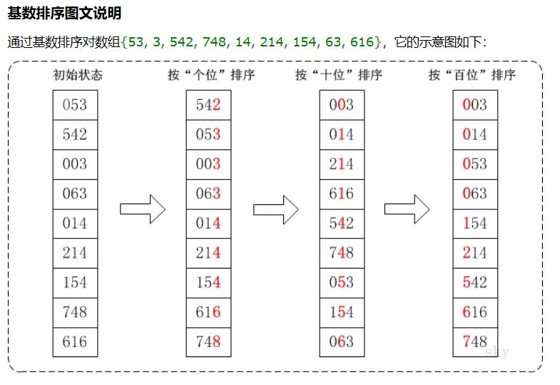
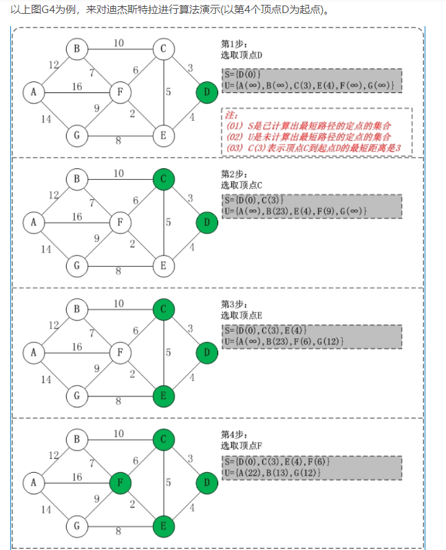
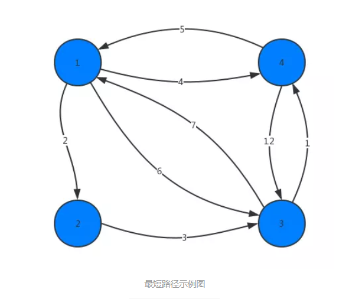
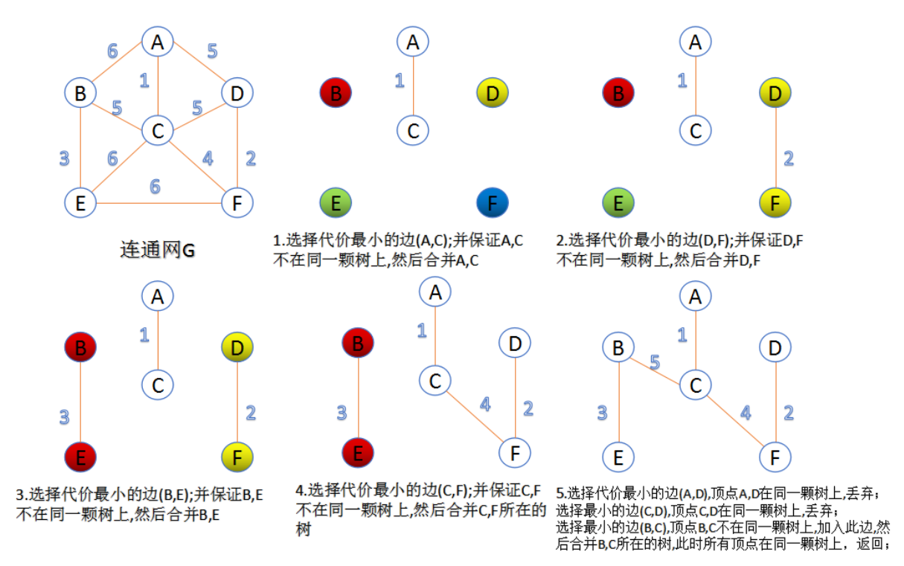
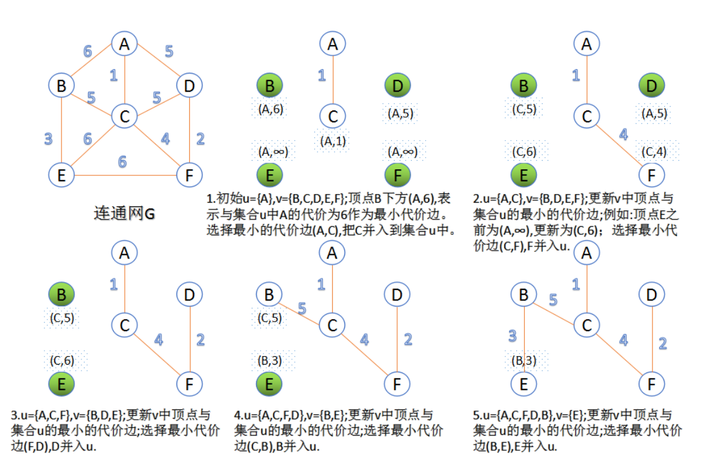

# 经典算法
## 排序
## 桶排序与计数排序，适用于固定区间内排序
划分桶大小，对桶中的数进行排序（快排，或者依次递归）
## 基数排序


由于基数排序无法对负数进行操作，当遇到负数的情况时可以将所有元素都加上一个常数使得所有元素为自然数后再排序，
输出时再减去这个常数即可.
## 图论
### 最短路径算法
#### 迪杰斯特拉算法 单源最短路径

1. (v0,v1,1), (v0,v2,5), (v0,...,~)  ~意为无穷大
2. (v1,v2,1+3<5,更新到v2的路径)...

缺点：单源，路径非负。
#### Floyd算法 多源最短路径（可求任意两点之间的最短路径）做题时建议使用此算法
从任意节点i到任意节点j的最短路径不外乎2种可能：
1) 直接从节点i到节点j。
2) 从节点i经过若干个节点k到节点j。
所以，我们假设arcs(i,j)为节点i到节点j的最短路径的距离，对于每一个节点k，我们检查arcs(i,k) + arcs(k,j) < arcs(i,j)是否成立，
如果成立，证明从节点i到节点k再到节点j的路径比节点i直接到节点j的路径短，我们便设置arcs(i,j) = arcs(i,k) + arcs(k,j)，这样一来，
当我们遍历完所有节点k，arcs(i,j)中记录的便是节点i到节点j的最短路径的距离。（由于动态规划算法在执行过程中，需要保存大量的临时状态
（即小问题的解），因此它天生适用于用矩阵来作为其数据结构，因此在本算法中，我们将不使用Guava-Graph结构（可用来做dijkstra算法），
而采用邻接矩阵来作为本例的数据结构）


1. 当不经过任意第三节点时，其最短路径为初始路径。
2. 枚举中转节点。
```java
for (int k = 1; k <= vexCount; k++) { //并入中转节点1,2,...vexCount，把k放到最外层？
    for (int i = 1; i <= vexCount; i++) {
        for (int j = 1; j < vexCount; j++) {
            if (arcs[i][k] + arcs[k][j] < arcs[i][j]) {
                arcs[i][j] = arcs[i][k] + arcs[k][j];
            }
        }
    }
} 
```
### 最小生成树
#### Kruskal算法 关注边

#### Prim算法 关注点

## 字符串
### KMP算法
kmp算法是字符串模式匹配算法，用于寻找子串在父串中出现的位置。
####暴力搜索
每当失配，父串左移一个单位重新配对，然而，我们应该利用失配的左段是匹配的，这一部分等于子串的一部分。
#### 最长公共前后缀
现在只关注子串中匹配的一部分，若父串左移一个单位后，剩下的仍匹配，则说明匹配的这一部分为最长公共前后缀。
所以我们可以先计算出子串的每一个位置的最长公共前后缀，用作每当失配的时候可以定位父串应该左移多少个单位（也就是子串中j指针应该
回溯多少个单位），继续往后匹配。

例如对于字符串 abacaba，其前缀有 a, ab, aba, abac, abacab，后缀有bacaba, acaba, caba, aba, ba, a。最长公共前后缀就是 aba。
## 哈夫曼编码
