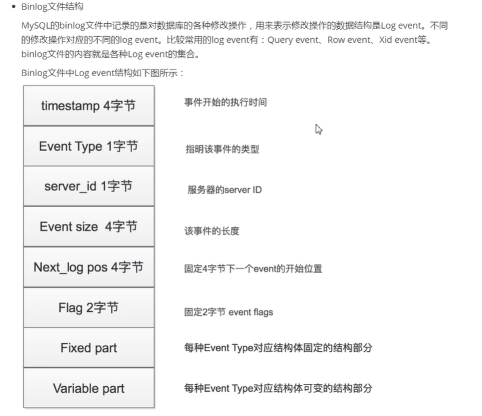

# MySQL
## 数据库四大范式
第一范式：为表格。

第二范式：第一范式基础上，消除对主键的部分依赖。

第三范式：第二范式基础上，消除对主键的传递依赖。

BC范式：第一范式基础上，消除对候选键的部分依赖和传递依赖。（与第三范式相比，要求从主键扩大为候选键）

反范式：通过增加冗余字段来减少表的连接，提高读效率。
## 数据库存储原理
索引的数据结构为B+树（支持范围查找），Hash索引（不支持范围查找）
## MyIsam 适合读多写少的情况（一般下，查询速度比Innodb快）
1. MyIsam中的索引与数据是分开的，索引中的节点记录的是数据在磁盘中的位置。
2. 不支持行锁，读取时对需要读到的所有表加锁，写入时则对表加排它锁.
3. 不支持事务。
4. 不支持外键。
5. 不支持崩溃后的安全恢复。
6. 支持延迟更新索引，极大提升写入性能。
7. 对于不会进行修改的表，支持压缩表，极大减少磁盘空间占用。
### B+树
索引树

## Innodb
Innodb的主键B+树中的叶子节点既是索引也是数据（基于双向链表），它是以主键为聚集索引，表中数据的物理顺序与主键索引的逻辑顺序相同。
因此它要求数据必定有主键（当不设定主键时，mysql会创建一个默认的主键）。 

对于其他非主键索引树，叶子节点上的数据为主键号（一致性和节省空间）。

叶子节点之间由双向链表连接，作用：
1. 使用自增数据时可以直接从插入到链表末尾，而uuid就不行了。
2. 实现范围查找，而B树只能中序遍历查找。

一个B+树的叶子节点为一页，页默认大小为16kb，而一行数据最大为64kb，意味着要记录行溢出，该行溢出到另一页。
假设一行数据为1kb，那么一页可以容纳16条数据。默认为16kb是因为文件系统一次IO读取一般4kb（视具体情况而定），而根据局部性原理，
它附近的数据马上会读取到，故设为16kb。那么读取一个节点就发生一次IO。

一棵B+树，32位机阶数为512，64位机阶数位171，一般高度为3。

一棵b+树一般能存2000万左右的记录。一个节点占一页16kb，假设主键为bigint（8b+6b指针）14b，
那么一个非叶子节点可以有16kb/14b=1170个，假设树高为3，那么，叶子节点数1170 * 1170，假设一行记录大小为1kb，
那么一个叶子节点可以有16kb/1kb=16条，总记录数：1170 * 1170 * 16=2000万左右。
### B+树
主键索引树

### 联合索引，最左前缀法则

这里为联合主键，联合索引也一个道理，只不过data换成主键。
联合索引中，叶子节点中索引依次排放，插入是依次比较，每个节点内元素成字典序，所以才有最左前缀原理，中间若失配，索引将无效。
### 索引覆盖 回表
索引覆盖：当这颗非主键索引树已经能满足要查询的数据时，那么就不用回表，否则就要根据拿到的主键id，去主键索引树上查到数据（回表）。
### 索引下推
对于user_table表，我们现在有（username,age）联合索引。

如果现在有一个需求，查出名称中以“张”开头且年龄小于等于10的用户信息，语句C如下：
"select * from user_table where username like '张%' and age <= 10".

语句C有两种执行可能：
1. 根据（username,age）联合索引查询所有满足名称以“张”开头的索引，然后回表查询出相应的全行数据，
然后再筛选出满足年龄小于等于10的用户数据。
2. 根据（username,age）联合索引查询所有满足名称以“张”开头的索引，然后直接再筛选出年龄小于等于10的索引，之后再回表查询全行数据。

明显的，第二种方式需要回表查询的全行数据比较少，这就是mysql的索引下推（默认启用）。innodb引擎的表，索引下推只能用于非聚集索引。
### 事务
mysql默认事务自动提交（一条语句一个事务），可以手动设置事务是否自动提交。

事务的隔离矩阵

mysql默认的事务隔离级别为RR（Repeatable Read 可重复读），解决幻读的方案如下：
1. 利用MVCC解决快照读的幻读问题。select * from t where a=1;属于快照读
2. 利用next-key解决当前读的幻读问题。
   * select * from t where a=1 lock in share mode;属于当前读 
   * select * from t where a=1 for upda;属于当前读 
   * insert update delete属于当前读
### 幻读的理解
在隔离级别为可重复读的条件下，幻读表现为：
1. 事务1和事务2同时 , 事务1读数据 , 事务2插入数据提交 , 事务1插入同样的数据时报错说已经重复了。
2. 事务1和事务2同时 , 事务1读数据 , 事务2插入数据提交 , 事务1更新数据却可以把事务2的数据也一块给更了。

解决方式是在select读时候的sql中增加for update  lock in share mode, 会把我所查到的数据锁住 , 别的事务根本插不进去 , 这样就解决了,
这里用到的是mysql的next-key locks。
### MVCC
参考自：
1. https://blog.51cto.com/itzhoujun/2357430
2. https://github.com/h2pl/Java-Tutorial

InnoDB的MVCC,是通过在每行记录后面保存两个隐藏的列来实现的（实际上还有一个列用于记录回滚指针）,这两个列，
分别保存了这个行的创建时间，一个保存的是行的删除时间。这里存储的并不是实际的时间值,而是系统版本号(可以理解为事务的ID)，
每开始一个新的事务，系统版本号就会自动递增，事务开始时刻的系统版本号会作为事务的ID.
#### 行记录

#### 回滚指针

#### 多版本生成
- 对于一个逻辑上的多版本生成过程，其方式如下
  * 最老的版本，一定是插入操作暂存到UNDO日志的版本(对于聚集索引，不是记录的所有字段读暂存到回滚段，而是主键信息被暂存)
  * 更新操作，把旧值存入UNDO日志。同一个日志反复被更新，则每次读存入一个旧值(前像)到UNDO日志内，如此就会有多个版本，版本之间，
  使用DATA_POLL_PTR
  * 执行根据的版本，由此所有版本构成一个链表，链头是索引上的记录，链尾是首次插入时生成的UNDO信息。
  * 删除操作，在UNDO日志中保存删除标志
#### 多版本查找
- 对于聚集索引，可以根据DATA_ROLL_PTR就可以从回滚段中找出前一个版本的记录，并知道此记录是更新操作还是插入操作生成的，
如果是插入操作生成的，则意味着此版本是最原始的版本，即使不可见也没有必要在继续回溯查找旧版本了
- 但是查找的过程与隔离级别紧密相关
  * 如果是未提交读隔离级别，根本不去找旧版本，在索引上读到的记录就被直接使用
  * 如果不是未提交隔离级别，则需要进入UNDO回滚段中根据DATA_POLL_PTR进行查找，还要判断是否可见，如果可见，则返回，
  如果不可见，则一直根据DATA_POLL_PTR进行查找
#### 快照与可见性判定
- innodb在执行select的时候会创建一个快照。
  * 隔离级别大于等于可重复读：事务块的所有的SELECT操作都要使用**同一个快照**，此快照是在第一个SELECT操作时建立的
  * 隔离级别小于等于已提交读：事务块内的所有的SELECT操作分别创建属于自己的快照，因此每次读都不同，后面的SELECT操作的读就可以读到
  本次读之前已经提交的数据
  * 当前数据可以看到哪些数据就是由这个快照决定的，快照有下面几个属性，并且可见性也根据这几个属性来判断的：
    + m_up_limit_id 一个快照，有左右边界，左边界是最小值，右边界是最大值，此变量是左边界
    + m_low_limit_id 右边界 
    + m_createor_trx_id 正在创建事务的事务ID
    + trx_ids 快照创建时，处于活动即尚未完成的读写事务的集合
- 可见性判定，通过比较该行记录的事务ID是否在该快照[m_up_limit_id,m_low_limit_id]区间的左侧，中间，还是右侧判断是否可见
  * 左侧 可见
  * 中间
    + 在trx_ids中不可见 （虽然该行记录发生在快照所处的事务之前，但**该记录的事务还在活动**中）
    + 等于m_createor_trx_id 可见
  * 右侧 不可见

总的来说，在事务隔离级别为RR下，快照创建后，当前事务不读取正在发生的事务（即使这些正在发生的事务id较小且提交了，当前事务也不读取，
因为RR下的快照在第一次select时生成，且只生成一次） 新增或修改的数据（读取之前已经完成的或者是自己修改的），
不理会是否被后来事务删除（被后来的事务删除了照样读取）。快照创建前，后来事务如果已经提交，那么当前事务在创建快照时，可见到后来事务的
操作结果。
### 事务与锁
事务在执行到要加锁的语句时开始加锁，commit后释放锁。此时遵循两段锁协议：
1. 加锁阶段：在该阶段可以进行加锁操作。在对任何数据进行读操作之前要申请并获得S锁（共享锁，其它事务可以继续加共享锁，
但不能加排它锁），在进行写操作之前要申请并获得X
锁（排它锁，其它事务不能再获得任何锁）。加锁不成功，则事务进入等待状态，直到加锁成功才继续执行。
2. 解锁阶段：当事务释放了一个封锁以后，事务进入解锁阶段，在该阶段只能进行解锁操作不能再进行加锁操作。

注意：如果如果要修改的那项记录没有走索引，那么这时会对表的所有数据项加锁（因为它并不知道该项记录在哪，可能这不等同于表锁）
#### 锁的兼容矩阵

#### 行锁
1. Record lock ：对索引项加锁，即锁定一条记录。
2. Gap lock：对索引项之间的‘间隙’、对第一条记录前的间隙或最后一条记录后的间隙加锁，即锁定一个范围的记录，不包含记录本身。
注意：gap lock**不需要**用于那些使用**唯一索引**锁住行来查找唯一行的语句，如主键索引。
3. Next-key Lock：锁定一个范围的记录并包含记录本身（上面两者的结合）。
#### 表锁
何时在InnoDB中使用表锁：
1. 当事务需要更新大部分数据时，表又比较大，如果使用默认的行锁，不仅效率低，而且还容易造成其他事务长时间等待和锁冲突。
2. 事务比较复杂，很可能引起死锁导致回滚。
#### 意向表锁的理解
如果没有意向锁，当已经有人使用行锁对表中的某一行进行修改时，如果另外一个请求要对全表进行修改，
那么就需要对所有的行是否被锁定进行扫描，在这种情况下，效率是非常低的；不过，在引入意向锁之后，
当有人使用行锁对表中的某一行进行修改之前，会先为表添加意向互斥锁（IX），再为行记录添加互斥锁（X），
在这时如果有人尝试对全表进行修改就不需要判断表中的每一行数据是否被加锁了，只需要通过等待意向互斥锁被释放就可以了。
### MVCC与锁
在MySQL中，如在RR下，MVCC与锁是共同起作用的。即在当前读的时候会加锁。 而加锁的时候，
读读共享，读写互斥，写写互斥，参考Java的ReentrantReadWriteLock(写读互斥，而我觉得MVCC就是利用快照使得写的时候可以读)。
### 事务与MVCC与锁
1. 在未提交读的时候，每一次读都会生成快照（其实也不算是快照了，因为每一次读都会生成），但在快照中不会去判断可见性，即直接拿到
版本链上最新的数据。
2. 在提交读的时候，每一次读都会生成快照，在快照中去判断可见性，可见性的判断参照上面，故而会读取到别人（该事务id<当前事务）
提交后的数据。
3. 在可重复读的时候，快照在一次读时生成，之后的读在此快照的基础上读取的自己的修改。

### 日志
#### undo log 逻辑日志（记录变化过程）

#### redo log 物理日志 某一时刻内存数据页状态

#### buffer是为了缓解上下层速率不一致，减少随机写
#### bin log 逻辑日志

主从复制的基础：binlog日志和relaylog日志
##### 什么是MySQL主从复制
简单来说就是保证主SQL（Master）和从SQL（Slave）的数据是一致性的，向Master插入数据后，
Slave会自动从Master把修改的数据同步过来（有一定的延迟），通过这种方式来保证数据的一致性，就是主从复制
##### 复制方式
MySQL5.6开始主从复制有两种方式：基于日志（binlog）、基于GTID（全局事务标示符）。 本文只涉及基于日志binlog的主从配置

##### 复制原理
1. Master将数据改变记录到二进制日志(binary log)中，也就是配置文件log-bin指定的文件，这些记录叫做二进制日志事件(binary
 log events) 
2. Slave通过I/O线程读取Master中的binary log events并写入到它的中继日志(relay log)
3. Slave重做中继日志中的事件，把中继日志中的事件信息一条一条的在本地执行一次，完成数据在本地的存储，
从而实现将改变反映到它自己的数据(数据重放)

##### 什么是binlog
1. binlog是一个二进制格式的文件，用于记录用户对数据库更新的SQL语句信息，例如更改数据库表和更改内容的SQL语句都会记录到binlog里，
但是对库表等内容的查询不会记录。
   * 默认情况下，binlog日志是二进制格式的，不能使用查看文本工具的命令（比如，cat，vi等）查看，而使用mysqlbinlog解析查看。
2. binlog的作用 当有数据写入到数据库时，还会同时把更新的SQL语句写入到对应的binlog文件里，这个文件就是上文说的binlog文件。
使用mysqldump备份时，只是对一段时间的数据进行全备，但是如果备份后突然发现数据库服务器故障，这个时候就要用到binlog的日志了。
   * 主要作用是用于数据库的主从复制及数据的增量恢复。
3. 如何开启binlog日志功能 在mysql的配置文件my.cnf中，增加log_bin参数即可开启binlog日志，也可以通过赋值来指定binlog日志的文件名，
实例如下：
   * [root@DB02 ~]# grep log_bin /etc/my.cnf log_bin = /application/mysql/logs/dadong-bin
   * [root@DB02 ~]# 提示：也可以按“log_bin = /application/mysql/logs/dadong-bin”命名，目录要存在。
   为什么要刷新binlog?找到全备数据和binlog文件的恢复临界点.
   
#### binlog与redo log
因为MySQL早期版本中没有InnoDB引擎，MySQL自带的引擎是MyISAM，MyISAM是没有crash-safe能力的，直到将InnoDB以插件的形式引入，
InnoDB使用Redo Log来实现crash-safe能力。

区别：
1. redo log是在InnoDB存储引擎层产生，而binlog是MySQL数据库的上层产生的，并且二进制日志不仅仅针对INNODB存储引擎，
MySQL数据库中的任何存储引擎对于数据库的更改都会产生二进制日志。
2. 两种日志记录的内容形式不同。MySQL的binlog是逻辑日志，其记录是对应的SQL语句。而innodb存储引擎层面的重做日志是物理日志。
### checkpoint
checkpoint是为了定期将db buffer的内容刷新到data file。当遇到内存不足、db buffer已满等情况时，
需要将db buffer中的内容/部分内容（特别是脏数据）转储到data file中。在转储时，会记录checkpoint发生的”时刻“。
在故障回复时候，只需要redo/undo最近的一次checkpoint之后的操作。
### sql语句
#### sql优化
- 字段
  * 尽量使用TINYINT、SMALLINT、MEDIUM_INT作为整数类型而非INT，如果非负则加上UNSIGNED
  * VARCHAR的长度只分配真正需要的空间
  * 使用枚举或整数代替字符串类型
  * 尽量使用TIMESTAMP而非DATETIME
  * 单表不要有太多字段，建议在20以内
  * 避免使用NULL字段，很难查询优化且占用额外索引空间
  * 用整型来存IP
- 索引
  * 索引并不是越多越好，要根据查询有针对性的创建，考虑在WHERE和ORDER BY命令上涉及的列建立索引，
  可根据EXPLAIN来查看是否用了索引还是全表扫描
  * 应尽量避免在WHERE子句中对字段进行NULL值判断
  * 值分布很稀少的字段不适合建索引，例如"性别"这种只有两三个值的字段
  * 字符字段只建前缀索引
  * 字符字段最好不要做主键
  * 不用外键，由程序保证约束
  * 尽量不用UNIQUE，由程序保证约束
  * 使用多列索引时主意顺序和查询条件保持一致，同时删除不必要的单列索引
- 查询SQL
  * 可通过开启慢查询日志来找出较慢的SQL
  * 不做列运算：SELECT id WHERE age + 1 = 10，任何对列的操作都将导致表扫描，它包括数据库教程函数、计算表达式等等，
  查询时要尽可能将操作移至等号右边
  * sql语句尽可能简单：一条sql只能在一个cpu运算；大语句拆小语句，减少锁时间；一条大sql可以堵死整个库
  * 不用SELECT *
  * OR改写成IN：OR的效率是n级别，IN的效率是log(n)级别，in的个数建议控制在200以内
  * 不用函数和触发器，在应用程序实现
  * 避免%xxx式查询
  * 少用JOIN
  * 使用同类型进行比较，比如用'123'和'123'比，123和123比
  * 尽量避免在WHERE子句中使用!=或<>操作符，否则将引擎放弃使用索引而进行全表扫描
  * 对于连续数值，使用BETWEEN不用IN：SELECT id FROM t WHERE num BETWEEN 1 AND 5
  * 列表数据不要拿全表，要使用LIMIT来分页，每页数量也不要太大，分页时可利用上索引，如：
  SELECT * from user limit 100001,20; -> SELECT * from user where id >=100001 limit 20;
#### where与having
1. WHERE 子句用来筛选 FROM 子句中指定的操作所产生的行。(聚合前)
2. GROUP BY 子句用来分组 WHERE 子句的输出。
3. HAVING 子句用来从分组的结果中筛选行。（聚合后）
#### 索引中的null值
在mysql中，null作为一种特殊的值也依然是可以用到索引的，只不过对比平常的值，null的运算只有is null和is not null，不能用>,<,=, 
对其进行算术运算的结果依然为null。
#### in与exsits
1. SELECT * FROM `user` WHERE id in (SELECT user_id FROM `order`)  先执行子查询，缓存子查询的结果集（排序后的？），
然后父查询每一次检查id是否在这个缓存中。
2. SELECT * FROM `user` WHERE exists (SELECT * FROM `order` WHERE user_id = user.id) exsits相当于一个函数，去判断
后面的结果集是否为空，不空返回true，空返回false。 好处在于后面的查询可以用上索引。
事实上，以上可用连接查询，select * from user,order where user.id=order.user_id