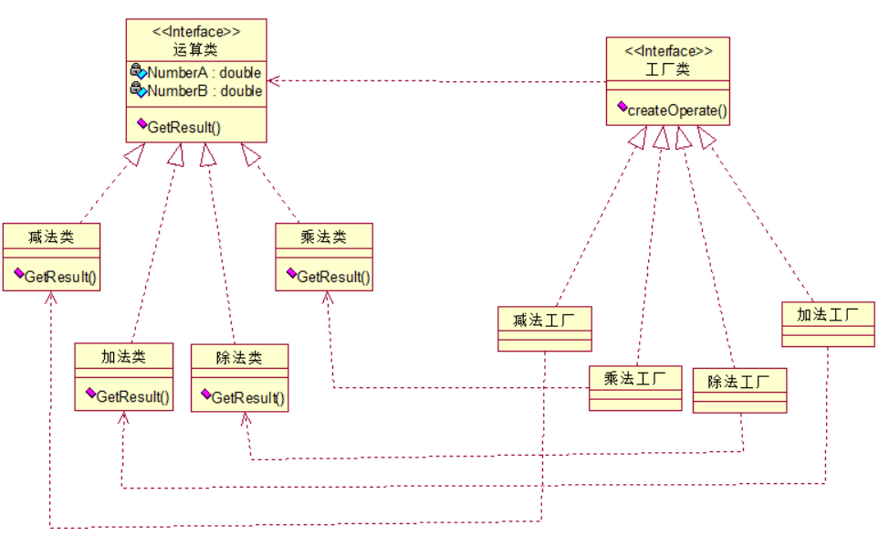
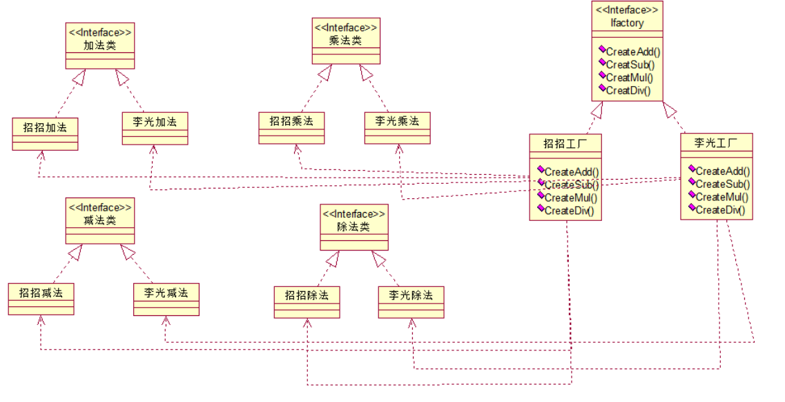
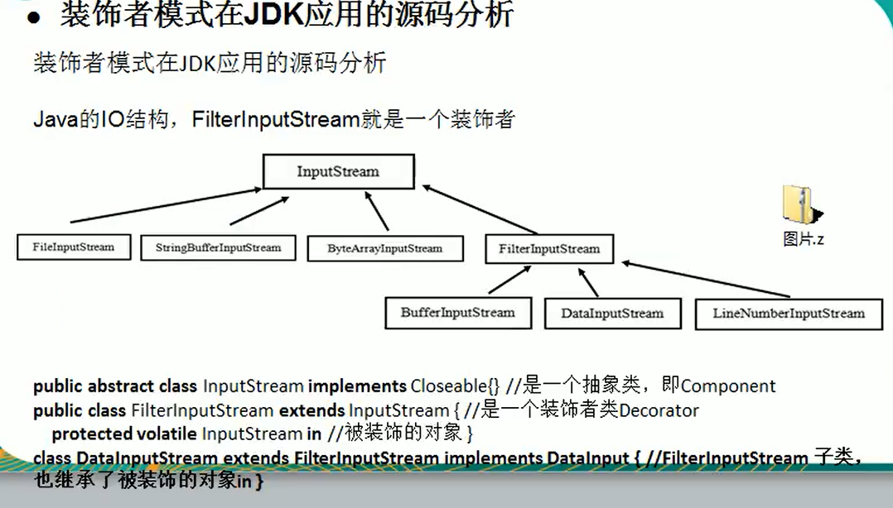
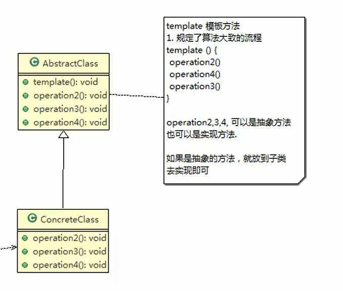

# 设计模式
## 简单工厂 违反封闭原则
```java
public class OperationFactory{
        public static Operation createOperate(string operate){
            Operation oper = null;
            switch (operate)      {//分支判断，在增加新的运算类的时候这里需要修改，违背了开放封闭原则
                case "+":
                    oper = new OperationAdd();
                    break;
                case "-":
                    oper = new OperationSub();
                    break;
                case "*":
                    oper = new OperationMul();
                    break;
                case "/":
                    oper = new OperationDiv();
                    break;
            }
            return oper;
        }    
}
```
## 工厂方法


在增加新的产品（对应UML图的算法）时，也必须增加新的工厂类，会带来额外的开销。
## 抽象工厂


我要是增加慧鹏加法，慧鹏减法，慧鹏乘法，慧鹏除法，那么我就可以直接增加了，工厂顺便增加一个慧鹏工厂，
这样完美了的利用好了开放封闭的原则！棒极了！但是我要是增加一个新的算法，比如是幂运算，那么它就要同时增加招招幂运算，李光幂运算，
慧鹏幂运算这几个类，同时还需要修改Ifactory，招招工厂，李光工厂！违反了开放封闭的原则！

## 装饰者模式


## 模板方法


## 观察者模式
addListener()

## 迭代器模式


