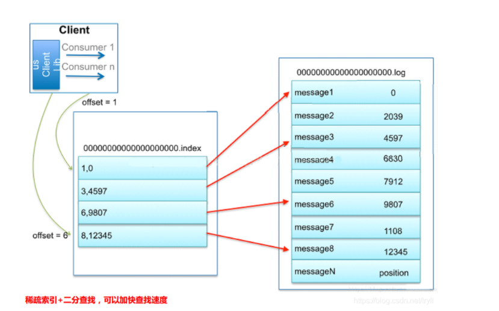

# kafka消息队列
## 性能提升
1. 利用操作系统PageCache。
2. 顺序写。
2. mmap和sendFile。
3. 稀疏索引，减少索引占用，使得可以完整将索引加载到内存。 
4. 消息批量压缩。
## 架构

某一时刻，同一消费者组里，不能有两个或以上个消费者同时对某一分区进行消费。

## 文件存储机制
Topic是逻辑上的，而partition（便于扩展，提高并发）则是物理存在的，而partition采用了分片和索引的思想。一个partition分为多个段，
一个段大小为1GB，对于每个段，.log文件存储实际的Message，.index索引文件存储的是Message在.log文件中的字节偏移量。
而又因为.index中的每一项是固定大小且有序的，那么在查找时，利用二分查找法。

## 索引

## offset

## 消息的发送
消息一次是只发送给某个主题下某个分区中的leader的，然后由leader发送ack给生产者。其中，follower的同步使用全量同步（ISR中的follower
完成了同步），这与zookeeper不同。但因为ISR机制，当某个ISR中的follower未能及时地同步时，该follower将会被踢出ISR。

流程：Kafka 的 Producer 发送消息采用的是异步发送的方式。在消息发送的过程中，涉及到了两个线程——main 线程和 Sender 线程，
以及一个线程共享变量——RecordAccumulator。main 线程将消息发送给 RecordAccumulator，Sender 线程不断从 RecordAccumulator 中拉取
消息发送到 Kafka broker。
## exactly once 不多不少，刚好一条
将服务器的 ACK 级别设置为-1，可以保证 Producer 到 Server 之间不会丢失数据，即 At
Least Once 语义。相对的，将服务器 ACK 级别设置为 0，可以保证生产者每条消息只会被
发送一次，即 At Most Once 语义。

0.11 版本的 Kafka，引入了一项重大特性：幂等性。所谓的幂等性就是指 Producer 不论
向 Server 发送多少次重复数据，Server 端都只会持久化一条。幂等性结合 At Least Once 语
义，就构成了 Kafka 的 Exactly Once 语义。即：
At Least Once + 幂等性 = Exactly Once

要启用幂等性，只需要将 Producer 的参数中 enable.idompotence 设置为 true 即可。Kafka
的幂等性实现其实就是将原来下游需要做的去重放在了数据上游。开启幂等性的 Producer 在
初始化的时候会被分配一个 PID，发往同一 Partition 的消息会附带 Sequence Number。而
Broker 端会对<PID, Partition, SeqNumber>做缓存，当具有相同主键的消息提交时，Broker 只
会持久化一条。
但是 PID 重启就会变化，同时不同的 Partition 也具有不同主键，所以幂等性无法保证跨
分区跨会话的 Exactly Once。
