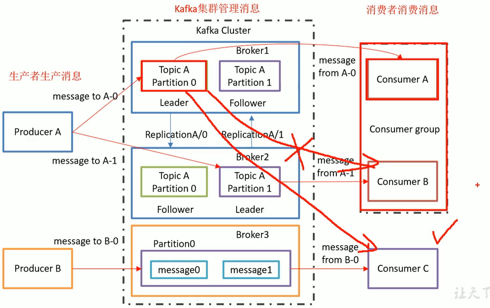

# kafka消息队列

## 架构

某一时刻，同一消费者组里，不能有两个或以上个消费者同时对某一分区进行消费。

## 文件存储机制
Topic是逻辑上的，而partition（便于扩展，提高并发）则是物理存在的，而partition采用了分片和索引的思想。一个partition分为多个段，
一个段大小为1GB，对于每个段，.log文件存储实际的Message，.index索引文件存储的是Message在.log文件中的字节偏移量。
而又因为.index中的每一项是固定大小且有序的，那么在查找时，利用二分查找法。