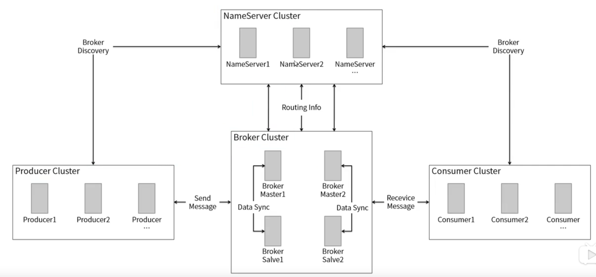
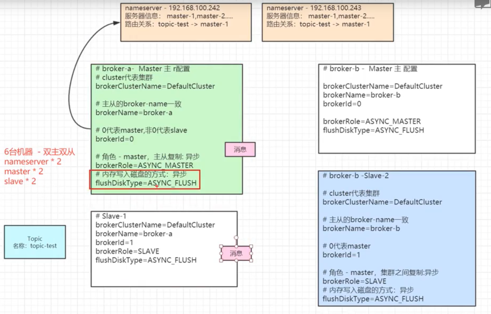
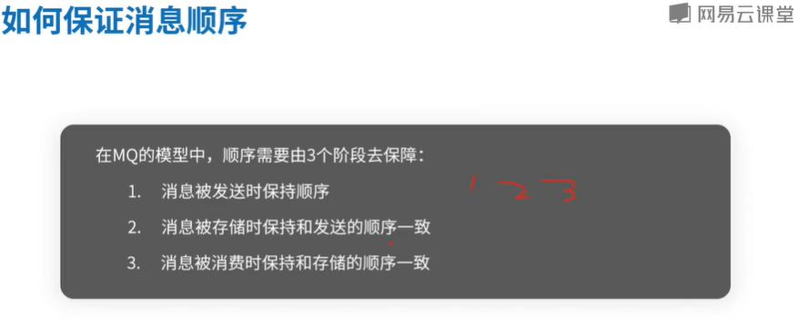
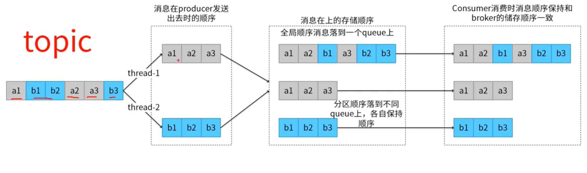
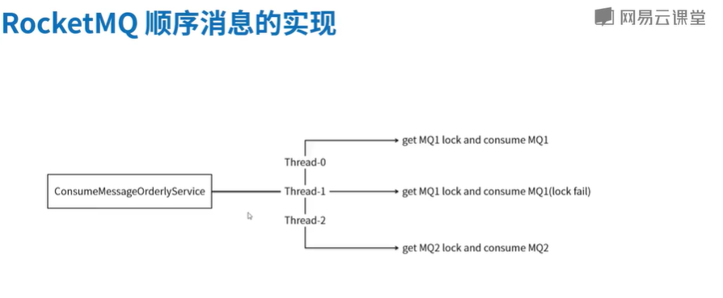
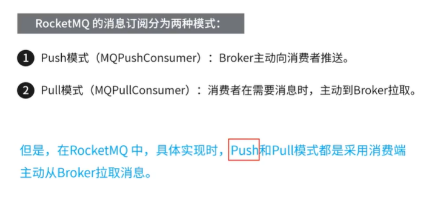

# rocketmq
mq与rpc与db又何联系呢？三者的本质都为信息的交换。
rocketmq中的broker是做数据存储的，利用的是文件系统，这要比db更为轻便、灵活、快捷，其中利用到了mmap。
## 架构图

NameServer(相互之间不交互信息)作为注册中心，同时记录如每个Broker都有哪些Producer和Consumer连接等信息。
## 有序消息
1. 全局有序，所有消息发送到同一个队列。
2. 分区有序，利用一致性hash，使得模值相同的消息发送到同一个队列。

## 延时消息
当生产者发送延时消息到Broker后，它不能被消费者立即消费到，而是根据消息的延时级别，经一段时间后才能被消费者消费。
## 消息订阅

push模式中，某主题下消息队列的遍历由框架完成。