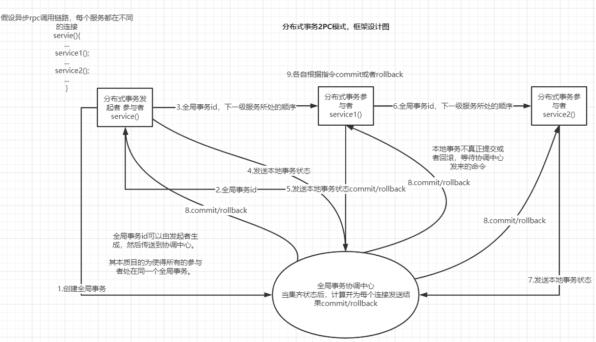
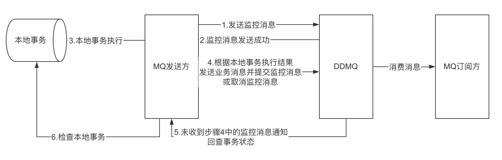
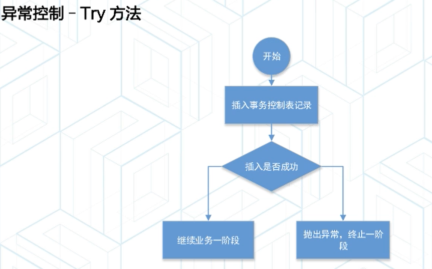
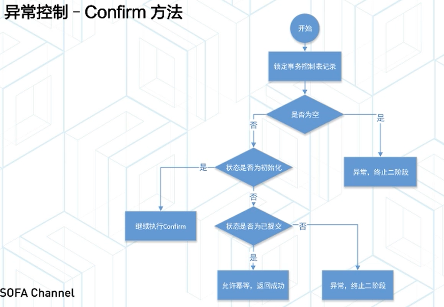
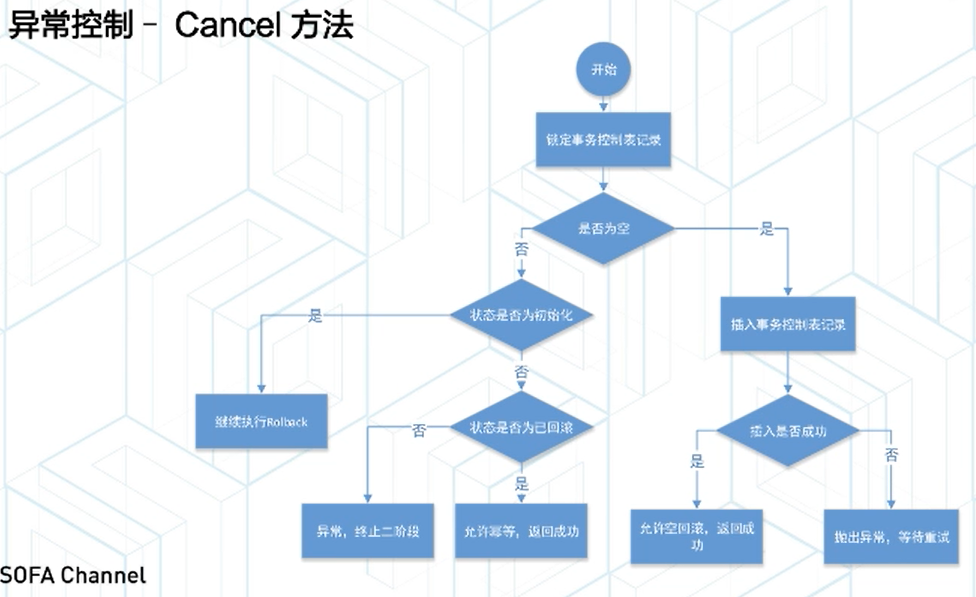

# 分布式事务

增加中间状态，预阶段是直接commit中间状态，最后确认或取消，达到最终状态或者初始状态。与上面的不同，减少了锁的粒度，提高了并发量。
其实关键就在于，最后各服务的状态是正确的，而上面没有中间状态，就只能不commit或是rollback，一直持有锁直至所有服务完成预提交。

## 分布式事务框架设计方案
框架目的，类似spring注解@Transactional(声明式事务)，低侵入，回滚操作由框架完成。
### 传统2PC

其中难点：
1. 网络传输可以用netty。
2. 低侵入，使用注解@GlobalTranscational，定义切面处理该注解。
3. 定义切面接管Connection。在有@GlabalTranscational注解，即开启全局事务的情况下，应使用经处理、可控制的Connection，
使得spring在提交或者回滚本地事务时(即调用connection.commit或者connection.rollback)，并不真正执行，而是向协调中心发送自己的状态，
新建一个线程去最终执行这个操作(这个执行线程应该等待协调中心发来结果)，然后先返回、响应用户(也可以由自己等，自己执行，
但似乎对用户不友好，也不能承受高并发)。

在两阶段提交协议中，如果参与者在准备阶段返回准备成功可提交，那么在事务提交阶段，当参与者必定需要提交成功（不管发生什么情况，掉电/宕机）。
但在提交过程中，会出现部分提交的情况（不一致）。
### 基于可靠消息的最终一致性
这个保证了本地事务和发送消息是原子的。
1.本地发送通知消息到mq，本地收到响应后，开启本地事务。
2.本地完成事务后，发送事务提交消息（不在事务中发送，是为了防止网络抖动导致长事务）。

### AT
本地要提交的时候真正提交，但仍然有个回滚机制，例如有个日志中心，当要回滚的时候，从日志中心拿取undo日志，覆盖掉本地已经提交的事务
### TCC
本地要提交的时候真正提交，但仍然有个回滚机制，例如有某个回调函数，当要回滚时调用，或者每个表从中间状态撤回初始状态(参与的表增加
一栏中间状态)。

用户接入 TCC 模式，最重要的事情就是考虑如何将业务模型拆成 2 阶段，实现成 TCC 的 3 个方法，并且保证 Try 成功 Confirm 一定能成功。
相对于 AT 模式，TCC 模式对业务代码有一定的侵入性，但是 TCC 模式无 AT 模式的全局行锁，TCC 性能会比 AT 模式高很多。