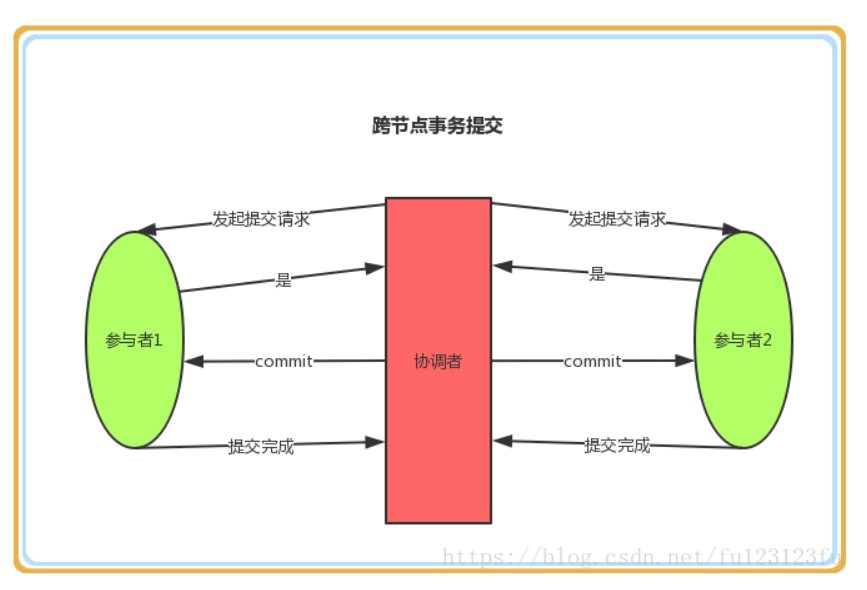
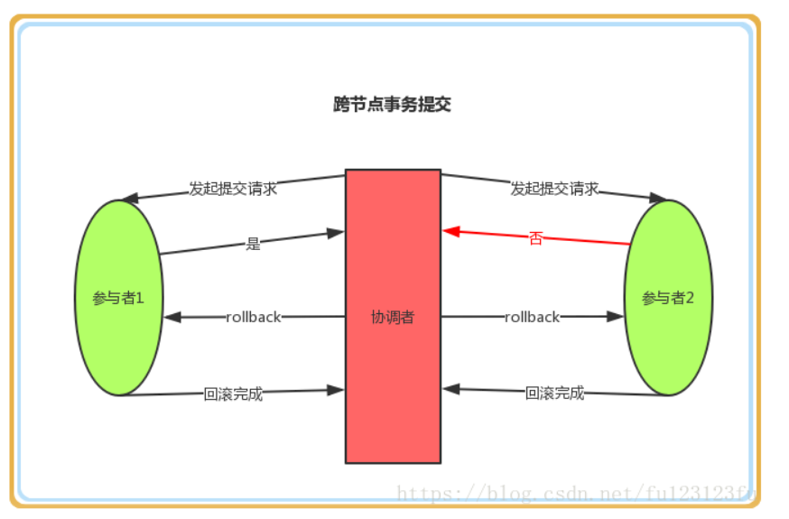
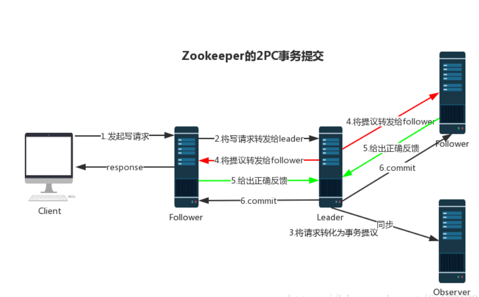

# zookeeper
1. 一致性，协调分布式服务的一致性。
2. 有头。一个zookeeper有leader, follower, observer(不参与投票)。
3. 数据树。树形目录结构。
   * 持久化节点。
   * 临时节点，断开连接后删除（有一定的心跳时延）。
   * 持久化顺序编号节点。
   * 临时顺序编号节点。
## 消息广播
### 事务2PC
follower收到客户端时事务请求时，自己不进行事务而是报告leader，由leader向各follower发出命令，leader得到一半确认之后，发出commit。

## 崩溃恢复
每个follower都有一个投票箱，初始都会投自己，每收到别人的选票就会计算（事务id,机器id）新的投票结果，并广告结果，如果某follower得到
一半以上得选票，那么它就成为了新的领导。
## watcher机制
## 分布式锁
利用临时顺序编号节点（持有锁线程挂掉后释放锁），watcher机制（监控自己的上一个节点是否被删除了）。