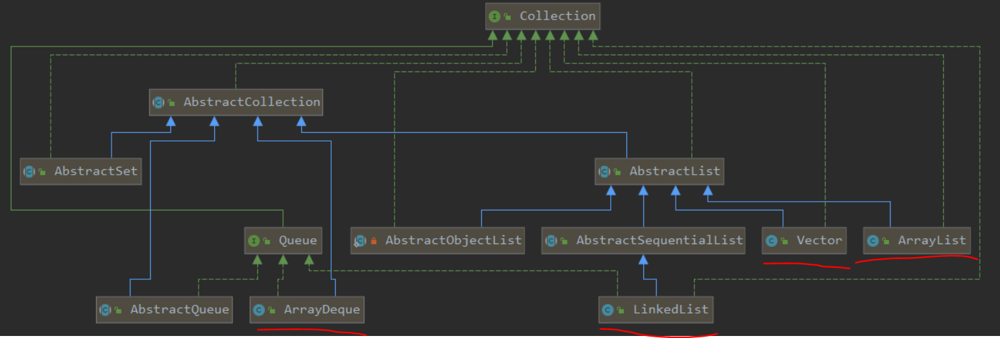

#Collection（并发容器单独分析）
## UML

这里标记了四个常用的容器，分别是：ArrayDeque, ArrayList, Vector, LinkedList。
其中LinkedList也实现了Queue接口，同样是可以当作双端队列来使用的。
## 常见用法
### ArrayDeque
```java
        Queue<Integer> qi=new ArrayDeque<>();//非空
        qi.add(1);
        qi.offer(2);//add与offer其实都是调用了同一个方法addLast
        qi.peek();//获取头部，不删除
        qi.poll();//获取头部，同时删除
```
### LinkedList
```java
        Queue<Integer> lqi=new LinkedList<>();//双向链表
        lqi.add(1);
        lqi.offer(2);//add与offer其实都是调用了同一个方法linkLast
        lqi.peek();
        lqi.poll();
```
### ArrayList
```java
        List<Integer> list=new ArrayList<>();
        list.add(1);
        list.add(1,2);
        list.get(1);
        list.remove(0);//依据下标删除
        list.remove(Integer.valueOf(2));//for循环遍历，判断equals
```
### Vector
其实就是方法加了synchronized的ArrayList，注意Vector的扩容与ArrayList不同。
```java
    private void grow(int minCapacity) {
        // overflow-conscious code
        int oldCapacity = elementData.length;
        int newCapacity = oldCapacity + ((capacityIncrement > 0) ?//如果构造时设定的增量为0，那么两倍扩容。
                                         capacityIncrement : oldCapacity);
        if (newCapacity - minCapacity < 0)
            newCapacity = minCapacity;
        if (newCapacity - MAX_ARRAY_SIZE > 0)
            newCapacity = hugeCapacity(minCapacity);
        elementData = Arrays.copyOf(elementData, newCapacity);
    }
```
## ArrayList源码分析
### 实际存储的数组
```java
    transient Object[] elementData; // non-private to simplify nested class access
```
### 默认容量为10，容量并不等于数组实际大小
```java
    private static final int DEFAULT_CAPACITY = 10;
```
### 有参构造
```java
    public ArrayList(int initialCapacity) {
        if (initialCapacity > 0) {
            this.elementData = new Object[initialCapacity];//new了一个数组
        } else if (initialCapacity == 0) {
            this.elementData = EMPTY_ELEMENTDATA;
        } else {
            throw new IllegalArgumentException("Illegal Capacity: "+
                                               initialCapacity);
        }
    }
```
### 调用无参构造，然后add
```java
private static final Object[] DEFAULTCAPACITY_EMPTY_ELEMENTDATA = {};//这是长度为0的空数组
public ArrayList() {
        this.elementData = DEFAULTCAPACITY_EMPTY_ELEMENTDATA;
    }
```
当调用无参构造后，此时ArrayList容量为10，elementData为长度为0的空数组，注意不是null。
此时调用add
```java
    public boolean add(E e) {
        ensureCapacityInternal(size + 1);  //检查容量
        elementData[size++] = e;
        return true;
    }

    private void ensureCapacityInternal(int minCapacity) {
        ensureExplicitCapacity(calculateCapacity(elementData, minCapacity));//计算当前数组容量
    }

    //计算数组应该要有的容量
    private static int calculateCapacity(Object[] elementData, int minCapacity) {
        if (elementData == DEFAULTCAPACITY_EMPTY_ELEMENTDATA) {//如果当前数组是默认的长度为0的空数组
             return Math.max(DEFAULT_CAPACITY, minCapacity);//返回默认容量10与当前要求的最小容量两者之间的最大值
        }
        return minCapacity;
    }

    //确定当前数组的大小是否可满足minCapacity
    private void ensureExplicitCapacity(int minCapacity) {
        modCount++;//fail-fast机制

        // overflow-conscious code
        if (minCapacity - elementData.length > 0)//如果数组的大小并没有达到容量
            grow(minCapacity);//那么扩容
    }

    private static final int MAX_ARRAY_SIZE = Integer.MAX_VALUE - 8;

    //扩容
    private void grow(int minCapacity) {
        // overflow-conscious code
        int oldCapacity = elementData.length;
        int newCapacity = oldCapacity + (oldCapacity >> 1);//新数组大小为旧数组大小的1.5倍
        if (newCapacity - minCapacity < 0)
            newCapacity = minCapacity;//如果计算得到的新数组大小依然不够，那么就直接用minCapacityz这个容量
        if (newCapacity - MAX_ARRAY_SIZE > 0)
            newCapacity = hugeCapacity(minCapacity);//如果达到了阈值，那么这是一个大容量
        // minCapacity is usually close to size, so this is a win:
        elementData = Arrays.copyOf(elementData, newCapacity);//将原数组的元素赋值到新数组上
    }
    
    private static int hugeCapacity(int minCapacity) {
        if (minCapacity < 0) // overflow
            throw new OutOfMemoryError();
        return (minCapacity > MAX_ARRAY_SIZE) ?
            Integer.MAX_VALUE ://数组大小可以达到int的最大值的
            MAX_ARRAY_SIZE;
    }
```
**由此可知，最佳实践为当可以确定容量时，尽量使用有参构造来避免后面的频繁扩容，因为扩容是相当耗时的。**
### fail-fast
详细可参见我的博客：https://www.cnblogs.com/AllenDuke/p/12346745.html