# Concurency
参考自：https://www.jianshu.com/p/506c1e38a922

并发包的设计在于volatile与cas。（ConcurrentHashMap中也使用到了synchronized）

由于Java的CAS同时具有volatile读和volatile写的内存语义，因此Java线程之间的通信现在有了下面4种方式。
1. A线程写volatile变量，随后B线程读这个volatile变量。
2. A线程写volatile变量，随后B线程用CAS更新这个volatile变量。
3. A线程用CAS更新一个volatile变量，随后B线程用CAS更新这个volatile变量。
4. A线程用CAS更新一个volatile变量，随后B线程读这个volatile变量。
## volatile
首先应该知道的是，每个cpu都有自己的缓存，而当cpu没有命中缓存的时候，就会去主存中读取数据，然后放到缓存。

所以这是一个cpu的同步、缓存一致性问题。（类似的有分布式下，redis与mysql缓存一致性）

如上，A线程修改了volatile变量时，会锁定其他cpu下该变量所在的缓存行（或者锁定总线，不让访问内存），不让其他cpu访问该变量，让
这次修改成原子性。修改的时候，因为遵循MESI缓存一致性协议，其他cpu会通过嗅探在总线上传播的数据来检查自己缓存的数据有效性，
当发现自己缓存行对应的内存地址的数据被修改，就会将该缓存行设置成无效状态，当下次CPU读取该变量时，发现所在的缓存行被设置为无效，
就会重新从内存中读取数据到缓存中。
### 应用
1. 多线程之间的通信。（可见性，JMM只是一种概念，单核cpu是没有这种忧虑的）
2. 并发单例double-check。（防止指令重排序）
### java层面 volatile关键字
```java
public class VolatileTest {

    static volatile int i;

    public static void main(String[] args){
        i = 10;
    }
}
```
### 字节码层面
```java
0 bipush 10
2 putstatic #2 <example/java/VolatileTest.i>
5 return
```
并没有发现什么异样，但可以看到变量i被标记成了volatile。

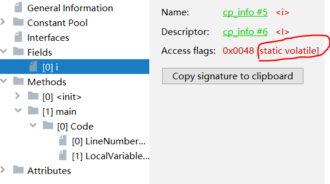jclasslib工具
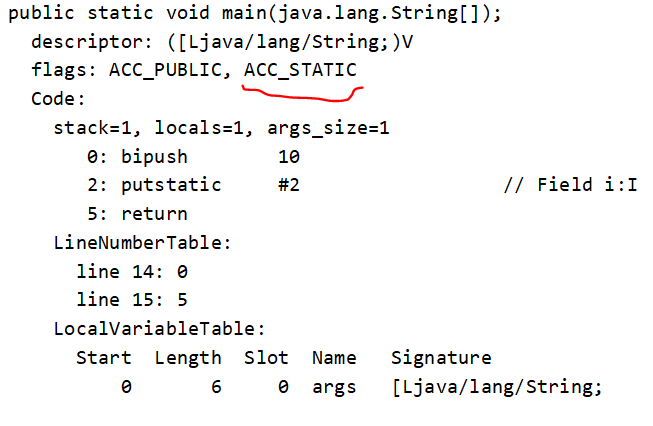javap命令
### jvm层面、内存屏障，汇编层面，lock指令
accessFlags.hpp文件

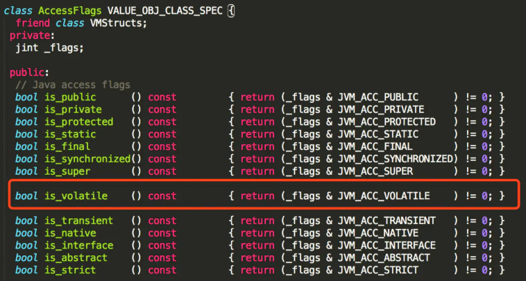

通过is_volatile()可以判断一个变量是否被volatile修饰，然后再全局搜"is_volatile"被使用的地方，
最后在bytecodeInterpreter.cpp文件中，找到putstatic字节码指令的解释器实现，里面有is_volatile()方法。

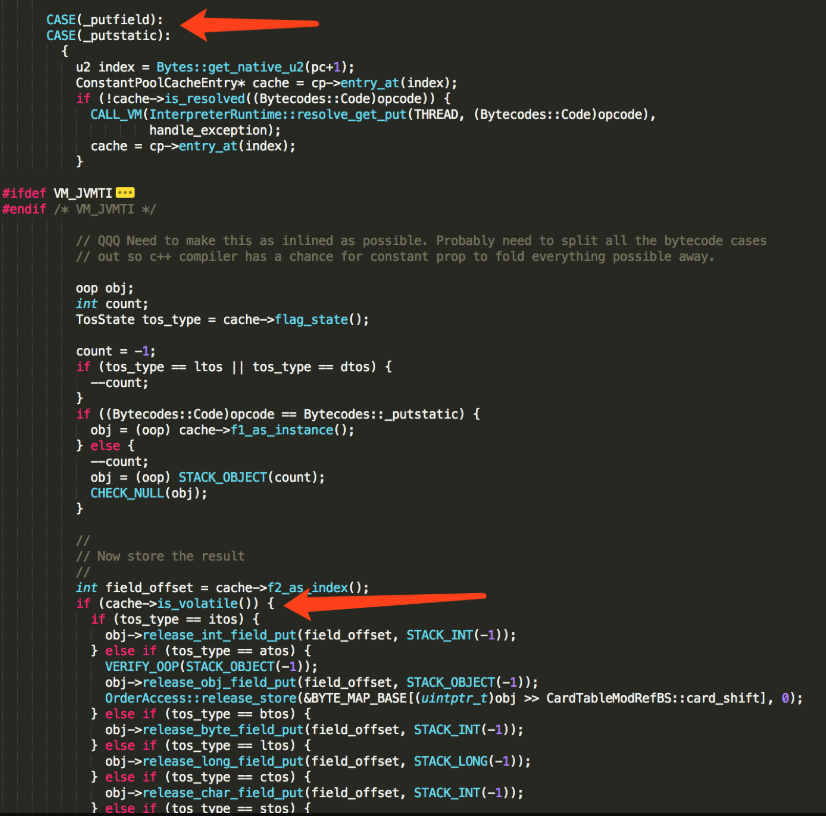

其中cache变量是java代码中变量i在常量池缓存中的一个实例，因为变量i被volatile修饰，所以cache->is_volatile()为真，
给变量i的赋值操作由release_int_field_put方法实现。

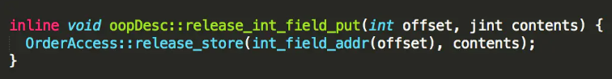
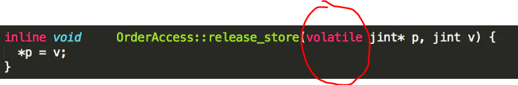

其中 jint* p指向的是java变量i（即p存放的是i的地址），而c++关键字volatile的作用同样是禁止指令优化（重排序），保持可见性。

这里我感觉原文说的有点混乱，忽略了c++ volatile这一层或者说与jvm中内联汇编代码混为一谈了。以下给出我的看法。
1. release_store**方法内**的指针p，使用了volatile修饰，其实只起到了防止重排序的作用，因为它是线程私有的，
每个线程执行到这个函数时，都会拷贝一个形参p（指向变量i）。
2. 这个时候对i的赋值只是写到了各自的缓存。
3. 赋值后插入一个storeload内存屏障，

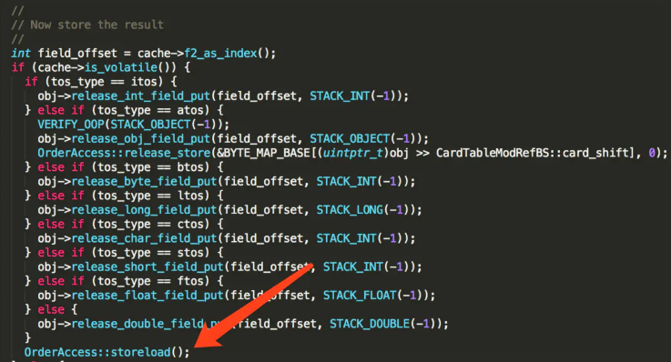
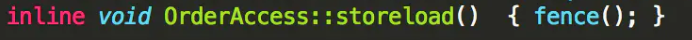
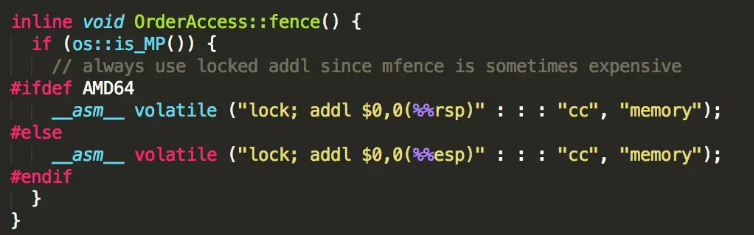

lock指令可以禁止两端指令重排序，同时将缓存中的数据立即写回主存（保留观点），写的时候禁止别人访问该缓存行（或者锁定总线），
这个时候其他cpu会嗅探（如上），当自己写完之后，会重新从主存中加载值。
### 完整的内存屏障，都有防止指令重排序的作用
保守策略下：
1. 在每个volatile写操作的前面插入一个StoreStore屏障。
2. 在每个volatile写操作的后面插入一个StoreLoad屏障。//将数据写回，重新从主存中读取
3. 在每个volatile读操作的前面插入一个LoadLoad屏障。//相当于只有指令重排序的作用
4. 在每个volatile读操作的后面插入一个LoadStore屏障。
很多时候编译器也可以删除某些屏障，但不会删除StoreLoad。
## Synchronized
## 应用
多线程之间的通信，同步。
### java层面 synchronized关键字
synchronized对象
```java
public class SynchronizedTest {

    public static void main(String[] args) {
        SynchronizedTest o=new SynchronizedTest();
        synchronized (o){}//这个对象可以是普通对象，也可以是Class对象，如synchronized(SynchronizedTest.class)，一样的
    }
}
```
synchronized加在方法上
```java
public class SynchronizedTest {

    public synchronized void synchronizedMember(){//加在静态方法上也一样
        int i=1;
    }
}
```
### 字节码层面
synchronized对象

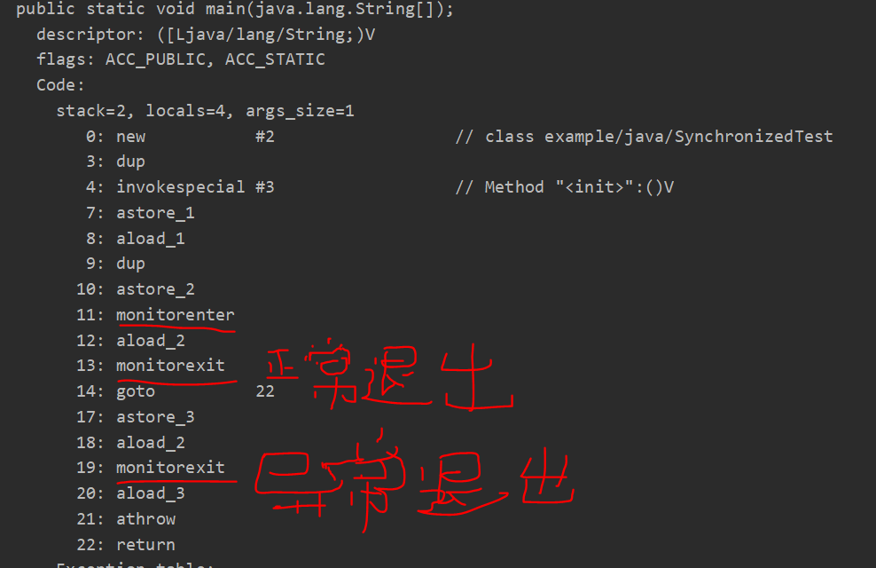

synchronized加在方法上

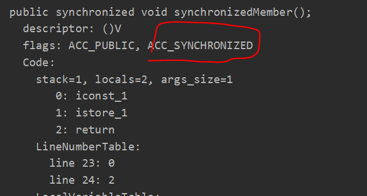
### jvm层面、内存屏障，汇编层面，lock指令
#### synchronized的可见性由内存屏障提供

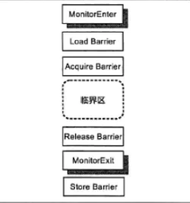

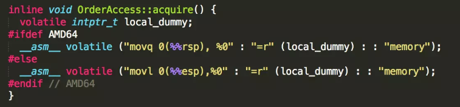
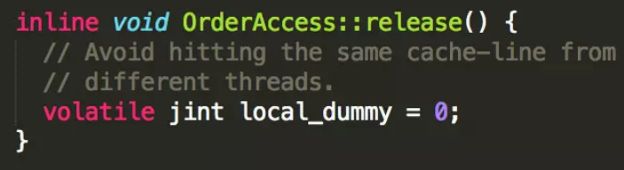

疑问：这里所说的避免多个线程命中同一行缓存究竟是什么意思？难道真的正如下面 **MESI与CAS** 所说，所谓的将数据写回主存只不过是在自己
的缓存修改，改变自己缓存的状态，然后发出invlidate信号交给总线去裁定是否可以将其他cpu的缓存行置为无效？

1. 在进入同步区域前，清空给缓存中的共享变量。acquire
2. 同步区域内要读取共享变量时从主存中读取。
3. 同步区域内是可以进行重排序的。（所以double-check要使用volatile变量来做判断，否则线程可能会拿到半初始化状态的对象）
4. 在离开同步区域时，将数据写回主存。release
#### 轻量级锁cas自旋阶段有用到lock cmpxchg指令
### 锁升级
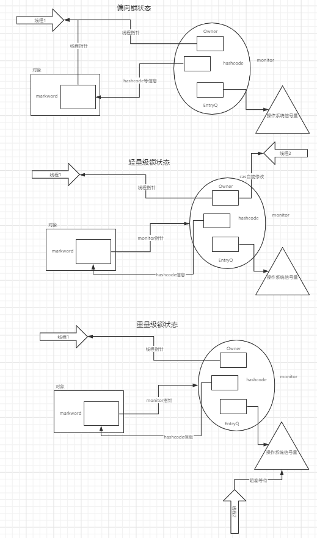
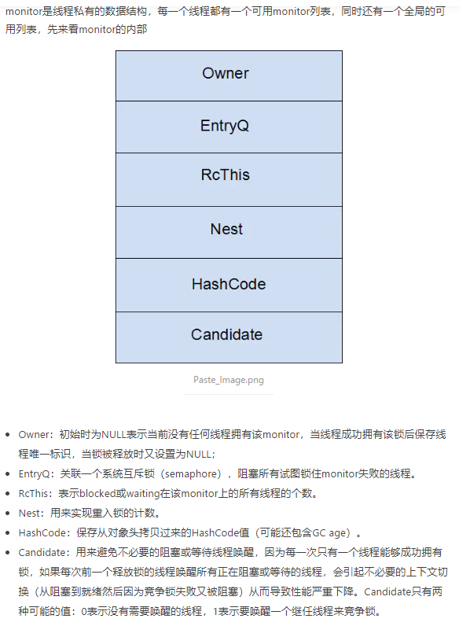

java对象头（64位机中）包括，类型（Klass）指针4B，markword 8B，实例数据（如果是引用那么存放的是oop普通对象指针，压缩前占8B，
压缩后占4B，如果是基本类型数据...），对齐填充（保证被8整除）。其中markword如下：
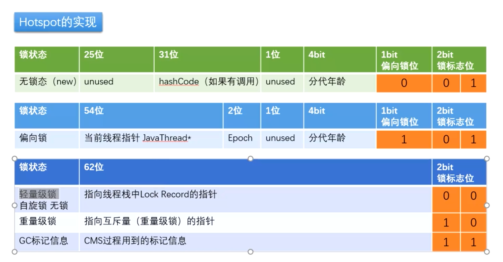

这个过程其实是可以类比自适应自旋的ReentrantLock的。

线程A在进入同步区域前先获得锁，离开后释放锁，在这过程之中，如果有线程B来竞争锁，那么在下一个SafePoint（用户线程静止）的时候，
如果此时线程A还没有释放锁，那么锁升级为轻量级锁（cas自旋）。

重量级锁情况下：当多个线程同时访问一段同步代码时，首先会进入_EntryList队列中，当某个线程获取到对象的monitor后进入_Owner区域
并把monitor中的_owner变量设置为当前线程，同时monitor中的计数器_count加1，若线程调用wait()方法，将释放当前持有的monitor，
_owner变量恢复为null，_count自减1，同时该线程进入_WaitSet集合中等待被唤醒。若当前线程执行完毕也将释放monitor(锁)并复位变量的值，
以便其他线程进入获取monitor(锁)。如下图所示
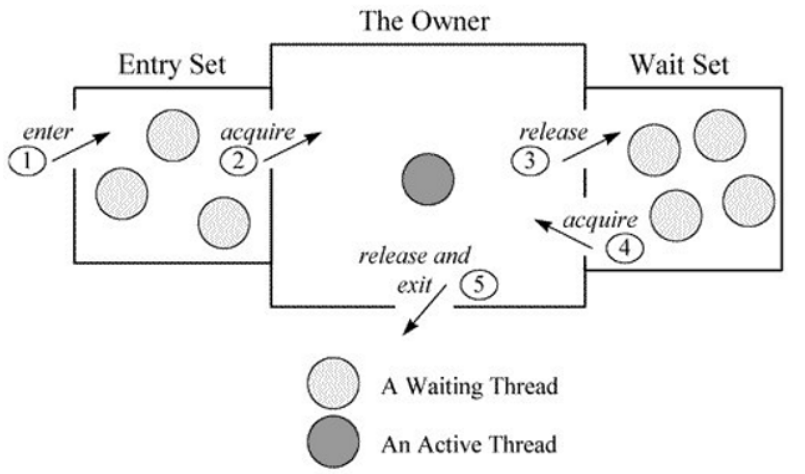
### 其他的锁优化
1. 自旋与自适应自旋：
如果持有锁的线程能在很短时间内释放锁资源，就可以让线程执行一个忙循环（自旋），等持有锁的线程释放锁后即可立即获取锁，
这样就避免用户线程和内核的切换的消耗。但是线程自旋需要消耗cpu的资源，如果一直得不到锁就会浪费cpu资源。
因此在jdk1.6引入了自适应自旋锁，自旋等待的时候不固定，而是由前一次在同一个锁上的自旋时间及锁的拥有者的状态来决定。
2. 锁消除:
锁消除是指虚拟机即时编译器在运行时，对于一些代码上要求同步但是被检测不可能存在共享数据竞争的锁进行消除。例如String类型的连接操作，
String是一个不可变对象，字符串的连接操作总是通过生成新的String对象来进行的，Javac编译器会对String连接做自动优化，
在JDK1.5的版本中使用的是StringBuffer对象的append操作，StringBuffer的append方法是同步方法，
这段代码在经过即时编译器编译之后就会忽略掉所有的同步直接执行。
在JDK1.5之后是使用的StringBuilder对象的append操作来优化字符串连接的。
3. 锁粗化:
将多次连接在一起的加锁、解锁操作合并为一次，将多个连续的锁扩展成一个范围更大的锁。例如每次调用StringBuffer.append方法都需要加锁，
如果虚拟机检测到有一系列的连续操作都是对同一个对象反复加锁和解锁，就会将其合并成一个更大范围的加锁和解锁操作，
如for循环内的加锁操作将会合并加到for循环外。

## cas
汇编指令lock cmpxchg，让比较并交换成一个原子操作。
### Unsafe类
### 原子变量与ABA问题
```java
public class CASAndABATest {

    public static void main(String[] args) {
        AtomicInteger i=new AtomicInteger(10);
        i.compareAndSet(10,11);//ABA问题

        //知道期间变化过，但不知道变化了多少次，其实是原子性地比较两个变量，比较值，比较版本
        AtomicMarkableReference<Integer> mi=new AtomicMarkableReference<>(1,false);
        mi.compareAndSet(1,2,false,true);

        //知道期间变化了多少次
        AtomicStampedReference<Integer> si=new AtomicStampedReference<>(3,0);
        si.compareAndSet(3,4,0,1);
    }
}
```
## 组合应用
一般组合使用方式为：volatile变量，原子变量，阻塞队列（并发队列），例如线程池。
## hapens-before原则
在不影响**单线程**执行的语义下，编译器，cpu会将指令优化、重排序。
而不同线程之间的操作则是没有happens before关系的，除非有volatile或者synchronized等带有跨线程（跨cpu）happen before关系的操作。
不同线程之间的非volatile、非synchronized操作直接要想有传递的happens before关系的话，
中间就肯定得有能产生happens before关系的volatile或者synchronized操作。
## 读写缓冲区与重排序
现代的处理器使用写缓冲区临时保存向内存写入的数据。写缓冲区可以保证指令流水线
持续运行，它可以避免由于处理器停顿下来等待向内存写入数据而产生的延迟。同时，通过以
批处理的方式刷新写缓冲区，以及合并写缓冲区中对同一内存地址的多次写，减少对内存总
线的占用。
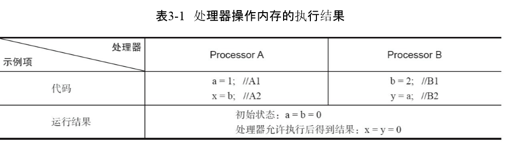
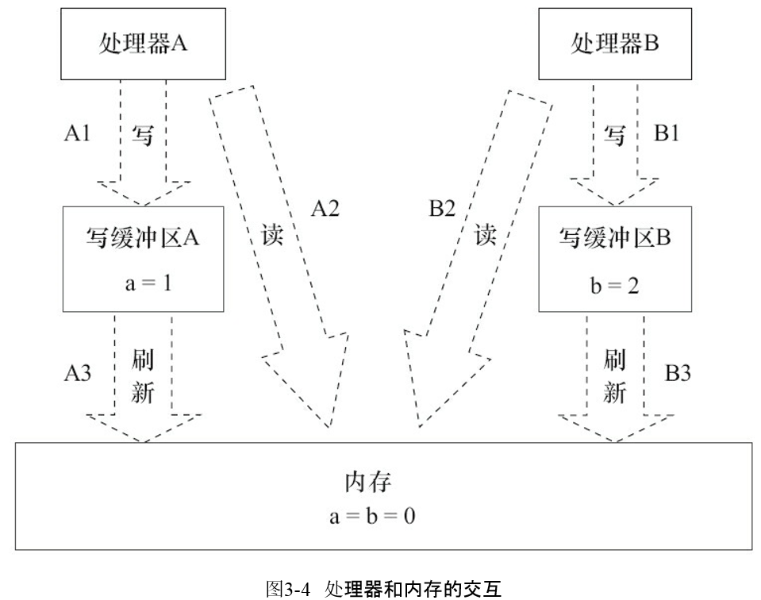

常见的处理器都允许Store-Load重排序；常见的处理器都不允许对 存在数据依赖的操作做重排序
## MESI
### 锁总线
1. Lock前缀指令的实现最终都会引起处理器缓存回写到内存，但在实现数据一致方面却可能有一定差异
2. Lock前缀指令导致在执行指令期间，声言处理器的 LOCK# 信号。多处理器环境中，LOCK# 信号确保声言期间，处理器可独占使用任何共享内存。
它会锁住总线，导致其他CPU不能访问总线，不能访问总线就意味着不能访问系统内存，但是在最近的处理器里，LOCK＃信号一般不锁总线，
而是锁缓存，毕竟锁总线开销比较大
3. 对于Intel486和Pentium处理器，在锁操作时，总是在总线上声言LOCK#信号。
### 缓存行状态
1. x86架构的每个缓存块的大小为64 bytes，称为缓存行（ cache-line，引出缓存行对齐的问题）。其它种类的处理器的缓存行大小可能不同。
更大的缓存行容量降低延迟，但是需要更大的带宽。
2. MESI 是指4中状态的首字母。每个缓存行有4个状态，可用2个字节表示，它们分别是：

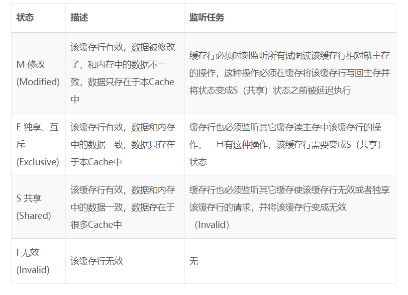
1. MESI要求cpu间协同工作，关键在于一个处理器写缓存时可以让另一个cpu的缓存无效，缓存写入内存后还可以进行数据同步
2. 例，假设有三个CPU A、B、C，对应三个缓存分别是cache a、b、 c。在主内存中定义了x的引用值为0
```java
读取缓存：
CPU A发出了一条指令，从主内存中读取x。
CPU A从主内存通过bus读取到 cache a中并将该cache line 设置为E状态。
CPU B发出了一条指令，从主内存中读取x。
CPU B试图从主内存中读取x时，CPU A检测到了地址冲突。这时CPU A对相关数据做出响应。此时x 存储于cache a和cache b中，x在chche a和cache b中都被设置为S状态(共享)

修改数据：
CPU A 计算完成后发指令需要修改x.
CPU A 将x设置为M状态（修改）并通知缓存了x的CPU B, CPU B将本地cache b中的x设置为I状态(无效)
CPU A 对x进行赋值

同步数据
CPU B 发出了要读取x的指令。
CPU B 通知CPU A,CPU A将修改后的数据同步到主内存时cache a 修改为E（独享）
CPU A同步CPU B的x,将cache a和同步后cache b中的x设置为S状态（共享）
```
### MESI与CAS的关系（synchronized轻量级锁的阶段也有cas自旋）
在x86架构上，CAS被翻译为”lock cmpxchg...“，当两个core同时执行针对同一地址的CAS指令时,
其实他们是在试图修改每个core自己持有的Cache line。

假设两个core都持有相同地址对应cacheline,且各自cacheline 状态为S, 这时如果要想成功修改,就首先需要把S转为E或者M, 
则需要向其它core invalidate 这个地址的cacheline,则两个core都会向ring bus发出 invalidate这个操作, 
那么在ringbus上就会根据特定的设计协议仲裁是core0,还是core1能赢得这个invalidate, 胜者完成操作, 失败者需要接受结果, 
invalidate自己对应的cacheline,再读取胜者修改后的值, 回到起点.

对于我们的CAS操作来说, 其实锁并没有消失,只是转嫁到了ring bus的总线仲裁协议中. 
而且大量的多核同时针对一个地址的CAS操作会引起反复的互相invalidate 同一cacheline, 造成pingpong效应, 同样会降低性能。
当然如果真的有性能问题，我觉得这可能会在ns级别体现了,一般的应用程序中使用CAS应该不会引起性能问题。
## 缓存行
###伪共享
cpu的缓存是以块为单位的，一块（一行）一般为64字节。

```java
public class FalseSharingWithPadding { 
    public volatile long x; 
    public volatile long y; 
}
```
按照缓存一致性协议，假如线程1要不断地修改当中的x，线程2要不断地修改当中的y，那么很可能就会发生这样的情况，它们位于各自cpu中同一行，
它们相互执行完都会让对方的缓存行失效，不断地从主存中从新加载。但其实，修改的变量并不相同（共享了这一缓存行，事实上并不需要，
称此伪共享）。

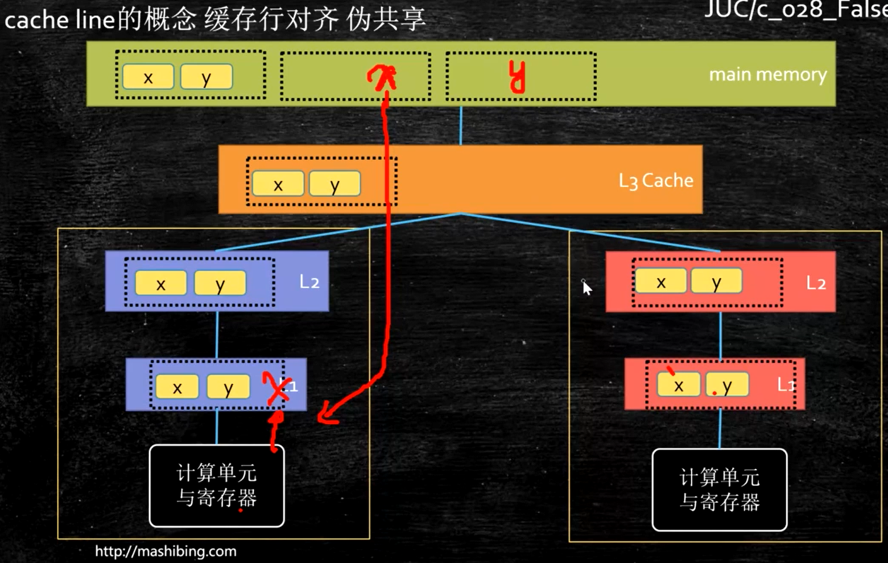

由此有了以下的解决方案：
```java
public class FalseSharingWithPadding { 
//加64字节的对齐，使其尽量位于不同的缓存行
    public volatile long x; 
    public volatile long p2;   // padding 
    public volatile long p3;   // padding 
    public volatile long p4;   // padding 
    public volatile long p5;   // padding 
    public volatile long p6;   // padding 
    public volatile long p7;   // padding 
    public volatile long p8;   // padding 
    public volatile long v1; 
}
```
让x，y大概率地位于不同的缓存行（可能会有编译器的优化），它们向相互执行完不会让对方的缓存行失效。
### 合并写技术 100x8不一定等于100x4x2 减少对内存总线的占用
意思是在一段循环中，合计要写入8字节，循环100次，可能分为两次循环执行效率更高，循环中写入4字节。
因为cpu一般凑够8字节才会写回主存，而前面凑够4字节后面的要等cpu写回主存，后者不用等。