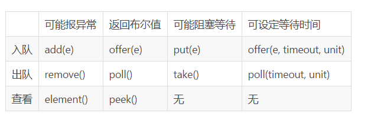

# Concurrent容器
并发容器或者锁都是基于AQS（AbstractQueuedSynchronizer）来实现的，
如常用的ReentrantLock（Condition，Semaphore，ReentrantReadWriteLock）、
CountDownLatch、CyclicBarrier、ArrayBlockingQueue、LinkedBlockingQueue、ConcurrentLinkedQueue、
DelayQueue延时队列、SynchronousQueue同步队列（put时阻塞直至被消费）。

用于并发的其实还有，ConcurrentHashMap，CopyOnWriteArrayList写时复制容器。
## AQS
AQS也是基于cas,用到了模板方法的设计模式。内部维护一个双向链表，目的是为了double-check，当某一节点的field出现null时，
可以从尾往前找。
## 最佳实践
### ReentrantLock
参考我的博客：https://www.cnblogs.com/AllenDuke/p/12272605.html

我利用原子变量（用于cas），ThreadLocal变量（用于自适应自旋，ReentrantLock中是没有自旋的），ConcurrentLinkedQueue（用于自旋失败
后并发入队），实现了一个可以简单自适应自旋的ReentrantLock（非公平），步骤基本一致，只是增加了自适应自旋。
```java
    volatile static int i=0;//i=0为空，i=10为满

    public static void reentrantLock(){
        ReentrantLock lock=new ReentrantLock();
        Condition notEmpty=lock.newCondition();
        Condition notFull=lock.newCondition();
        new Thread(()->{
            lock.lock();
            for(;;){
                if(i==10){
                    System.out.println("已满，生产者暂停工作");
                    notEmpty.signalAll();
                    try {
                        notFull.await();
                    } catch (InterruptedException e) {
                        e.printStackTrace();
                    }
                }else i++;
            }
        }).start();
        new Thread(()->{
            lock.lock();
            for(;;){
                if(i==0){
                    System.out.println("已空，消费者暂停工作");
                    notFull.signalAll();
                    try {
                        notEmpty.await();
                    } catch (InterruptedException e) {
                        e.printStackTrace();
                    }
                }else i--;
            }
        }).start();
    }
```
#### 加锁过程
如果是第一个线程tf，那么和队列无关，线程直接持有锁。并且也不会初始化队列，如果接下来的线程都是交替执行，那么永远和AQS队列无关，
都是直接线程持有锁，如果发生了竞争，比如tf持有锁的过程中T2来lock，那么这个时候就会初始化AQS，
初始化AQS的时候会在队列的头部虚拟一个Thread为NULL的Node，因为队列当中的head永远是持有锁的那个node（除了第一次会虚拟一个，
其他时候都是持有锁的那个线程锁封装的node），现在第一次的时候持有锁的是tf而tf不在队列当中所以虚拟了一个node节点，
队列当中的除了head之外的所有的node都在park，当tf释放锁之后unpark某个（基本是队列当中的第二个，为什么是第二个呢？
前面说过head永远是持有锁的那个node，当有时候也不会是第二个，比如第二个被cancel之后，至于为什么会被cancel，不在我们讨论范围之内，
cancel的条件很苛刻，基本不会发生）node之后，node被唤醒，假设node是t2，那么这个时候会首先把t2变成head（sethead），
在sethead方法里面会把t2代表的node设置为head，并且把node的Thread设置为null，为什么需要设置null？其实原因很简单，
现在t2已经拿到锁了，node就不要排队了，那么node对Thread的引用就没有意义了。所以队列的head里面的Thread永远为null。
#### 来历
java1.6前，同步靠synchornize关键字，但这是一个重量级锁（等待与持有之间会发生阻塞与运行的状态切换，花费大量资源），
于是有了后来基于cas的可重入锁，但线程不能盲目cas自旋，若失败应该阻塞，放弃cpu资源，于是有了park,unpark。
ReentrantLock与synchornize关键字作用十分相似，差别在于，在会发生线程竞争的模型中，其实很多时候竞争都不激烈（但仍需要保证同步），
而ReentrantLock在不发生竞争时，是不需要发生状态切换的。
### CountDownLatch
```java
    public static void countdownlatch(){
        CountDownLatch countDownLatch=new CountDownLatch(5);//不可重用
        for (int i = 0; i < 6; i++) {
            new Thread(()->{
                countDownLatch.countDown();//最低减到0，因为内部发现当前是0后直接返回
            }).start();
        }
        try {
            countDownLatch.await();//调用后等待减0
        } catch (InterruptedException e) {
            e.printStackTrace();
        }
    }
```
### CyclicBarrier
```java
    public static void cyclicbarrier(){
        CyclicBarrier cyclicBarrier=new CyclicBarrier(5);//相当于栅栏，可重用
        for (int i = 0; i < 4; i++) {
            new Thread(()->{
                try {
                    System.out.println(Thread.currentThread().getName() + " is ready");
                    /**
                     * 先原子性-1，再判断是否为0，是则5个人去cas地把state设回5，接着往下执行，不是就自旋，
                     * 当最后一个人到达时唤醒全部，CyclicBarrier进入下一代。
                     */
                    cyclicBarrier.await();
                    Random random =new Random();
                    double time = random.nextDouble() + 9;
                    System.out.println(Thread.currentThread().getName() + ": "+ time);
                } catch (InterruptedException e) {
                    e.printStackTrace();
                } catch (BrokenBarrierException e) {
                    e.printStackTrace();
                }
            }).start();
        }
    }
```
### ReentrantReadWriteLock 可由此联想到MySQL事务与锁的关系
```java
    public static void reentrantreadwritelock() throws InterruptedException {
        /**
         * 读写锁
         * 读读共享
         * 读写互斥
         * 写写互斥
         */
        ReentrantReadWriteLock lock=new ReentrantReadWriteLock();

//        lock.readLock().lock();//在要去获得写锁时，要写释放已获得的读锁，否则死锁
//        lock.writeLock().lock();

//        lock.writeLock().lock();//在已获得写锁时，可以继续去获得读锁
//        lock.readLock().lock();

        //当获得写锁后，其他线程不可读（MySQL利用MVCC解决这个问题）
        new Thread(()->{
            lock.writeLock().lock();
            System.out.println("写锁获得");
            try {
                Thread.sleep(3000);
            } catch (InterruptedException e) {
                e.printStackTrace();
            }
            lock.writeLock().unlock();
            System.out.println("写锁释放");
        }).start();
        Thread.sleep(1000);//先让写锁获得
        new Thread(()->{
            lock.readLock().lock();
            System.out.println("读锁获得");
            lock.readLock().unlock();
            System.out.println("读锁释放");
        }).start();

        //当获得读锁后，其他线程不可写（MVCC快照读不加锁）
        new Thread(()->{
            lock.readLock().lock();
            System.out.println("读锁获得");
            try {
                Thread.sleep(3000);
            } catch (InterruptedException e) {
                e.printStackTrace();
            }
            System.out.println("读锁释放");
            lock.readLock().unlock();
        }).start();
        Thread.sleep(1000);//先让读锁获得
        new Thread(()->{
            lock.writeLock().lock();
            System.out.println("写锁获得");
            System.out.println("写锁释放");
            lock.writeLock().unlock();
        }).start();
    }
```
### 并发队列
1. ArrayBlockingQueue中生产者与消费者共用同一把锁，不能同时工作，阻塞。内部使用一个ReentrantLock。
2. LinedBlockingQueue中生产者与消费者有各自的锁，可以同时工作，阻塞。内部使用两个ReentrantLock。
3. ConcurrentLinkedQueue不阻塞。利用cas自旋来设值。



记得有这么回事就可以了，在用的时候可以看一下api。
### 公平锁与非公平锁
公平锁
```java
 protected final boolean tryAcquire(int acquires) {
            final Thread current = Thread.currentThread();
            int c = getState();
            if (c == 0) {
                // !hasQueuedPredecessors()保证了不论是新的线程还是已经排队的线程都顺序使用锁
                if (!hasQueuedPredecessors() &&
                    compareAndSetState(0, acquires)) {
                    setExclusiveOwnerThread(current);
                    return true;
                }
            }
            else if (current == getExclusiveOwnerThread()) {
                int nextc = c + acquires;
                if (nextc < 0)
                    throw new Error("Maximum lock count exceeded");
                setState(nextc);
                return true;
            }
            return false;
        }
```
公平锁中，若有队伍，则新线程必须入队。

非公平锁
```java
final boolean nonfairTryAcquire(int acquires) {
            final Thread current = Thread.currentThread();
            int c = getState();
            if (c == 0) {
                // 新的线程可能抢占已经排队的线程的锁的使用权
                if (compareAndSetState(0, acquires)) {
                    setExclusiveOwnerThread(current);
                    return true;
                }
            }
            else if (current == getExclusiveOwnerThread()) {
                int nextc = c + acquires;
                if (nextc < 0) // overflow
                    throw new Error("Maximum lock count exceeded");
                setState(nextc);
                return true;
            }
            return false;
        }
```
非公平锁中，若新线程进来的时候碰巧遇到锁释放，则新线程直接持有锁，否则进队伍。

入队后，公平与非公平无二。
### park与unpark
unpark函数可以先于park调用。比如线程B调用unpark函数，给线程A发了一个“许可”，那么当线程A调用park时，它发现已经有“许可”了，
那么它会马上再继续运行。

当调用park时，先尝试直接能否直接拿到“许可”，即_counter>0时，如果成功，则把_counter设置为0,并返回：如果不成功，
则构造一个ThreadBlockInVM，然后检查_counter是不是>0，如果是，则把_counter设置为0，unlock mutex并返回：否则，再判断等待的时间，
然后再调用pthread_cond_wait函数等待，如果等待返回，则把_counter设置为0，unlock mutex并返回。

当unpark时，则简单多了，直接设置_counter为1，再unlock mutext返回。如果_counter之前的值是0，
则还要调用pthread_cond_signal唤醒在park中等待的线程：

LockSupport.park()和unpark()和object.wait()和notify()很相似，那么它们有什么区别呢？
1. 面向的主体不一样。LockSuport主要是针对Thread进进行阻塞处理，可以指定阻塞队列的目标对象，每次可以指定具体的线程唤醒。Object.wait()是以对象为纬度，阻塞当前的线程和唤醒单个(随机)或者所有线程。
2. 实现机制不同。虽然LockSuport可以指定monitor的object对象，但和object.wait()，两者的阻塞队列并不交叉。可以看下测试例子。object.notifyAll()不能唤醒LockSupport
的阻塞Thread.
3. ff中断的时候park不会抛出InterruptedException异常，所以需要在park之后自行判断中断状态，然后做额外的处理。
### 线程池
参考我的博客：https://www.cnblogs.com/AllenDuke/p/12292358.html

我利用原子变量（用于cas），ConcurrentLinkedQueue（任务并发入队），实现了一个可以线程池，步骤基本一致，
较为不同的有两点：
1. 我用的是ConcurrentLinkedQueue，而原生的用BlockingQueue。
2. 因为不会阻塞，线程会空闲自旋，我让任务优先分配给空闲线程。
#### 参数
1. 核心线程数
2. 最大线程数
3. 空闲时长
4. 阻塞队列
5. 拒绝策略（提供有：1.抛弃任务，抛出异常。2.抛弃任务，不抛异常。3.丢弃任务队列中的队头，加入当前任务。4.任务由调用者线程处理）
#### 执行过程
1. 先由核心线程处理。
2. 如果核心线程在忙，那么进入队列（线程完成一个任务后会从队列中拿取）。
3. 如果队列已满，但还没达最大线程数，那么新建线程来处理。
4. 如果已达最大线程数，那么执行拒绝策略（默认为抛弃任务，抛出异常）。
5. 非核心线程空闲一定时间后消亡。
## ConcurrentHashMap
### 源码分析
putVal方法
```java
final V putVal(K key, V value, boolean onlyIfAbsent) {
        if (key == null || value == null) throw new NullPointerException();
        int hash = spread(key.hashCode());
        int binCount = 0;
        for (Node<K,V>[] tab = table;;) {//注意这里是循环
            Node<K,V> f; int n, i, fh;
            if (tab == null || (n = tab.length) == 0)//如果还没初始化
                tab = initTable();//初始化
            else if ((f = tabAt(tab, i = (n - 1) & hash)) == null) {//如果对应下标为null
                if (casTabAt(tab, i, null,
                             new Node<K,V>(hash, key, value, null)))//直接cas放置
                    break;                   // no lock when adding to empty bin
            }
            else if ((fh = f.hash) == MOVED)//如果发现正在扩容
                tab = helpTransfer(tab, f);//帮助扩容，扩容后进入下一个循环再来判断
            else {//找到了对应桶
                V oldVal = null;
                synchronized (f) {//这里锁住了对应的桶，所以下面的赋值不用cas
                    if (tabAt(tab, i) == f) {
                        if (fh >= 0) {
                            binCount = 1;
                            for (Node<K,V> e = f;; ++binCount) {//循环找到链表末尾
                                K ek;
                                if (e.hash == hash &&
                                    ((ek = e.key) == key ||
                                     (ek != null && key.equals(ek)))) {
                                    oldVal = e.val;
                                    if (!onlyIfAbsent)
                                        e.val = value;
                                    break;
                                }
                                Node<K,V> pred = e;
                                if ((e = e.next) == null) {
                                    pred.next = new Node<K,V>(hash, key,
                                                              value, null);
                                    break;
                                }
                            }
                        }
                        else if (f instanceof TreeBin) {
                            Node<K,V> p;
                            binCount = 2;
                            if ((p = ((TreeBin<K,V>)f).putTreeVal(hash, key,
                                                           value)) != null) {
                                oldVal = p.val;
                                if (!onlyIfAbsent)
                                    p.val = value;
                            }
                        }
                    }
                }
                if (binCount != 0) {
                    if (binCount >= TREEIFY_THRESHOLD)
                        treeifyBin(tab, i);
                    if (oldVal != null)
                        return oldVal;
                    break;
                }
            }
        }
        addCount(1L, binCount);
        return null;
    }
```
get方法
```java
    public V get(Object key) {
        Node<K,V>[] tab; Node<K,V> e, p; int n, eh; K ek;
        int h = spread(key.hashCode());
        if ((tab = table) != null && (n = tab.length) > 0 &&
            (e = tabAt(tab, (n - 1) & h)) != null) {
            if ((eh = e.hash) == h) {
                if ((ek = e.key) == key || (ek != null && key.equals(ek)))
                    return e.val;
            }
        //hash值为负值表示正在扩容，这个时候查的是ForwardingNode的find方法来定位到nextTable来
        //eh=-1，说明该节点是一个ForwardingNode，正在迁移，此时调用ForwardingNode的find方法去nextTable里找。
        //eh=-2，说明该节点是一个TreeBin，此时调用TreeBin的find方法遍历红黑树，由于红黑树有可能正在旋转变色，所以find里会有读写锁。
        //eh>=0，说明该节点下挂的是一个链表，直接遍历该链表即可。
            else if (eh < 0)
                return (p = e.find(h, key)) != null ? p.val : null;
            while ((e = e.next) != null) {
                if (e.hash == h &&
                    ((ek = e.key) == key || (ek != null && key.equals(ek))))
                    return e.val;
            }
        }
        return null;
    }
```
## CopyOnWriteArrayList
### 源码分析
add方法
```java
    public boolean add(E e) {
        final ReentrantLock lock = this.lock;
        lock.lock();//修改时加锁
        try {
            Object[] elements = getArray();
            int len = elements.length;
            Object[] newElements = Arrays.copyOf(elements, len + 1);//复制
            newElements[len] = e;
            setArray(newElements);//修改引用关系
            return true;
        } finally {
            lock.unlock();
        }
    }
```
get方法，有可能拿到旧数据
```java
    public E get(int index) {
        return get(getArray(), index);
    }

    private transient volatile Object[] array;

    final Object[] getArray() {
        return array;
    }

    private E get(Object[] a, int index) {
        return (E) a[index];
    }
```
## DelayQueue
在拿取时，要经延时时间后才能成功拿取到。

