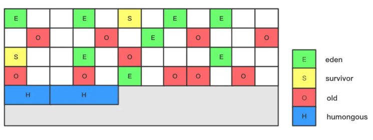
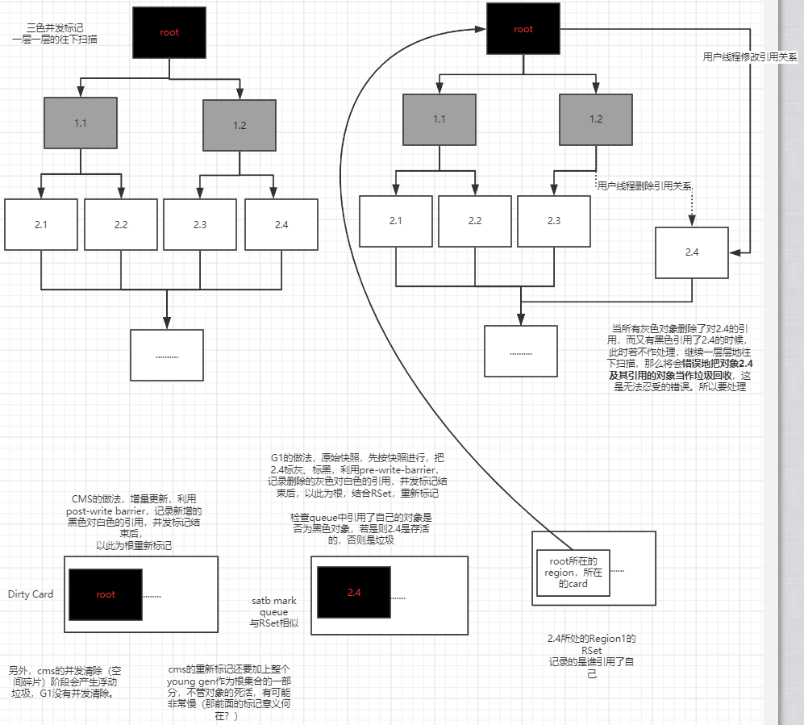
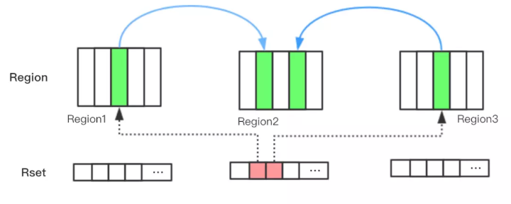
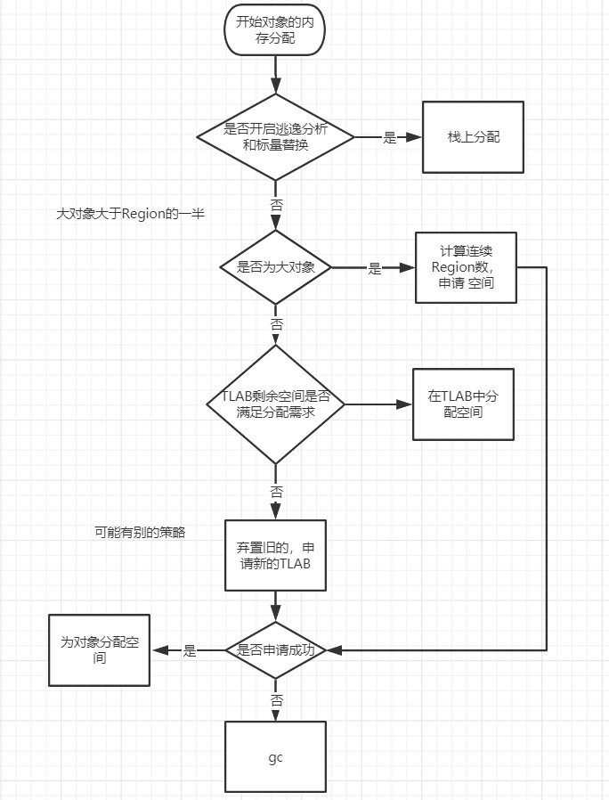
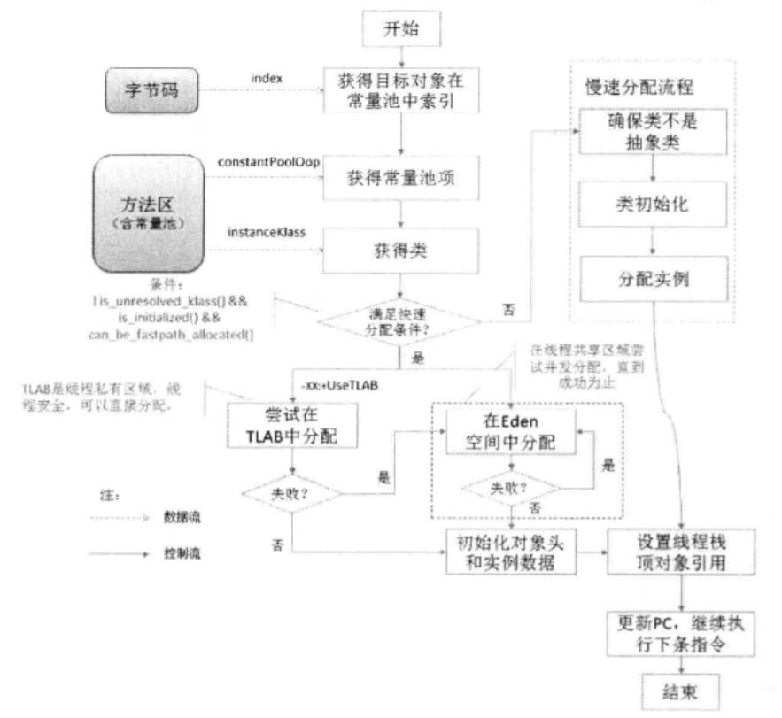

# GC
## 算法
1. 引用计数法。无法解决循环依赖的问题。
2. 根可达分析。当根对象出发，沿着引用链，标记活对象。gc root可以是以下对象：
   * 启动类加载器和扩展类加载器以及它们引用的对象。
   * 还活动的线程。
   * 虚拟机栈和本地方法栈上的局部变量。
   * 全局性的引用如常量和静态属性。
3. 分代算法，针对不同的年龄层，使用不同的算法。
## 分代模型
young : old = 1 : 2，在young中又分为eden : s0 : s1 = 8 : 1 : 1。

在young gc中使用的标记-复制算法，在复制的过程中s0、s1角色互换，每存活一次年龄+1，
当年龄达到15时（在markword中，分代年龄占4bit），对象移动到老年区（young gc中如果存活对象过多，s0或者s1装不下，那么会放到old区）。

大对象（超过s0/s1的一半）直接移动到老年区（g1中标记为H Region），因此在gc调优时要特别注意此种情形，
如果这种对象是朝生夕灭且数量大的话，而young gc又回收不到，进而发生频繁的full gc，导致STW过长。针对此种情形，可适当地把s0和s1调大。
## 垃圾收集器
1. 年轻代串行收集器
2. 年轻代并行收集器
3. 老年代串行收集器
4. 老年代并行收集器
5. cms
6. g1
## g1
参考自：https://www.jianshu.com/p/0f1f5adffdc1

G1 GC提出了不确定性Region，每个空闲 Region 不是为某个固定年代准备的，它是灵活的，需求驱动的。
### 堆内存结构


每个Region（1MB~32MB）被标记了E、S、O和H，说明每个Region在运行时都充当了一种角色，其中H是以往算法中没有的，它代表Humongous，
这表示这些Region存储的是巨型对象（humongous object，H-obj），当新建对象大小超过Region大小一半时，
直接在新的一个或多个连续Region中分配，并标记为H。
### gc模式
#### 标记周期
1. initial mark: 初始标记过程，STW，标记了从GC Root可达的对象
2. concurrent marking: 并发标记过程，整个过程gc collector线程与应用线程可以并行执行，标记出GC Root可达对象衍生出去的存活对象，
并收集各个Region的存活对象信息
3. remark: 最终标记过程，整个过程STW，标记出那些在并发标记过程中遗漏的，或者内部引用发生变化的对象
4. clean up: 垃圾清除过程，STW，如果发现一个Region中没有存活对象，则把该Region加入到空闲列表中。
   * cms中为并发清理，因而会有浮动垃圾的问题。
5. 注意：这个时候才开始young gc去复制存活对象或者出发mix gc。
#### young gc 标记——复制
发生在年轻代的GC算法，一般对象（除了巨型对象）都是在eden region中分配内存，当所有eden region被耗尽无法申请内存时，
就会触发一次young gc，这种触发机制和之前的young gc差不多，执行完一次young gc，
活跃对象会被拷贝到survivor region或者晋升到old region中，空闲的region会被放入空闲列表中，等待下次被使用。
#### mixed gc
当越来越多的对象晋升到老年代old region时，为了避免堆内存被耗尽，虚拟机会触发一个混合的垃圾收集器，即mixed gc，
该算法并不是一个old gc，除了回收整个young region，还会回收一部分的old region，这里需要注意：是**一部分老年代**，
而不是全部老年代，可以选择哪些old region进行收集，从而可以对垃圾回收的耗时时间进行控制。

那么mixed gc什么时候被触发？

先回顾一下cms的触发机制，如果添加了以下参数：
```java
-XX:CMSInitiatingOccupancyFraction=80 
-XX:+UseCMSInitiatingOccupancyOnly
```
当老年代的使用率达到80%时，就会触发一次cms gc。相对的，mixed gc中也有一个阈值参数 -XX:InitiatingHeapOccupancyPercent，
当老年代大小占整个堆大小百分比达到该阈值时，会触发一次mixed gc.
#### full gc 标记——整理（标记——清除——压缩）
如果对象内存分配速度过快，mixed gc来不及回收，导致老年代被填满，就会触发一次full gc，
G1的full gc算法就是单线程执行的serial old gc，会导致异常长时间的暂停时间，需要进行不断的调优，尽可能的避免full gc.
### 三色标记法 并发收集

### RSet


记录的是谁引用了自己，old->young，old->old，用于辅助gc，如何辅助？主要是用来更新引用信息的，young Region内部的存活对象
被移走之后（复制到S区）， 根据原RSet中指向自己的老年代引用来找到老年代对象，然后更新指向到新的Region（S区）。
### Rset实现原理
在对象引用赋值的时候，插入屏障，做下记录。
### CSet Collection Set
当真正开始gc的时候，如young gc，会把CSet里的Region里的对象复制到S区。
### TLAB
TLAB(Thread Local Alloc Buffer)线程本地分配缓冲区，我们知道线程在新建对象时，要从堆中申请一块内存，在并发时，
要防止别的线程申请到同一块内存，所以要同步。为了避免这种大量的同步，在线程新建时，便分配给线程一块本地分配缓冲区，
线程可直接在把对象存放在本地分配缓冲区中（依然是共享的，只是解决申请内存时的冲突），当TLAB满了的时候，再另有机制。
所以，实际上TLAB的分配同样是需要同步的，不能把同一缓冲区分配给了不同的线程。
### 对象内存分配过程




栈上分配依靠逃逸分析(默认开启)，如果一个对象不会在方法内逃逸（不会共享），那么对象会被打散成基本的数据然后在栈上分配空间。
### 栈上分配事例
```java
/**
 * @author 杜科
 * @description 测试栈上分配
 * -server -Xmx15m -Xms15m -XX:+DoEscapeAnalysis -XX:+PrintGC -XX:-UseTLAB -XX:+EliminateAllocations
 * -Xmx15m -Xms15m 限定最大最小，防止分配堆内存时跳动
 * DoEscapeAnalysis 逃逸分析
 * EliminateAllocations 标量替换
 * 不开启的话将发生大量GC
 * @contact AllenDuke@163.com
 * @date 2020/3/16
 */
public class AllocateOnStackTest {

    public static void main(String[] args) {
        for(int i=0;i<1000000000;i++){
            new User();
        }
    }
}
```
## 垃圾收集器的选用
吞吐量：运行用户代码时间／（运行用户代码时间＋垃圾回收时间）

1. 吞吐量优先的并行收集器（减少垃圾收集时间）
2. 响应时间优先的并发收集器（尽量让用户线程在垃圾收集的过程中也能运行，响应用户的操作）