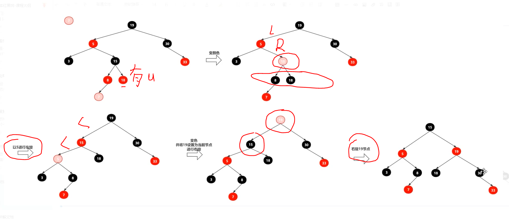

# 高级数据结构

## 红黑树

### 简介
一种二叉查找树，但在每个节点增加一个存储位表示节点的颜色，可以是红或黑（非红即黑）。
通过对任何一条从根到叶子的路径上各个节点着色的方式的限制，红黑树确保没有一条路径会比其它路径长出两倍，因此，
红黑树是一种弱平衡二叉树（由于是弱平衡，可以看到，在相同的节点情况下，AVL树的高度低于红黑树），相对于要求严格的AVL树来说，
它的旋转次数少，所以对于搜索，插入，删除操作较多的情况下，我们就用红黑树。

###性质

1. 每个节点非红即黑
2. 根节点是黑的;
3. 每个叶节点（叶节点即树尾端NULL指针或NULL节点）都是黑的;
4. 如图所示，如果一个节点是红的，那么它的两儿子都是黑的;
5. 对于任意节点而言，其到叶子点树NULL指针的每条路径都包含相同数目的黑节点;
6. 每条路径都包含相同的黑节点;

1. 新插入的节点是红色的。
2. 如果插入之后不符合红黑树性质：
   - 如果uncle节点为红色，那么将p节点与u节点变黑色，pp节点变红色，接着当前节点变成pp节点，递归以下操作。
   - 如果当前是LR，那么左旋一次，变成LL。
   - 如果当前是LL，那么右旋一次，达到平衡。
   - 如果当前是RL，那么右旋一次，变成RR。
   - 如果当前是RR，那么左旋一次，达到平衡。
   
## 线段树

## 树状数组

## 哈夫曼树

