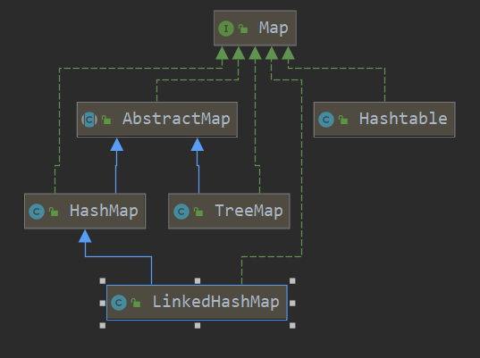
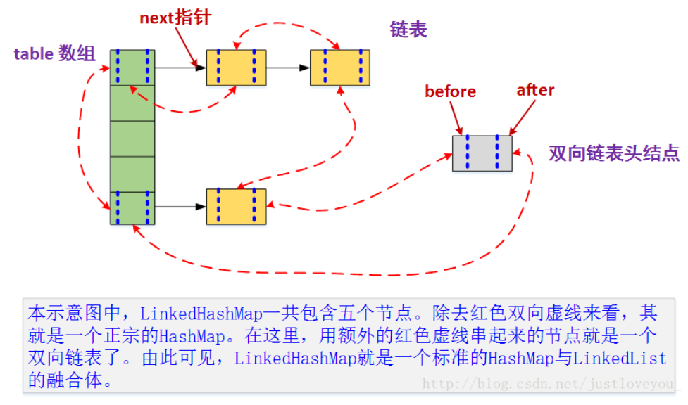
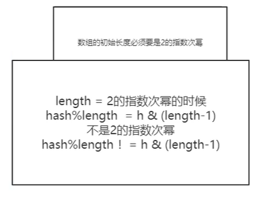
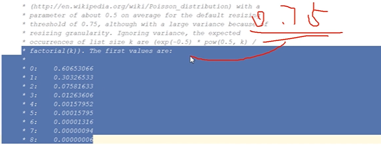
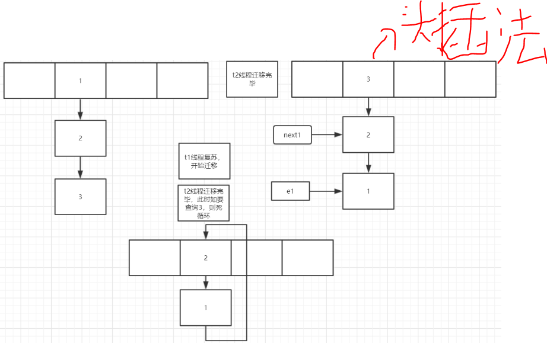
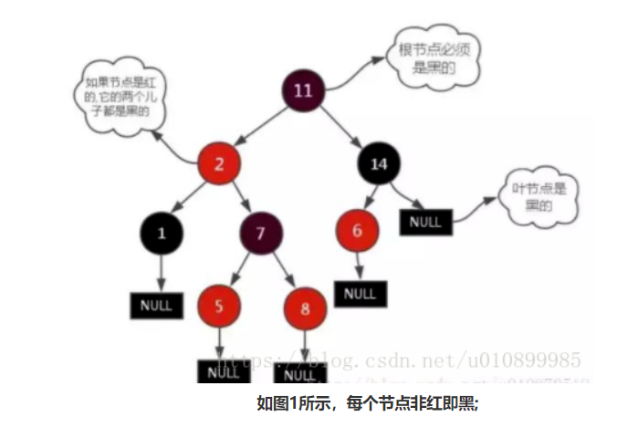

# Map （并发容器单独分析）
## UML


也就是这几个常用的map，分别是LindedHashMap, HashMap, TreeMap, Hashtable。
## LindedHashMap 继承自HashMap
### 用法
```java
    public static void main(String[] args) {
        Map<Character, Integer> lruTest = new LruTest(16,0.75f,true);
        String s = "abcdefghijkl";
        for (int i = 0; i < s.length(); i++) {
            lruTest.put(s.charAt(i), i);
        }
        System.out.println("LRU中key为i的的值为： " + lruTest.get('i'));//当使用accessOrder后，每次访问到的元素就放回链尾
        System.out.println("LRU的大小 ：" + lruTest.size());//LRU的大小 ：6
        System.out.println("LRU ：" + lruTest);//LRU ：{g=6, h=7, j=9, k=10, l=11, i=8}，链头最旧，链尾最近使用
    }

public class LruTest<K,V> extends LinkedHashMap<K,V> {

    int cacheCeiling=6;//缓存上限

    /**
     * @description: 调用父类的无参构造
     * @param initialCapacity 初始容量
     * @param loadFactor 加载因子
     * @param accessOrder 访问顺序，true为开启，false为关闭（使用插入顺序）
     * @return:
     * @author: 杜科
     * @date: 2020/3/19
     */
    public LruTest(int initialCapacity, float loadFactor, boolean accessOrder) {
        super(initialCapacity, loadFactor, accessOrder);
    }

    /**
     * @description: 当大小达到缓存上限时，删除最旧的节点
     * @param eldest 最旧的节点
     * @return: boolean true为要删除，false为不删除
     * @author: 杜科
     * @date: 2020/3/19
     */
    @Override
    protected boolean removeEldestEntry(Map.Entry<K, V> eldest) {
        if(size()>cacheCeiling) return true;
        else return false;
    }

}
```
### 源码分析
#### 图示

#### Entry元素
```java
其实LindedHashMap = LinedList + HashMap。在HashMap.Node的基础上，加上前后指针。
    static class Entry<K,V> extends HashMap.Node<K,V> {
        Entry<K,V> before, after;//双向链表，前后指针
        Entry(int hash, K key, V value, Node<K,V> next) {
            super(hash, key, value, next);
        }
    }

    /**
     * The head (eldest) of the doubly linked list.
     */
    transient LinkedHashMap.Entry<K,V> head;//头部为最旧的元素

    /**
     * The tail (youngest) of the doubly linked list.
     */
    transient LinkedHashMap.Entry<K,V> tail;//尾部为最新的元素
```
#### 构造方法
都只是设定一些参数，在真正put的时候，才会去创建数组。
#### put方法
在开始之前，经过前面的示例，我们也应该能够猜到的是，每当进行put的时候（之前或**之后**），都会去调用removeEldestEntry方法，
看看是否应该删除最旧节点。

LinkedHashMap的put调用的是父类HashMap的put，所以这里顺便也研究HashMap的put方法了
```java
    public V put(K key, V value) {
        return putVal(hash(key), key, value, false, true);
    }

/**
     * Implements Map.put and related methods
     *
     * @param hash hash for key
     * @param key the key
     * @param value the value to put
     * @param onlyIfAbsent if true, don't change existing value
     * @param evict if false, the table is in creation mode.
     * @return previous value, or null if none//如果有旧值就返回旧值，没有就返回null
     */
    final V putVal(int hash, K key, V value, boolean onlyIfAbsent,
                   boolean evict) {
        Node<K,V>[] tab; Node<K,V> p; int n, i;
        if ((tab = table) == null || (n = tab.length) == 0)//当真正put的时候才会去创建数组
            n = (tab = resize()).length;//扩容
        if ((p = tab[i = (n - 1) & hash]) == null)//如果对应下标位置没有元素，则直接放置
            tab[i] = newNode(hash, key, value, null);
        else {//如果有元素
            Node<K,V> e; K k;//现在p为链头，e为新元素应该放置的位置
            if (p.hash == hash &&//如果key的hash值相等，而且key相同或者equals，那么就将新值覆盖当前值
                ((k = p.key) == key || (key != null && key.equals(k))))//重写equals要重写hashcode
                e = p;
            else if (p instanceof TreeNode)//如果是树节点
                e = ((TreeNode<K,V>)p).putTreeVal(this, tab, hash, key, value);
            else {//如果是链表节点
                for (int binCount = 0; ; ++binCount) {//循环找到链表末尾，尾插法
                    if ((e = p.next) == null) {//如果p就是链尾
                        p.next = newNode(hash, key, value, null);
                        if (binCount >= TREEIFY_THRESHOLD - 1) // -1 for 1st
                            treeifyBin(tab, hash);
                        break;
                    }
                    if (e.hash == hash &&//同上
                        ((k = e.key) == key || (key != null && key.equals(k))))
                        break;
                    p = e;//往下寻找
                }
            }
            if (e != null) { //如果存在key相同的旧值
                V oldValue = e.value;
                if (!onlyIfAbsent || oldValue == null)//覆盖旧值
                    e.value = value;
                afterNodeAccess(e);//调用LinkedHashMap重写后的方法，检查访问顺序，尝试将访问到的节点加回到双向链表的末尾
                return oldValue;
            }
        }
        ++modCount;//fail-fast
        if (++size > threshold)//如果当前大小超过容量阈值就扩容
            resize();
        afterNodeInsertion(evict);//调用LinkedHashMap重写后的方法，
        return null;
    }

    static final int MAXIMUM_CAPACITY = 1 << 30;

    //扩容，返回扩容之后的数组，1.7中扩容迁移元素时，使用的是头插法，并发扩容可能会形成环（继而死循环）
    final Node<K,V>[] resize() {
        Node<K,V>[] oldTab = table;
        int oldCap = (oldTab == null) ? 0 : oldTab.length;
        int oldThr = threshold;//阈值
        int newCap, newThr = 0;
        //计算出新的容量和容量阈值，这里忽略细节
        threshold = newThr;
        @SuppressWarnings({"rawtypes","unchecked"})
            Node<K,V>[] newTab = (Node<K,V>[])new Node[newCap];//新的node数组
        table = newTab;
        if (oldTab != null) {//将元素迁移到新数组上
            for (int j = 0; j < oldCap; ++j) {//循环地对所有链表进行拆分
                Node<K,V> e;
                if ((e = oldTab[j]) != null) {//如果这条链表有元素
                    oldTab[j] = null;//旧数组当前位置置null，help gc，防止内存泄漏
                    if (e.next == null)//如果该链表只有一个元素
                        newTab[e.hash & (newCap - 1)] = e;//放置到新数组中新的位置
                    else if (e instanceof TreeNode)//如果是树节点
                        ((TreeNode<K,V>)e).split(this, newTab, j, oldCap);
                    else { // 以第oldCap bit=0?1，把链表拆分为高低链表，
                        // 这也是为什么把数组容量设置为2的幂次方的原因，在扩容进行大量的rehash的时候可以用位运算来提升速度
                        Node<K,V> loHead = null, loTail = null;
                        Node<K,V> hiHead = null, hiTail = null;
                        Node<K,V> next;
                        do {
                            next = e.next;
                            if ((e.hash & oldCap) == 0) {//属于低链表
                                if (loTail == null)
                                    loHead = e;
                                else
                                    loTail.next = e;
                                loTail = e;
                            }
                            else {//属于高链表
                                if (hiTail == null)
                                    hiHead = e;
                                else
                                    hiTail.next = e;
                                hiTail = e;
                            }
                        } while ((e = next) != null);
                        if (loTail != null) {
                            loTail.next = null;
                            newTab[j] = loHead;//低链表在新数组的相同下标位置
                        }
                        if (hiTail != null) {
                            hiTail.next = null;
                            newTab[j + oldCap] = hiHead;//高链表在旧下标+旧容量的位置
                        }
                    }
                }
            }
        }
        return newTab;
    }

    //位于HashMap当中 Callbacks to allow LinkedHashMap post-actions 模板方法设计模式
    void afterNodeAccess(Node<K,V> p) { }
    void afterNodeInsertion(boolean evict) { }
    void afterNodeRemoval(Node<K,V> p) { }

    //位于LinkedHashMap当中
    void afterNodeAccess(Node<K,V> e) { //开启访问顺序后，将每次访问的节点加到双向链表末尾
        LinkedHashMap.Entry<K,V> last;
        if (accessOrder && (last = tail) != e) {//检查是否开启了访问顺序
            LinkedHashMap.Entry<K,V> p =
                (LinkedHashMap.Entry<K,V>)e, b = p.before, a = p.after;
            p.after = null;
            if (b == null)
                head = a;
            else
                b.after = a;
            if (a != null)
                a.before = b;
            else
                last = b;
            if (last == null)
                head = p;
            else {
                p.before = last;
                last.after = p;
            }
            tail = p;
            ++modCount;
        }
    }

    //位于LinkedHashMap当中
    void afterNodeInsertion(boolean evict) { // possibly remove eldest
        LinkedHashMap.Entry<K,V> first;//双向链表头节点
        if (evict && (first = head) != null && removeEldestEntry(first)) {//LruTest当中重写了removeEldestEntry
            K key = first.key;
            removeNode(hash(key), key, null, false, true);//删除头节点
        }
    }
```
**总结一下**，由上可知，当要插入新值的时候，有以下步骤：
1. 检查数组大小，如果为空或者长度为0就扩容。
2. 计算下标，检查对应下标有没有元素，没有就直接放置。
3. 如果对应下标已有元素，检查key是不是相同（hash值，==||equals），如果相同，那么就找到了对应的位置。
4. 如果key不同，如果是树节点，那么按树的插入方式，如果是链表节点，那么在此链表中找到链表末尾。
5. 现在已经确定了新值在此链表中应处的位置。
6. 如果这个位置上有旧值，那么判断是否覆盖。
7. 如果覆盖旧值，那么在LinkedHashMap中判断是否启用访问顺序，若启用，则把当前元素加到双向链表末尾。
8. 如果不存在旧值，那么已经把新元素加到链表末尾了，检查是否要扩容后，LinkedHashMap判断是否要删除双向链表中的最旧值（即链头）。
### 数组的容量2的指数幂

### 扩容因子 0.75
0.75是经过权衡的：
1. 当趋向0时，如0.5，能提高查找速率，因为减少了链表的长度（红黑树的高度），但是浪费空间。
2. 当趋向1时，如1，能最大限度地利用空间，但是冲突严重，增大链表长度（红黑树高度）。
### 链表转红黑树的阈值为8
链表长度为8转红黑树，经泊松分布和0.75的扩容因子，计算得，链表长度出现的概率，红黑树出现的概率并不高，性能提升也不高。


### HashMap1.7 并发扩容成环，查询锁的原因
当两个线程同时对原有的旧的Hash表扩容时，当其中一个线程正在扩容时（遍历单向链表）切换到另外一个线程进行扩容操作（头插法，链表反转），
并且在线程二中完成了所有的扩容操作，此时再切换到线程1中就可能造成单向链表形成一个环，
从而在下一次查询操作时（这个环中丢失了某些元素）就可能发生死循环。



可结合HashMap1.7扩容的源码进行分析。
## Hashtable
其实就是方法加了synchronized的HashMap，一般不用了，因为有更好的并发容器ConcurrentHashMap。
## TreeMap 数据结构为红黑树
### 用法
```java
    public static void main(String[] args) {
        
        //比较器比较的是key
        Map<Student, String> treeMap=new TreeMap((Comparator<Student>) (o1, o2) -> o1.age-o2.age);//按年龄排序
        treeMap.put(new Student(22,"lisi"),"lisi");
        treeMap.put(new Student(21,"zhangsan"),"zhangsan");
        treeMap.put(new Student(23,"wangwu"),"wangwu");
        System.out.println("TreeMap："+treeMap);
//TreeMap：{Student{age=21, name='zhangsan'}=zhangsan, 
// Student{age=22, name='lisi'}=lisi, Student{age=23, name='wangwu'}=wangwu}

        //要有比较器或者实现Comparable是因为要确定两个元素的比较规则
        Map<Student, String> treeMap=new TreeMap((Comparator<Student>) (o1, o2) -> o1.age-o2.age);//按姓名字典序
        treeMap.put(new Student(22,"lisi"),"lisi");
        treeMap.put(new Student(21,"zhangsan"),"zhangsan");
        treeMap.put(new Student(23,"wangwu"),"wangwu");
        System.out.println("TreeMap："+treeMap);
//TreeMap：{Student{age=22, name='lisi'}=lisi, 
// Student{age=23, name='wangwu'}=wangwu, Student{age=21, name='zhangsan'}=zhangsan}
    }

    static class Student {
        int age;
        String name;
        Student(int age,String name){
            this.age=age;
            this.name=name;
        }

        @Override
        public String toString() {
            return "Student{" +
                    "age=" + age +
                    ", name='" + name + '\'' +
                    '}';
        }
    }
```
当不便修改Student类时（即实现Comparable接口，重写compareTo方法），可使用比较器的方式。
# Set
HashSet, LinkedHashSet, TreeSet其实就是Map，只是把值指向了一个标志。
## HashSet
```java
    // Dummy value to associate with an Object in the backing Map
    private static final Object PRESENT = new Object();

    public boolean add(E e) {
        return map.put(e, PRESENT)==null;
    }
```
# 红黑树
## 简介
一种二叉查找树，但在每个节点增加一个存储位表示节点的颜色，可以是红或黑（非红即黑）。
通过对任何一条从根到叶子的路径上各个节点着色的方式的限制，红黑树确保没有一条路径会比其它路径长出两倍，因此，
红黑树是一种弱平衡二叉树（由于是弱平衡，可以看到，在相同的节点情况下，AVL树的高度低于红黑树），相对于要求严格的AVL树来说，
它的旋转次数少，所以对于搜索，插入，删除操作较多的情况下，我们就用红黑树。
## 性质


1. 每个节点非红即黑
2. 根节点是黑的;
3. 每个叶节点（叶节点即树尾端NULL指针或NULL节点）都是黑的;
4. 如图所示，如果一个节点是红的，那么它的两儿子都是黑的;
5. 对于任意节点而言，其到叶子点树NULL指针的每条路径都包含相同数目的黑节点;
6. 每条路径都包含相同的黑节点;