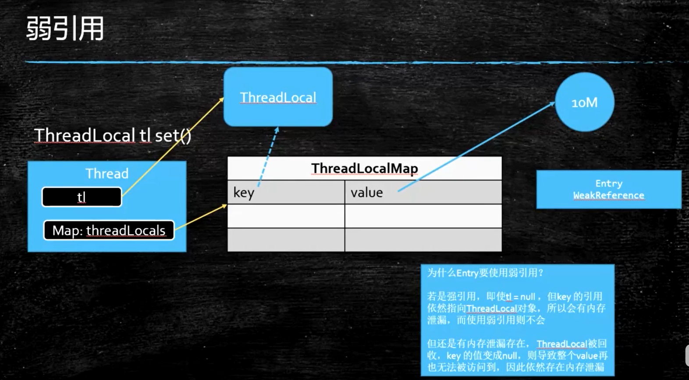

# ThreadLocal
## ThreadLocal用法
```java
ThreadLocal<String> localName = new ThreadLocal();
localName.set("占小狼");
String name = localName.get();
```
##

```java
package java.lang;
import java.lang.ref.*;
import java.util.Objects;
import java.util.concurrent.atomic.AtomicInteger;
import java.util.function.Supplier;

public class ThreadLocal<T> {

    private final int threadLocalHashCode = nextHashCode(); /* 注意这是 final 的 */

    /**
     * ThreadLocal的hash值来自于这个静态的AtomicInteger对象getAndAdd方法返回的int值，其中增量是0x61c88647。
     * 因为线程可能会并发创建ThreadLocal，所以使用原子对象
     */
    private static AtomicInteger nextHashCode =
        new AtomicInteger();

    /**
     * 为了让哈希码能均匀的分布在2的N次方的数组里。
     * 0x61c88647 = 2^32 * 黄金分割比，
     * 斐波拉契数列
     * f(n) = f(n-1) + f(n-2) (n>1)
     * f(0) = 0
     * f(1) = 1
     * 当n趋向于无穷大时，前一项与后一项的比值越来越逼近黄金比。
     */
    private static final int HASH_INCREMENT = 0x61c88647;

    private static int nextHashCode() {
        return nextHashCode.getAndAdd(HASH_INCREMENT);
    }

    protected T initialValue() {
        return null;
    }

    public static <S> ThreadLocal<S> withInitial(Supplier<? extends S> supplier) {
        return new SuppliedThreadLocal<>(supplier);
    }

    public ThreadLocal() {
    }

    public T get() {
        Thread t = Thread.currentThread();
        ThreadLocalMap map = getMap(t); /* 这个Map是Thread对象中的一个属性 */
        if (map != null) {
            ThreadLocalMap.Entry e = map.getEntry(this);
            if (e != null) {
                @SuppressWarnings("unchecked")
                T result = (T)e.value;
                return result;
            }
        }
        return setInitialValue();
    }

    /* 返回的是一个空值 */
    private T setInitialValue() {
        T value = initialValue(); /* 初始值，如果没有指定，那么为null */
        Thread t = Thread.currentThread();
        ThreadLocalMap map = getMap(t);
        if (map != null)
            map.set(this, value);
        else
            createMap(t, value);
        return value;
    }


    public void set(T value) {
        Thread t = Thread.currentThread();
        ThreadLocalMap map = getMap(t);
        if (map != null)
            map.set(this, value);
        else
            createMap(t, value);
    }


     public void remove() {
         ThreadLocalMap m = getMap(Thread.currentThread());
         if (m != null)
             m.remove(this);
     }


    ThreadLocalMap getMap(Thread t) {
        return t.threadLocals;
    }


    void createMap(Thread t, T firstValue) {
        t.threadLocals = new ThreadLocalMap(this, firstValue);
    }


    static ThreadLocalMap createInheritedMap(ThreadLocalMap parentMap) {
        return new ThreadLocalMap(parentMap);
    }


    T childValue(T parentValue) {
        throw new UnsupportedOperationException();
    }

    /**
     * An extension of ThreadLocal that obtains its initial value from
     * the specified {@code Supplier}.
     */
    static final class SuppliedThreadLocal<T> extends ThreadLocal<T> {

        private final Supplier<? extends T> supplier;

        SuppliedThreadLocal(Supplier<? extends T> supplier) {
            this.supplier = Objects.requireNonNull(supplier);
        }

        @Override
        protected T initialValue() {
            return supplier.get();
        }
    }


    static class ThreadLocalMap {

        static class Entry extends WeakReference<ThreadLocal<?>> {
            /** The value associated with this ThreadLocal. */
            Object value;

            Entry(ThreadLocal<?> k, Object v) {
                super(k);
                value = v;
            }
        }

        /**
         * The initial capacity -- MUST be a power of two.
         */
        private static final int INITIAL_CAPACITY = 16;

        /**
         * The table, resized as necessary.
         * table.length MUST always be a power of two.
         */
        private Entry[] table;

        /**
         * The number of entries in the table.
         */
        private int size = 0;

        /**
         * The next size value at which to resize.
         */
        private int threshold; // Default to 0

        /**
         * Set the resize threshold to maintain at worst a 2/3 load factor.
         */
        private void setThreshold(int len) {
            threshold = len * 2 / 3; /* 扩容阈值为 2/3 */
        }
        
        /* 把table看作是循环数组 */

        /**
         * Increment i modulo len.
         */
        private static int nextIndex(int i, int len) {
            return ((i + 1 < len) ? i + 1 : 0);
        }

        /**
         * Decrement i modulo len.
         */
        private static int prevIndex(int i, int len) {
            return ((i - 1 >= 0) ? i - 1 : len - 1);
        }


        ThreadLocalMap(ThreadLocal<?> firstKey, Object firstValue) {
            table = new Entry[INITIAL_CAPACITY];
            int i = firstKey.threadLocalHashCode & (INITIAL_CAPACITY - 1);
            table[i] = new Entry(firstKey, firstValue);
            size = 1;
            setThreshold(INITIAL_CAPACITY);
        }

        private ThreadLocalMap(ThreadLocalMap parentMap) {
            Entry[] parentTable = parentMap.table;
            int len = parentTable.length;
            setThreshold(len);
            table = new Entry[len];

            for (int j = 0; j < len; j++) {
                Entry e = parentTable[j];
                if (e != null) {
                    @SuppressWarnings("unchecked")
                    ThreadLocal<Object> key = (ThreadLocal<Object>) e.get();
                    if (key != null) {
                        Object value = key.childValue(e.value);
                        Entry c = new Entry(key, value);
                        int h = key.threadLocalHashCode & (len - 1);
                        while (table[h] != null)
                            h = nextIndex(h, len);
                        table[h] = c;
                        size++;
                    }
                }
            }
        }
        
        private Entry getEntry(ThreadLocal<?> key) {
            int i = key.threadLocalHashCode & (table.length - 1);
            Entry e = table[i];
            if (e != null && e.get() == key)
                return e;
            else
                return getEntryAfterMiss(key, i, e);
        }


        private Entry getEntryAfterMiss(ThreadLocal<?> key, int i, Entry e) {
            Entry[] tab = table;
            int len = tab.length;

            while (e != null) {
                ThreadLocal<?> k = e.get();
                if (k == key)
                    return e;
                if (k == null)
                    expungeStaleEntry(i);
                else
                    i = nextIndex(i, len);
                e = tab[i];
            }
            return null;
        }

        private void set(ThreadLocal<?> key, Object value) {
			
            Entry[] tab = table;
            int len = tab.length;
            int i = key.threadLocalHashCode & (len-1); /* 算出下标 */

            for (Entry e = tab[i];
                 e != null;
                 e = tab[i = nextIndex(i, len)]) {/* 线性探测 */
                ThreadLocal<?> k = e.get();

                if (k == key) {
                    e.value = value;
                    return;
                }

                if (k == null) {
                    replaceStaleEntry(key, value, i);
                    return;
                }
            }

            tab[i] = new Entry(key, value);
            int sz = ++size;
            if (!cleanSomeSlots(i, sz) && sz >= threshold)
                rehash();
        }

        /**
         * Remove the entry for key.
         */
        private void remove(ThreadLocal<?> key) {
            Entry[] tab = table;
            int len = tab.length;
            int i = key.threadLocalHashCode & (len-1);
            for (Entry e = tab[i];
                 e != null;
                 e = tab[i = nextIndex(i, len)]) {
                if (e.get() == key) {
                    e.clear();
                    expungeStaleEntry(i);
                    return;
                }
            }
        }

        private void replaceStaleEntry(ThreadLocal<?> key, Object value,
                                       int staleSlot) {
            Entry[] tab = table;
            int len = tab.length;
            Entry e;

            int slotToExpunge = staleSlot;
            for (int i = prevIndex(staleSlot, len);
                 (e = tab[i]) != null;
                 i = prevIndex(i, len)) /* 往前扫描 */
                if (e.get() == null) /* e.get()即为key ThreadLocal对象 */
                    slotToExpunge = i;

            for (int i = nextIndex(staleSlot, len); /* 向后扫描 */
                 (e = tab[i]) != null;
                 i = nextIndex(i, len)) {
                ThreadLocal<?> k = e.get();

                if (k == key) {
                    e.value = value;
                    
                    /* 交换位置 因为staleSlot更接近正确位置 */

                    tab[i] = tab[staleSlot];
                    tab[staleSlot] = e;

                    // Start expunge at preceding stale entry if it exists
                    if (slotToExpunge == staleSlot)
                        slotToExpunge = i;
                    cleanSomeSlots(expungeStaleEntry(slotToExpunge), len);
                    return;
                }

                // If we didn't find stale entry on backward scan, the
                // first stale entry seen while scanning for key is the
                // first still present in the run.
                if (k == null && slotToExpunge == staleSlot)
                    slotToExpunge = i;
            }

            // If key not found, put new entry in stale slot
            tab[staleSlot].value = null;
            tab[staleSlot] = new Entry(key, value);

            // If there are any other stale entries in run, expunge them
            if (slotToExpunge != staleSlot)
                cleanSomeSlots(expungeStaleEntry(slotToExpunge), len);
        }

        /**
         * Expunge a stale entry by rehashing any possibly colliding entries
         * lying between staleSlot and the next null slot.  This also expunges
         * any other stale entries encountered before the trailing null.  See
         * Knuth, Section 6.4
         *
         * @param staleSlot index of slot known to have null key
         * @return the index of the next null slot after staleSlot
         * (all between staleSlot and this slot will have been checked
         * for expunging).
         */
        private int expungeStaleEntry(int staleSlot) {
            Entry[] tab = table;
            int len = tab.length;

            // expunge entry at staleSlot
            tab[staleSlot].value = null;
            tab[staleSlot] = null;
            size--;

            // Rehash until we encounter null
            Entry e;
            int i;
            for (i = nextIndex(staleSlot, len);
                 (e = tab[i]) != null;
                 i = nextIndex(i, len)) {
                ThreadLocal<?> k = e.get();
                if (k == null) {
                    e.value = null;
                    tab[i] = null;
                    size--;
                } else {
                    int h = k.threadLocalHashCode & (len - 1);
                    if (h != i) {
                        tab[i] = null;

                        // Unlike Knuth 6.4 Algorithm R, we must scan until
                        // null because multiple entries could have been stale.
                        while (tab[h] != null)
                            h = nextIndex(h, len);
                        tab[h] = e;
                    }
                }
            }
            return i;
        }

        /**
         * Heuristically scan some cells looking for stale entries.
         * This is invoked when either a new element is added, or
         * another stale one has been expunged. It performs a
         * logarithmic number of scans, as a balance between no
         * scanning (fast but retains garbage) and a number of scans
         * proportional to number of elements, that would find all
         * garbage but would cause some insertions to take O(n) time.
         *
         * @param i a position known NOT to hold a stale entry. The
         * scan starts at the element after i.
         *
         * @param n scan control: {@code log2(n)} cells are scanned,
         * unless a stale entry is found, in which case
         * {@code log2(table.length)-1} additional cells are scanned.
         * When called from insertions, this parameter is the number
         * of elements, but when from replaceStaleEntry, it is the
         * table length. (Note: all this could be changed to be either
         * more or less aggressive by weighting n instead of just
         * using straight log n. But this version is simple, fast, and
         * seems to work well.)
         *
         * @return true if any stale entries have been removed.
         */
        private boolean cleanSomeSlots(int i, int n) {
            boolean removed = false;
            Entry[] tab = table;
            int len = tab.length;
            do {
                i = nextIndex(i, len);
                Entry e = tab[i];
                if (e != null && e.get() == null) {
                    n = len;
                    removed = true;
                    i = expungeStaleEntry(i);
                }
            } while ( (n >>>= 1) != 0);
            return removed;
        }

        /**
         * Re-pack and/or re-size the table. First scan the entire
         * table removing stale entries. If this doesn't sufficiently
         * shrink the size of the table, double the table size.
         */
        private void rehash() {
            expungeStaleEntries();

            // Use lower threshold for doubling to avoid hysteresis
            if (size >= threshold - threshold / 4)
                resize();
        }

        /**
         * Double the capacity of the table.
         */
        private void resize() {
            Entry[] oldTab = table;
            int oldLen = oldTab.length;
            int newLen = oldLen * 2;
            Entry[] newTab = new Entry[newLen];
            int count = 0;

            for (int j = 0; j < oldLen; ++j) {
                Entry e = oldTab[j];
                if (e != null) {
                    ThreadLocal<?> k = e.get();
                    if (k == null) {
                        e.value = null; // Help the GC
                    } else {
                        int h = k.threadLocalHashCode & (newLen - 1);
                        while (newTab[h] != null)
                            h = nextIndex(h, newLen);
                        newTab[h] = e;
                        count++;
                    }
                }
            }

            setThreshold(newLen);
            size = count;
            table = newTab;
        }

        /**
         * Expunge all stale entries in the table.
         */
        private void expungeStaleEntries() {
            Entry[] tab = table;
            int len = tab.length;
            for (int j = 0; j < len; j++) {
                Entry e = tab[j];
                if (e != null && e.get() == null)
                    expungeStaleEntry(j);
            }
        }
    }
}
```
## get set
```java 
public void set(T value) {
    Thread t = Thread.currentThread();
    ThreadLocalMap map = getMap(t);
    if (map != null)
        map.set(this, value);
    else
        createMap(t, value);
}

//get去线性查找的时候若遇到的为null的key，将先线性清楚为null的key
public T get() {
    Thread t = Thread.currentThread();
    ThreadLocalMap map = getMap(t);
    if (map != null) {
        ThreadLocalMap.Entry e = map.getEntry(this);
        if (e != null) {
            @SuppressWarnings("unchecked")
            T result = (T)e.value;
            return result;
        }
    }
    return setInitialValue();
}

ThreadLocalMap getMap(Thread t) {
    return t.threadLocals;
}
```
### key的hash值从同一个hash函数获得
```java
    private final int threadLocalHashCode = nextHashCode();

    /**
     * The next hash code to be given out. Updated atomically. Starts at
     * zero.
     */
    private static AtomicInteger nextHashCode =
        new AtomicInteger();

    /**
     * The difference between successively generated hash codes - turns
     * implicit sequential thread-local IDs into near-optimally spread
     * multiplicative hash values for power-of-two-sized tables.
     */
    private static final int HASH_INCREMENT = 0x61c88647;//（斐波那契散列乘数，通过该数散列出来的结果会比较均匀）

    /**
     * Returns the next hash code.
     */
    private static int nextHashCode() {
        return nextHashCode.getAndAdd(HASH_INCREMENT);
    }
```
## ThreadLocalMap
为什么不用HashMap？key要继承弱引用，get,put有清理功能。
### 线程的实例数据
位于线程类中
```java
ThreadLocal.ThreadLocalMap threadLocals = null;
```
### hash冲突
冲突时比较下一个（线性探测法），故而数据量大，冲突严重时，性能低下
```java
private void set(ThreadLocal<?> key, Object value) {
    Entry[] tab = table;
    int len = tab.length;
    int i = key.threadLocalHashCode & (len-1);

    for (Entry e = tab[i];
         e != null;
         e = tab[i = nextIndex(i, len)]) {
        ThreadLocal<?> k = e.get();

        if (k == key) {
            e.value = value;
            return;
        }

        if (k == null) {
            replaceStaleEntry(key, value, i);
            return;
        }
    }

    tab[i] = new Entry(key, value);
    int sz = ++size;
    if (!cleanSomeSlots(i, sz) && sz >= threshold)
        rehash();
}
```
### Entry 封装ThreadLocal与set定的值 内存泄漏
```java
static class Entry extends WeakReference<ThreadLocal<?>> {
    /** The value associated with this ThreadLocal. */
    Object value;

    Entry(ThreadLocal<?> k, Object v) {
        super(k);//key成了一个弱引用
        value = v;
    }
}
```
key被保存到了WeakReference对象中，这就导致了一个问题，ThreadLocal在**没有被外部强引用**时，发生GC时会被回收。

例如，ThreadLocal是在方法内创建然后set(value)，GC时，该方法对应的栈帧还在栈上，那么改Entry不会被回收，因为引用着强引用value, 
但是作为弱引用的key却被回收了，现在key=null。那么GC完毕后，再也不能用这个key去把value查出来，
但是Entry与value这种强引用关系还存在着，那么这块内存就再也回收不了。



线程类的成员变量threadLocals强引用着ThreadLocalMap，ThreadLocalMap强引用着Entry数组，而Entry弱引用着ThreadLocal（这种关系是弱的）。当外部没有强引用者ThreadLocal时，那么gc时，ThreadLocal将会被回收。
### 避免内存泄漏
```java
ThreadLocal<String> localName = new ThreadLocal();
try {
    localName.set("占小狼");
    // 其它业务逻辑
} finally {
    localName.remove();//使用完及时删除
}
```
### 扩容，初始容量16，2的指数
在扩容前，先把过期清理，如果仍然达到阈值75%，那么进行扩容。
## ThreadLocal在Spring事务管理中的应用
spring中使用ThreadLocal来设计TransactionSynchronizationManager类，实现了事务管理与数据访问服务的解耦，
同时也保证了多线程环境下connection的线程安全问题。

TransactionSynchronizationManager首先从数据库连接池中获得一个connection，并构造一个connection包装类，使用这个包装类开启事务，
最后通过TransactionSynchronizationManager将connection与ThreadLocal绑定，事务提交或者回滚后，解除绑定。
## 四种引用
1. 强引用。gc后仍发现内存不足，这样宁愿抛出OOM也不会回收强引用。
2. 软引用。gc后仍发现内存不足，这样会回收软引用。可用于缓存，当内存足够，可以正常的拿到缓存，当内存不够，就会先干掉缓存，
不至于马上抛出OOM。。
3. 弱引用。gc时回收，例如ThreadLocal.
4. 虚引用。get不到，常用于堆外内存的管理、释放，例如DirectByteBuffer的Cleaner。
    * 当垃圾回收器准备回收一个对象时，如果发现它还有虚引用，就会在垃圾回收后，将这个虚引用加入引用队列，在其关联的虚引用出队前，
    不会彻底销毁该对象。 所以可以通过检查引用队列中是否有相应的虚引用来判断对象是否已经被回收了。
    


