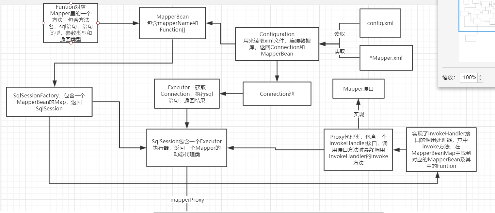
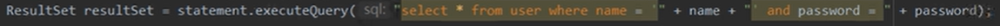
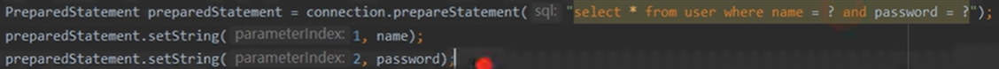
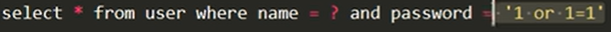
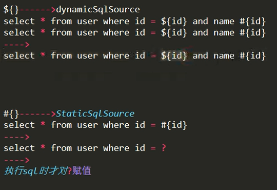

# mybatis
## 模拟mybatis

1. 读取xml文件，建立连接。从图中可以看出，MyConfiguration负责与人交互。待读取xml后，
将属性和连接数据库的操作封装在MyConfiguration对象中供后面的组件调用。
本文将使用dom4j来读取xml文件（包括config.xml和mapper.xml），它具有性能优异和非常方便使用的特点。
2. 创建SqlSession，搭建Configuration和Executor之间的桥梁。我们经常在使用框架时看到Session，Session到底是什么呢？一个Session
仅拥有一个对应的数据库连接。类似于一个前段请求Request，它可以直接调用exec(SQL)来执行SQL语句。从流程图中的箭头可以看出，
MySqlSession的成员变量中必须得有MyExecutor和MyConfiguration去集中做调配，箭头就像是一种关联关系。
我们自己的MySqlSession将有一个getMapper方法，然后使用动态代理生成对象后，就可以做数据库的操作了。
3. 创建Executor，封装JDBC操作数据库。Executor是一个执行器，负责SQL语句的生成和查询缓存（缓存还没完成）的维护，
也就是jdbc的代码将在这里完成，不过本文只实现了单表，有兴趣的同学可以尝试完成多表。
4. 创建MapperProxy，使用动态代理生成Mapper对象.我们只是希望对指定的接口生成一个对象，使得执行它的时候能运行一句sql
罢了，而接口无法直接调用方法，所以这里使用动态代理生成对象，在执行时还是回到MySqlSession中调用查询，最终由MyExecutor做JDBC查询。
这样设计是为了单一职责，可扩展性更强。
## sql注入
statement会产生sql注入，形如：selectByStatement("aa","1 or 1=1");

产生的sql为：select from user where name='aa' and password= 1 or 1=1;这样会把所有记录都查出来。

而prepareStatement

当成字符串处理，加入了' '

### $与#的区别
语句中只要有$，该语句就为动态sql，在真正调用的时候再去解析，并提前赋值（在翻译成prepareStatement前），
故而有可能出现sql注入的情况，$的真正用处在于select ${selection} from user——>select id from user，用#就达不到这样的效果，
只会翻译成?，赋值后变成字符常量。

'#'为静态sql，在解析的时候就翻译成（prepareStatement）不会产生sql注入，在执行的时候再赋值。

,#{arg1}或者${arg1}对应的是jdk1.8之前的方法参数名，在1.8后在编译的时候加入真正的参数名，可以写成#{name}或者${name}
而#{param1}对应的是mybatis的自定义注解@Param。

另外在jdk1.8，在编译时是不会保留方法上的形参名的而是为arg1, arg2，但是会保留方法内局部变量表中的名字。所以，
通过使用asm字节码工具的springmvc能从class文件方法局部变量表中拿到参数的名字，而mybatis只能用注解（或顺序）标明。

jdk1.8后，加参数-parameters进行编译，就保留了。