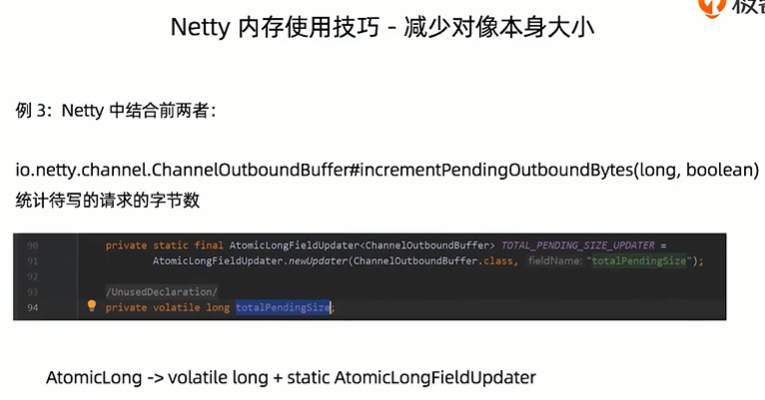
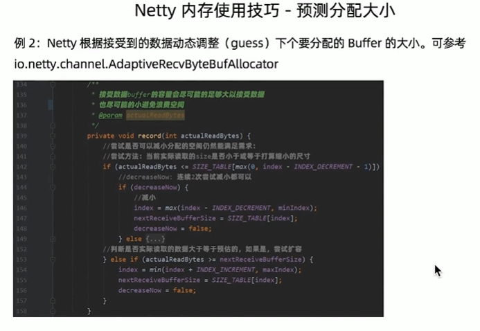
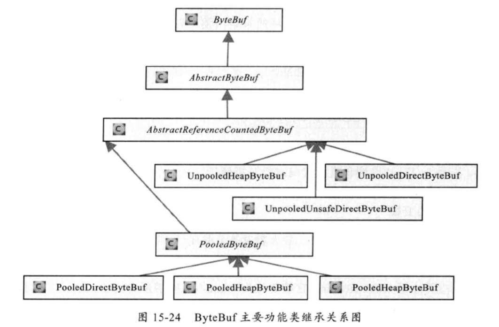
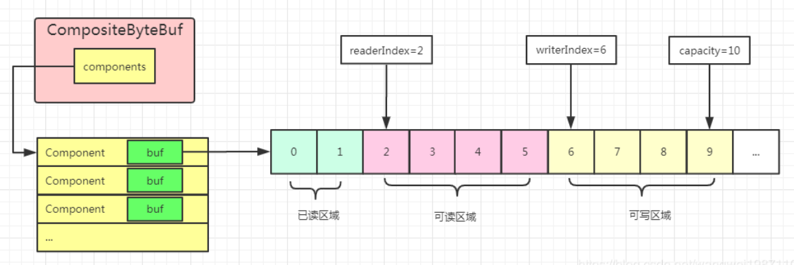

# memory 内存使用




使用CompositeByteBuf，使用内存池
## 内存池结构
二叉堆结构，从上往下寻找，从下往上更新状态。
## ByteBuf


它的申请和释放是线程安全的，但它的访问是非线程安全的。类似ArrayList的动态扩容机制。
### PooledByteBuf
### UnPooledByteBuf
### CompositeByteBUf

### 释放时机
《Netty进阶之路 跟着案例学Netty》P39。

响应ByteBuf（如writeAndFlush(buf)）由netty释放，例如在将HeapBuf转换为DirectBuf的时候释放。
```java
    protected final ByteBuf newDirectBuffer(ByteBuf buf) {
        final int readableBytes = buf.readableBytes();
        if (readableBytes == 0) {
            ReferenceCountUtil.safeRelease(buf);
            return Unpooled.EMPTY_BUFFER;
        }

        final ByteBufAllocator alloc = alloc();
        if (alloc.isDirectBufferPooled()) {
            ByteBuf directBuf = alloc.directBuffer(readableBytes);
            directBuf.writeBytes(buf, buf.readerIndex(), readableBytes);
            ReferenceCountUtil.safeRelease(buf);//将作为HeapByteBuf的buf引用计数-1，更新状态
            return directBuf;
        }

        final ByteBuf directBuf = ByteBufUtil.threadLocalDirectBuffer();
        if (directBuf != null) {
            directBuf.writeBytes(buf, buf.readerIndex(), readableBytes);
            ReferenceCountUtil.safeRelease(buf);
            return directBuf;
        }

        // Allocating and deallocating an unpooled direct buffer is very expensive; give up.
        return buf;
    }
```
请求ByteBuf，Handler继承SimpleChannelInboundHandler可释放；
```java
    @Override
    public void channelRead(ChannelHandlerContext ctx, Object msg) throws Exception {
        boolean release = true;
        try {
            if (acceptInboundMessage(msg)) {
                @SuppressWarnings("unchecked")
                I imsg = (I) msg;
                channelRead0(ctx, imsg);//业务handler只需重写channelRead0
            } else {
                release = false;
                ctx.fireChannelRead(msg);
            }
        } finally {
            if (autoRelease && release) {
                ReferenceCountUtil.release(msg);//引用计数-1
            }
        }
    }
```
fireChannelRead()，由TailContext释放。
```java
    @Override
    public void channelRead(ChannelHandlerContext ctx, Object msg) {onUnhandledInboundMessage(ctx, msg);}

    protected void onUnhandledInboundMessage(ChannelHandlerContext ctx, Object msg) {
        onUnhandledInboundMessage(msg);
        if (logger.isDebugEnabled()) {
            logger.debug("Discarded message pipeline : {}. Channel : {}.",
                         ctx.pipeline().names(), ctx.channel());
        }
    }

    protected void onUnhandledInboundMessage(Object msg) {
        try {
            logger.debug(
                    "Discarded inbound message {} that reached at the tail of the pipeline. " +
                            "Please check your pipeline configuration.", msg);
        } finally {
            ReferenceCountUtil.release(msg);//引用计数-1
        }
    }
```
那么应该时刻记着由最后一个使用的人释放（ReferenceCountUtil.release(byteBuf)）。