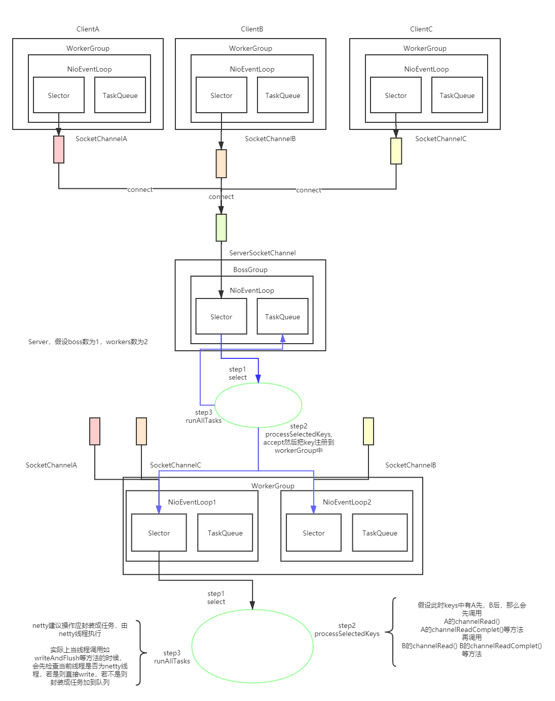

# netty
## 结构概览

## 一些特点
1. 线程绑定一个任务队列，select时，即使没有数据到来也不会一直阻塞，会超时地select，然后去执行任务队列里的任务（Idle任务）。
2. 写数据时，不会一直写，超过一定时间后，注册写事件等待下次select，防止大量的写而导致其他连接得不到及时响应。
3. 提供EpollServerSocketChannel，使用jdk没有提供epoll边缘触发模式。
4. FastThreadLocal InternalThreadLocalMap 使其不发生hash冲突，每个FastThreadLocal使用唯一的可以对应唯一的桶的hash值，
这个hash值来自AtomicInteger.getAndIncrement()方法，如果hash值大于数组长度，数组扩容。
5. 组合ByteBuf，零拷贝，提供多个ByteBuf的组合视图。
6. epoll空轮询检测，对Selector的select操作周期进行统计，每完成一次空的select操作进行一次计数，若在某个周期内连续发生N次空轮询，
则触发了epoll死循环bug。重建Selector，判断是否是其他线程发起的重建请求，若不是则将原SocketChannel从旧的Selector上去除注册，
重新注册到新的Selector上，并将原来的Selector关闭。
7. 自实现的内存管理。
8. 责任链，高级过滤器模式。