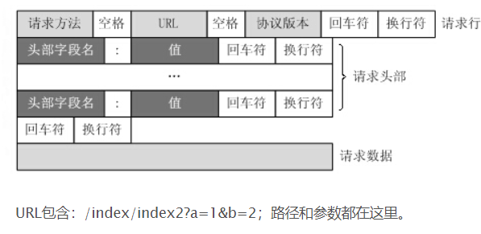
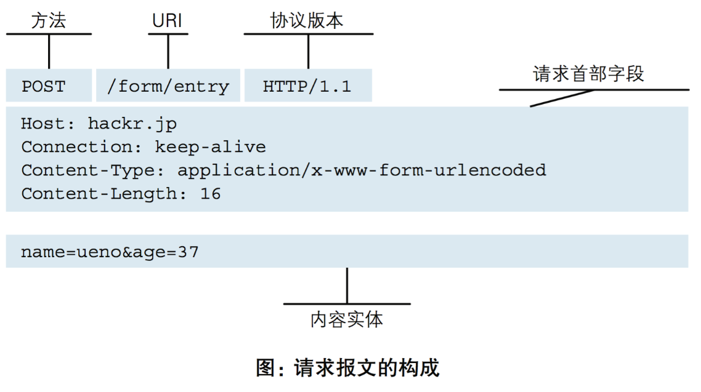
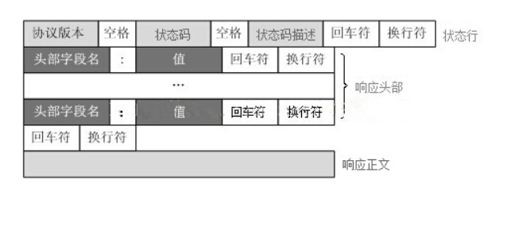
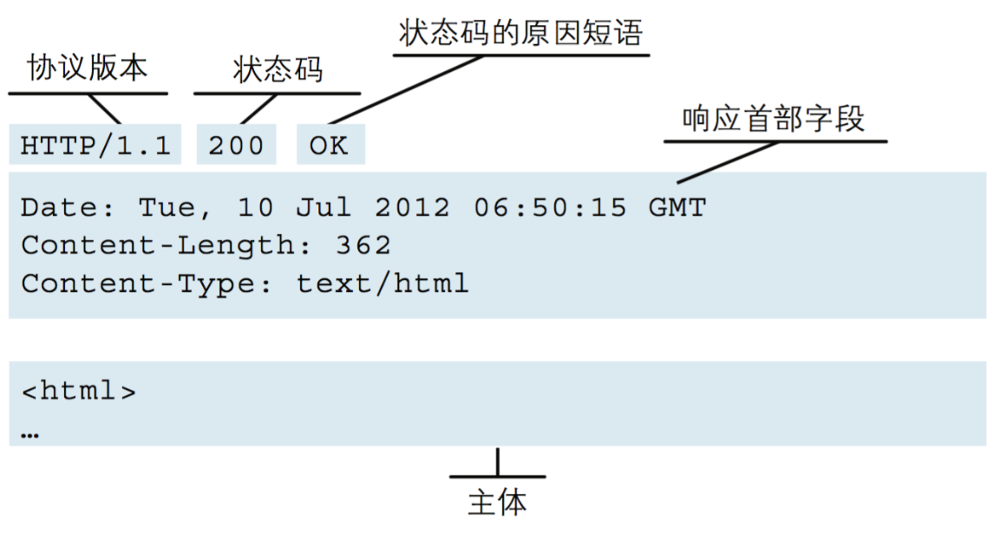
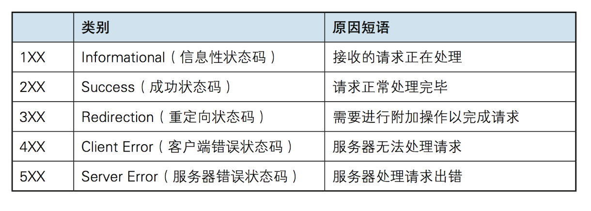
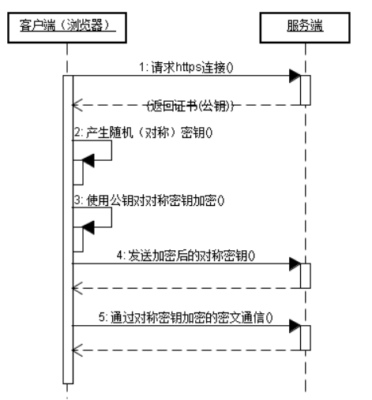

# HTTP
默认80端口
## HTTP请求格式(请求协议)

## HTTP请求方法
HTTP/1.1协议中共定义了八种方法（也叫“动作”）来以不同方式操作指定的资源：
1. GET。向指定的资源发出“显示”请求。使用GET方法应该只用在读取数据，而不应当被用于产生“副作用”的操作中，
例如在Web Application中。其中一个原因是GET可能会被网络蜘蛛等随意访问。
2. HEAD。与GET方法一样，都是向服务器发出指定资源的请求。只不过服务器将不传回资源的本文部分。
它的好处在于，使用这个方法可以在不必传输全部内容的情况下，就可以获取其中“关于该资源的信息”（元信息或称元数据）。
3. POST。向指定资源提交数据，请求服务器进行处理（例如提交表单或者上传文件）。数据被包含在请求本文中。
这个请求可能会创建新的资源或修改现有资源，或二者皆有。
4. PUT。向指定资源位置上传其最新内容。
5. DELETE。请求服务器删除Request-URI所标识的资源。
6. TRACE。回显服务器收到的请求，主要用于测试或诊断。
7. OPTIONS。这个方法可使服务器传回该资源所支持的所有HTTP请求方法。用'*'来代替资源名称，向Web服务器发送OPTIONS请求，
可以测试服务器功能是否正常运作。
8. CONNECT。HTTP/1.1协议中预留给能够将连接改为管道方式的代理服务器。通常用于SSL加密服务器的链接（经由非加密的HTTP代理服务器）。

**注意事项：**
1. 方法名称是区分大小写的。当某个请求所针对的资源不支持对应的请求方法的时候，服务器应当返回状态码405（Method Not Allowed），
当服务器不认识或者不支持对应的请求方法的时候，应当返回状态码501（Not Implemented）。
2. HTTP服务器至少应该实现GET和HEAD方法，其他方法都是可选的。当然，所有的方法支持的实现都应当匹配下述的方法各自的语义定义。
此外，除了上述方法，特定的HTTP服务器还能够扩展自定义的方法。例如PATCH（由 RFC 5789指定的方法）用于将局部修改应用到资源。
3. GET提交的数据会放在URL之后，也就是请求行里面，以?分割URL和传输数据，参数之间以&相连，如EditBook?name=test1&id=123456.
（请求头里面那个content-type做的这种参数形式），而POST方法是把提交的数据放在HTTP包的请求体中.
4. GET提交的数据大小有限制（因为浏览器对URL的长度有限制），而POST方法提交的数据没有限制.
## HTTP响应格式(响应协议)

## 版本
1. HTTP/1.0 一次请求-响应，建立一个连接，用完关闭；每一个请求都要建立一个连接；
2. HTTP/1.1 keep-alive，tcp连接在一定时间或者一定请求次数内不关闭，减少tcp握手次数，减少tcp慢启动的影响。而队头阻塞问题，与
长短连接无关，而是由HTTP的请求-响应模型导致。针对此如何优化？可以并发连接，对一个服务端建立多个连接，但也有一定的消耗。
3. HTTP/2 多个请求可同时在一个连接上并行执行（优先级）。某个请求任务耗时严重，不会影响到其它请求的正常执行。头部压缩。
grpc使用的是http2.0。
# HTTPS
默认443端口。

HTTPS=HTTP+SSL/TLS。
先非对称加密，再对称加密。CA证书防止中间人攻击。
## 建立连接时的简单示意图
