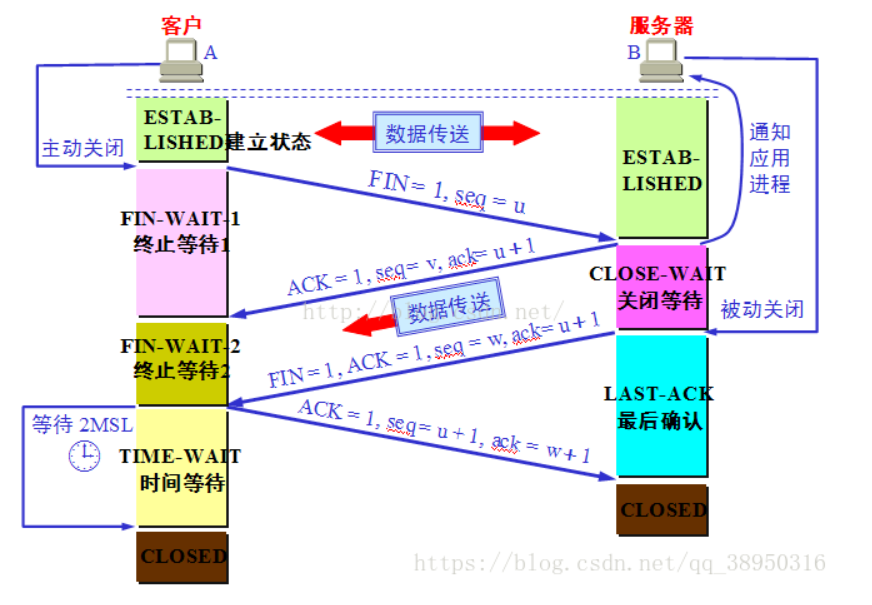

# TCP
## TCP报文格式

其中：
1. 32位确认序号：32位的序列号由接收端计算机使用，重组分段的报文成最初形式。如果设置了ACK控制位，
这个值表示一个准备接收的包的序列码。
2. 标志：6位标志域。表示为：紧急标志、有意义的应答标志、推、重置连接标志、同步序列号标志、完成发送数据标志。
按照顺序排列是：URG、ACK、PSH、RST、SYN、FIN。
3. 16位窗口大小：用来表示想收到的每个TCP数据段的大小。TCP的流量控制由连接的每一端通过声明的窗口大小来提供，窗口是数据的窗口。
4. 校验和：https://www.cnblogs.com/zxiner/p/7203192.html
5. 数据偏移：占4比特，表示数据开始的地方离TCP段的起始处有多远。实际上就是TCP段首部的长度。由于首部长度不固定，因此数据偏移字段是必要的。
## 三次握手


两次握手行不行？
若两次握手就建立的话，在A第一次放给B的请求连接报文在网络中延迟了，于是A重发请求连接报文，这次准时到达B收到后同意连接，于是B的连接
就打开了，B发回同意报文，A收到后A的连接也打开了，于是开始通信。当通信完毕后，四次挥手断开连接。若此时B收到了A第一次发的、在网络中
延迟了的报文（假设报文还存活），于是B再次同意连接，打开了自己的连接，发回同意报文，但是对A来说这个连接是无效，不予理会。
于是B就干等着了。所以，两次握手是有问题的。

四次握手行不行？
首先四次握手是可以的，但三次握手已经足够，而且建立连接不像释放连接那样，半连接状态不能传输数据（挥手时的半连接状态可以长时间存在）。
## 四次挥手


主动关闭的一方为什么要等待2MSL？
1. 等待2MSL是为了让A最后发的确认报文准时到达B。假设该报文在网络中延迟了。对B来说，在B最后发出FIN报文时，会开始计时，
若在2MSL后还没有收到确认，那么B会重发这个FIN报文。如果A没有等待2MSL的话，那么A是收不到B重发的FIN报文的，而B也不能正常进入closed，
所以要等待。
2. A在发送完ACK报文段后，再经过2MSL时间，就可以使本连接持续的时间所产生的所有报文段都从网络中消失。
这样就可以使下一个新的连接中不会出现这种旧的连接请求的报文段。

服务端有大量连接处于time_wait:
1. time_wait状态，持续2*MSL(Max Segment Lifetime)两倍最大段生存期,MSL的值是2分钟，缺省240s,但是在实际的实现中，常用的值有
以下三种：30秒，1分钟，2分钟。
2. 对于基于TCP的HTTP协议，关闭TCP连接的是Server端，这样，Server端会进入TIME_WAIT状态，可想而知，对于访问量大的Web Server，
会存在大量的TIME_WAIT状态，假如server一秒钟接收1000个请求，那么就会积压240*1000=240000个TIME_WAIT的记录。处于time_wait的连接
默认是不可用的。
3. 可以减少time_wait时间，可以使处于time_wait的连接可以重用。
```java
#表示如果套接字由本端要求关闭，这个参数决定了它保持在FIN-WAIT-2状态的时间 
net.ipv4.tcp_fin_timeout=30  

#表示开启重用。允许将TIME-WAIT sockets重新用于新的TCP连接，默认为0，表示关闭 
net.ipv4.tcp_tw_reuse = 1 
```
## MSL
MSL是Maximum Segment Lifetime英文的缩写，中文可以译为“报文最大生存时间”，他是任何报文在网络上存在的最长时间，
超过这个时间报文将被丢弃。因为tcp报文（segment）是ip数据报（datagram）的数据部分，具体称谓请参见《数据在网络各层中的称呼》一文，
而ip头中有一个TTL域，TTL是time to live的缩写，中文可以译为“生存时间”，这个生存时间是由源主机设置初始值但不是存的具体时间，
而是存储了一个ip数据报可以经过的最大路由数，每经过一个处理他的路由器此值就减1，当此值为0则数据报将被丢弃，
同时发送ICMP报文通知源主机。RFC 793中规定MSL为2分钟，实际应用中常用的是30秒，1分钟和2分钟等。

2MSL即两倍的MSL，TCP的TIME_WAIT状态也称为2MSL等待状态，当TCP的一端发起主动关闭，在发出最后一个ACK包后，
即第3次握手完成后发送了第四次握手的ACK包后就进入了TIME_WAIT状态，必须在此状态上停留两倍的MSL时间，
等待2MSL时间主要目的是怕最后一个ACK包对方没收到，那么对方在超时后将重发第三次握手的FIN包，
主动关闭端接到重发的FIN包后可以再发一个ACK应答包。在TIME_WAIT状态时两端的端口不能使用，要等到2MSL时间结束才可继续使用。
当连接处于2MSL等待阶段时任何迟到的报文段都将被丢弃。
不过在实际应用中可以通过设置SO_REUSEADDR选项达到不必等待2MSL时间结束再使用此端口。
## 流量控制

当主机A收到累积确认后，将已接收数据移出发送窗口，并调整窗口大小为300


## 拥塞控制


* 超时重传，数据包发出后在一定时间内如果没有收到确认，那么发送方认为丢失了，于是重传数据包。
* 快重传，即发送方尽快重传，而不是等待超时重传计时器开始才重传，如12丢失了，发送方连续三次收到ack=12（即确认12之前的送达，
接收方期望下一个为12），于是发送方立马重传12。用以解决个别报文段丢失但是实际上网络并没有拥塞的情况。
## syn洪泛攻击
攻击者伪造大量ip，向被服务端发起连接(发送syn报文)，服务收到syn报文后，返回一个syn+ack报文，此时的连接状态位半连接，但由于攻击者的
IP地址是伪造的，意味着服务端是收不到攻击者的ack报文，于是服务端认为超时，就重发，在重发一定次数后，才断开这个连接。如果收到大量的
攻击，那么服务端被耗费大量资源无法对外服务。

防范：降低SYN timeout时间，使得主机尽快释放半连接的占用；又比如采用SYN cookie设置，如果短时间内连续收到某个IP的重复SYN请求，
则认为受到了该IP的攻击，丢弃来自该IP的后续请求报文。
## 服务端最大连接数
单机端口数65536，0号端口有特殊作用，1024以下一般由操作系统使用。客户端最多发起65535个连接。
一条tcp由四元组确定，即(localIP,localPort,RemoteIP,RemotePort)。
服务端理论上约可接收2^32^ * 2^16^ =2^48^个连接，当然这是收到一些参数限制的，还有内存等物理限制。因为对于服务端来说，最重要的是知道
(RemoteIP,RemotePort)->socket。accept 才不会分配新端口号，不然大家不用考虑单机的 C10K 问题了，反正端口号不够用不是？
如果是tcp client用同一个本地端口去连不同的两个服务器ip，连第二个时就会提示端口已被占用。

而在java中，windows下一条channel占用两个端口。

linux下，select最大文件描述符数为1024

## nagle算法 TCP_NODELAY 粘包拆包
### 发送方 
tcp默认使用nagle算法，使得连接中最多只允许一个发送中的报文，即每发送一个报文需要得到对方确认后，方可发送下一个报文，
而每次只有当发送缓冲区累积到一定量时才会发送，由此在发送方粘包了。
解决办法：
1. 设置urgent标志位可以优先处理。
2. 启用参数TCP_NODELAY，可以禁用nagle算法，发送缓冲区只有小数据量时也会发送，可以达到低延时。
### 接收方
1. 如果数据报到达时就已经粘包，接收方不作处理就直接读取的话，会在应用层表现粘包。
2. 如果数据报到达时没有粘包，但接收方来不及读取，由此在接收缓冲区累积起来了，这样也会粘包。
解决办法：
1. 设定一个完整的数据包为某一特定长度。
2. 设定一个完整的数据包以某个特定字符结尾。
## tcp-fast-open TFO
TCP Fast Open（TFO）是用来加速连续TCP连接的数据交互的TCP协议扩展，原理如下：在TCP三次握手的过程中，当用户首次访问Server时，
发送SYN包，Server根据用户IP生成Cookie（已加密），并与SYN-ACK一同发回Client；当Client随后重连时，在SYN包携带TCP Cookie；
如果Server校验合法，则在接收到用户回复的ACK前就可以向用户直接发送数据；否则按照正常三次握手进行。

# OSI网络七层模型
1. 物理层，
2. 数据链路层，ARP(为了得到MAC地址)
3. 网络层，IP(IPv4,IPv6)，ICMP(ping命令)
4. 传输层，TCP，UDP，TLS
5. 会话层，
6. 表现层，
7. 应用层，TELNET、FTP、TFTP、SMTP、HTTP、DHCP、DNS、SSH
# UDP


报文有效占比高，实时性高。

无连接（数据丢失），面向数据报

基于UDP设计差不多可靠的算法？
要想UDP可靠，那只能从上层入手，也就是应用层，在应用层加入类似TCP的协议，比如序号确认，超时重传。

IP报文最大传输单元MTU，以太网的MTU是1500字节。

## IP分片

### 为什么要分片？
互联网协议使网络互相通信。设计要迎合不同物理性质的网络; 它是独立于链路层使用的基础传输技术。具有不同硬件的网络通常会发生变化，
不仅在传输速度，而且在最大传输单元（MTU）。

分片与重组都会在网络层解决。

### 分片会有什么危害？
IP数据报大于1500字节,大于MTU.这个时候发送方IP层就需要分片(fragmentation)，把数据报分成若干片,使每一片都小于MTU。
而接收方IP层则需要进行数据报的重组，这样就会多做许多事情,而更严重的是,由于UDP的特性,当某一片数据传送中丢失时,接收方便无法重组数据报，
将导致丢弃整个UDP数据报，或者要求将整个UDP数据报，即所有分片都要重传一遍，这个代价有点大。 

### 如何避免分片？
UDP分片解决方案：应该在上层给数据包分片，使其尽量不会发生IP分片，接收方同样利用编号重组。
参考下面TCP的解决方案。

TCP协议内的分片解决：在这3次握手中，除了确认SYN分节外，通信的两端还进行协商了一个值，MSS，这个值用来告诉对方，
能够发送的TCP分节的大小。这个值一般是取其链路层的MTU大小减去TCP头部大小和IP头部的大小。MSS=MTU-TCP头部大小-IP头部大小. 
MTU的值可以通过询问链路层得知。当两端确认好MSS后进行通信，当TCP层往IP层传输数据时，如果TCP层缓冲区的大小大于MSS，
那么TCP层都会将其发送缓冲区中的数据切分成MSS大小的分组进行传输。
## 多播
udp支持多播，而多播有什么好处？
在单播的情况下，假设要向100个地址发送1G文件，那么要迭代100次，cpu进行了100次相关的拷贝，而在多播的情况下，这样的相关拷贝就只在发送
者方进行一次，而把拷贝转嫁到交换机或者路由器上，对发送者来说这是极大的提升。