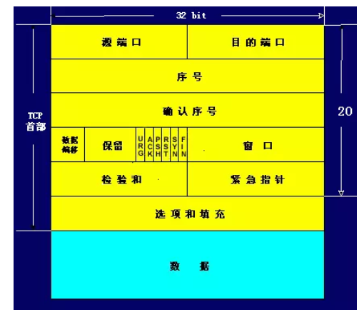
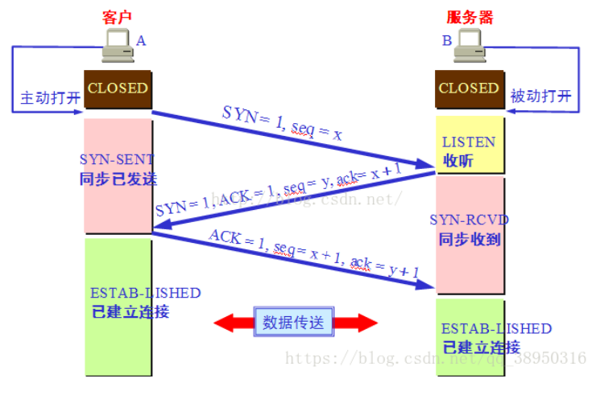
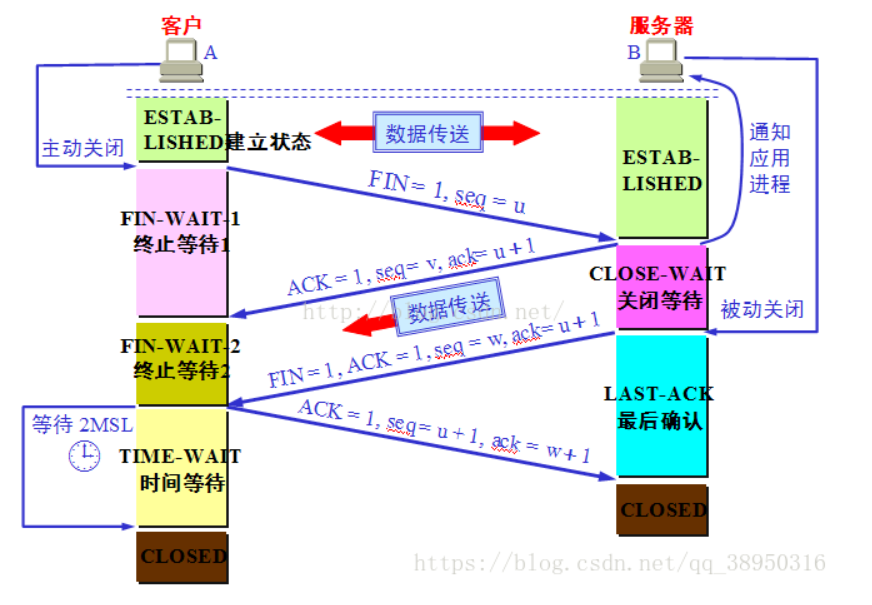
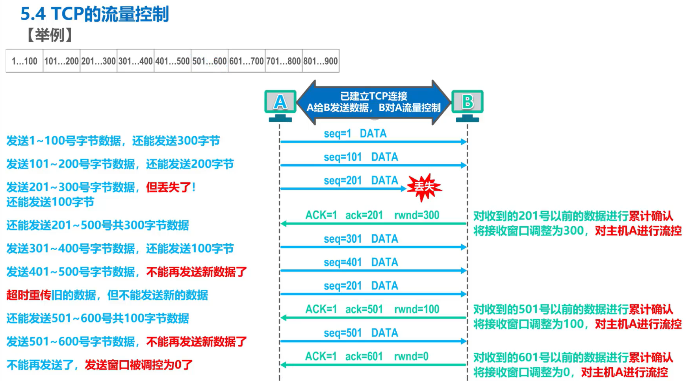
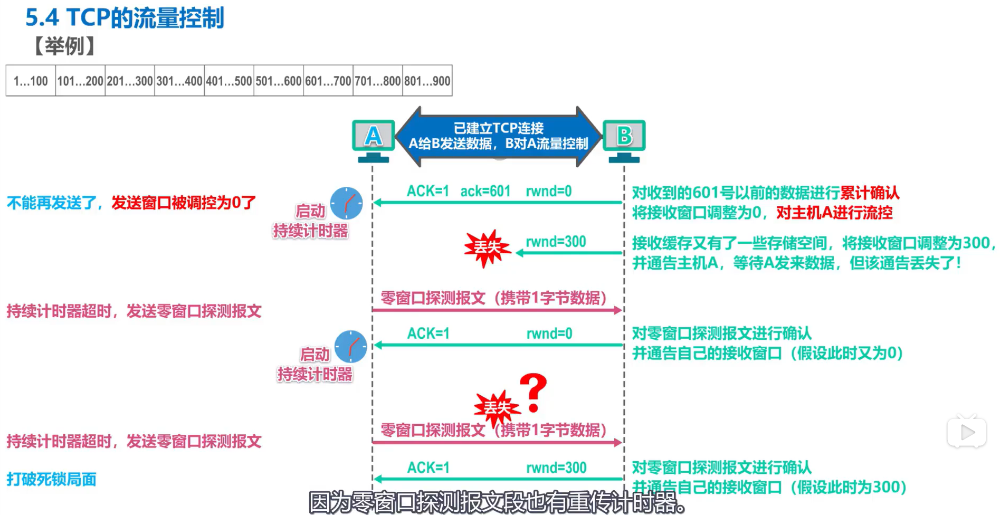
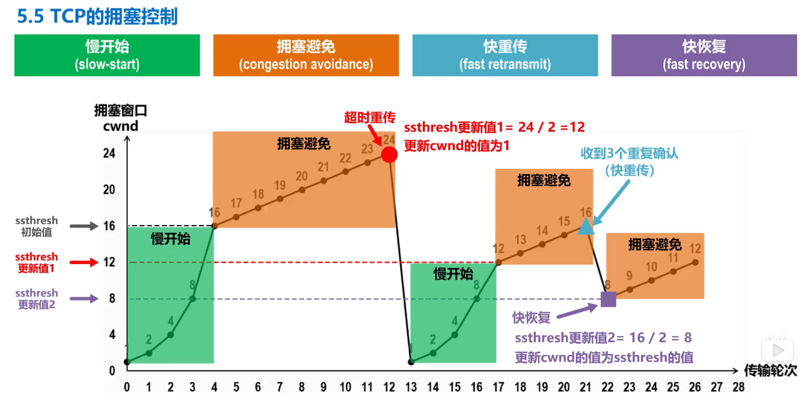

# TCP
## TCP报文格式

其中：
1. 32位确认序号：32位的序列号由接收端计算机使用，重组分段的报文成最初形式。如果设置了ACK控制位，
这个值表示一个准备接收的包的序列码。
2. 标志：6位标志域。表示为：紧急标志、有意义的应答标志、推、重置连接标志、同步序列号标志、完成发送数据标志。
按照顺序排列是：URG、ACK、PSH、RST、SYN、FIN。
3. 16位窗口大小：用来表示想收到的每个TCP数据段的大小。TCP的流量控制由连接的每一端通过声明的窗口大小来提供。窗口大小为字节数，
起始于确认序号字段指明的值，这个值是接收端正期望接收的字节。窗口大小是一个16字节字段，因而窗口大小最大为65535字节。
## 三次握手

两次握手行不行？

若两次握手就建立的话，在A第一次放给B的请求连接报文在网络中延迟了，于是A重发请求连接报文，这次准时到达B收到后同意连接，于是B的连接
就打开了，B发回同意报文，A收到后A的连接也打开了，于是开始通信。当通信完毕后，四次挥手断开连接。若此时B收到了A第一次发的、在网络中
延迟了的报文（假设报文还存活），于是B再次同意连接，打开了自己的连接，发回同意报文，但是对A来说这个连接是无效，不予理会。
于是B就干等着了。所以，两次握手是有问题的。

## 四次挥手

主动关闭的一方为什么要等待2MSL？
1. 等待2MSL是为了让A最后发的确认报文准时到达B。假设该报文在网络中延迟了。对B来说，在B最后发出FIN报文时，会开始计时，
若在2MSL后还没有收到确认，那么B会重发这个FIN报文。如果A没有等待2MSL的话，那么A是收不到B重发的FIN报文的，而B也不能正常进入closed，
所以要等待。
2. A在发送完ACK报文段后，再经过2MSL时间，就可以使本连接持续的时间所产生的所有报文段都从网络中消失。
这样就可以使下一个新的连接中不会出现这种旧的连接请求的报文段。
## MSL
MSL是Maximum Segment Lifetime英文的缩写，中文可以译为“报文最大生存时间”，他是任何报文在网络上存在的最长时间，
超过这个时间报文将被丢弃。因为tcp报文（segment）是ip数据报（datagram）的数据部分，具体称谓请参见《数据在网络各层中的称呼》一文，
而ip头中有一个TTL域，TTL是time to live的缩写，中文可以译为“生存时间”，这个生存时间是由源主机设置初始值但不是存的具体时间，
而是存储了一个ip数据报可以经过的最大路由数，每经过一个处理他的路由器此值就减1，当此值为0则数据报将被丢弃，
同时发送ICMP报文通知源主机。RFC 793中规定MSL为2分钟，实际应用中常用的是30秒，1分钟和2分钟等。

2MSL即两倍的MSL，TCP的TIME_WAIT状态也称为2MSL等待状态，当TCP的一端发起主动关闭，在发出最后一个ACK包后，
即第3次握手完成后发送了第四次握手的ACK包后就进入了TIME_WAIT状态，必须在此状态上停留两倍的MSL时间，
等待2MSL时间主要目的是怕最后一个ACK包对方没收到，那么对方在超时后将重发第三次握手的FIN包，
主动关闭端接到重发的FIN包后可以再发一个ACK应答包。在TIME_WAIT状态时两端的端口不能使用，要等到2MSL时间结束才可继续使用。
当连接处于2MSL等待阶段时任何迟到的报文段都将被丢弃。
不过在实际应用中可以通过设置SO_REUSEADDR选项达到不必等待2MSL时间结束再使用此端口。
## 流量控制

## 拥塞控制

## syn洪泛攻击
攻击者伪造大量ip，向被服务端发起连接(发送syn报文)，服务收到syn报文后，返回一个syn+ack报文，此时的连接状态位半连接，但由于攻击者的
IP地址是伪造的，意味着服务端是收不到攻击者的ack报文，于是服务端认为超时，就重发，在重发一定次数后，才断开这个连接。如果收到大量的
攻击，那么服务端被耗费大量资源无法对外服务。

防范：降低SYN timeout时间，使得主机尽快释放半连接的占用；又比如采用SYN cookie设置，如果短时间内连续收到某个IP的重复SYN请求，
则认为受到了该IP的攻击，丢弃来自该IP的后续请求报文
# 网络七层模型
