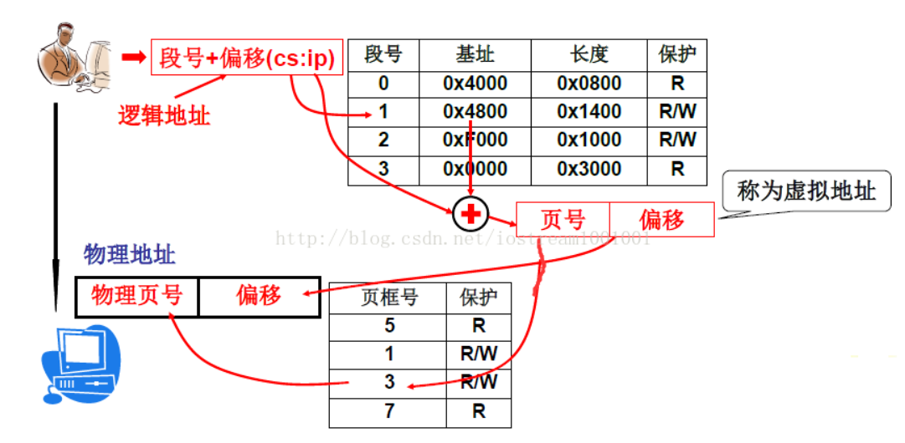

# OS
## Linux进程与线程 协程
在Linux中线程其实就是共享某些资源的进程，在创建线程的时候，其实是创建了进程并指定了它的共享资源。

而像windows和solaris等则有专门的机制支持线程，进程中有指向线程的指针，由进程去描述地址空间和共享资源，
线程本身又去描述自己独占的资源。

当父进程（p）结束后，它的进程描述符并不会马上被删除，父进程的父进程(pp)会被通知到，
pp要在自己的子进程中（即p所在的线程组中）为p的子进程（chirlds）寻找一个养父，若没有那么init进程将成为chirlds的新的父亲。

协程是用户态轻量级线程，如一个内核线程可以对应多个协程，多个协程之间的调度由程序员来控制，好处在于没有线程上下文的切换。
## 进程间的通讯方式
1. 无名管道，如jvm channel的select于wakeup
2. FIFO，也称为命名管道，它是一种文件类型。
   * FIFO可以在无关的进程之间交换数据，与无名管道不同。
   * FIFO有路径名与之相关联，它以一种特殊设备文件形式存在于文件系统中。
3. 消息队列。
4. 信号量，用于同步和互斥，不能用于交换复杂数据。
5. 共享内存。
## 用户态与内核态
进程用户态的时候，是不能后访问内核代码的，进程有4G的地址空间，在用户态是只能访问低3G的地址空间，而最后1G的空间是所有进程共享的，
内核态4G的地址空间都能访问。

线程在发生中断的时候，如软中断-系统调用，会从用户态转为内核态，此时用户栈会保存用户代码的上下文，内核代码将在内核栈中执行，
此时若发生进程调度，内核栈将保存此时的内核代码的上下文。
## 进程上下文
## 进程调度算法
1. FIFO
2. 抢占式
3. 基于时间片
4. 基于时间片的优先级
## 死锁
### 产生的四个必要条件
1. 互斥
2. 不可抢夺
3. 占有且等待
4. 循环等待
### 避免，打破四个中的其中一个
实际上常用的有：
1. 可抢夺
2. 一次申请（即把需要的锁，一次申请过来）
3. 申请超时（在申请的时候等待一段时间，仍失败就放弃）
## 银行家算法（资源有序分配，避免死锁）
最大需求矩阵，当前需求矩阵，可用矩阵
## 虚拟内存
### 段式 页式 段页式
段式：
在内存把程序载入内存中时，会采用分段的方式进行加载，不同的程序段使用不同的存储形式，简单的说就是对于不同的程序块，
留不同的空闲空间，分开访问。例如代码段一般是只读的不会增长，那么就不留空闲空间。而动态数组段就留一个较多的空闲空间，
因为需要动态增长。如果不采用分段，那么当动态数组不断增长，超过了原来分配的空间，那么就必须把整个程序拷贝到另一个更大的空间。
这个无疑是浪费空间和时间的，如果仅仅是把动态函数的那段移动到更大的空间，这样效率会有很大的提高，并且使内存的管理更加精确。
那么定位具体的指令（数据）的地址就可以修改为：<段号，段内偏移>。

页式：
在内存管理中，为了减少内存的空间的浪费，采用了页作为分配的基本单位（大小通常是4K），而且在分配的过程中采用了页号（逻辑地址）
和页框号（物理地址）的映射表，这样使得程序在内存中的分布就不需要严格的连续分布了

段页式：
对用户而言，分段是对内存的有效使用；而对于计算机而言，分页可以提高内存的使用效率。操作系统需要满足两个方面的需求，
所以就采取了段页相结合的方式来管理内存。
为了解决这一问题引入了虚拟内存（就是通过一张段表完成地址映射转换）：简单的说就是用户发出访问程序段的逻辑地址<段号，段内偏移量>，
通过对这一逻辑地址的运算将其转换为访问页的虚拟地址<页号，页内偏移量>，再由MMU将其转换为内存的物理地址<页框号，页内偏移量>。
通过这种方式，用户访问的就是虚拟内存，经过两次地址映射后，变成真实的物理地址。

### 页与页框（块）
页是指程序分页，如 1kB 一页。

页框或者块是指内存分页框或者分块，如 1kB 一页框或者一块。 
### 页式存储与地址转换（逻辑地址转物理地址）
例如：
已知某个分页系统，页面大小为1K(即1024字节)，某一个作业有4个页面，分别装入到主存的第3、4、6、8块中，求逻辑地址2100对应的物理地址。

解：

根据题目产生页表：

|  页号   | 页框号/帧号/块号  |
|  ----  | ----  |
| 0 | 3 |
| 1 | 4 |
| 2 | 6 |
| 3 | 8 |

1. 求该逻辑地址的页号 = 2100/1024=2 （整除）
2. 求它的页内偏移量 = 2100 % 1024 =52 （取余）
3. 根据逻辑地址的页号查出物理地址的页框号/帧号： 
4. 求出物理地址 = 6*1024 + 52 = 6196
