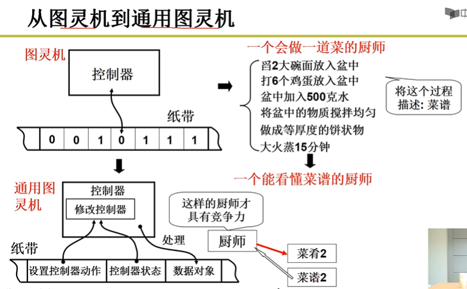

# OS
## 操作系统的故事（32位机）
### 图灵机与通用图灵机（冯诺依曼结构）

### 操作系统的历史
1. 批处理系统
2. 多道程序系统(单个进程等待IO时切换到下一个)
3. 分时系统(unix)
### 按下电源键第一件事
加载固定引导扇区里的内容，这内容（汇编代码，机器代码）与启用进入操作系统相关。（可以联想模拟文件系统加载第一个块）
### 从x86 16位实模式切换到32位保护模式
### 从汇编进入linux main函数（初始化，不会结束）
c代码最后也是编译成汇编的。


```
#include <unistd.h>
#include <stdio.h> 
int main () 
{ 
	pid_t fpid; //fpid表示fork函数返回的值
	int count=0;
	fpid=fork(); 
	if (fpid < 0) 
		printf("error in fork!"); 
	else if (fpid == 0) {
		printf("i am the child process, my process id is %d/n",getpid()); 
		printf("我是爹的儿子/n");//对某些人来说中文看着更直白。
		count++;
	}
	else {
		printf("i am the parent process, my process id is %d/n",getpid()); 
		printf("我是孩子他爹/n");
		count++;
	}
	printf("统计结果是: %d/n",count);
	return 0;
}
```
运行结果是：

    i am the child process, my process id is 5574
    我是爹的儿子
    统计结果是: 1
    i am the parent process, my process id is 5573
    我是孩子他爹
    统计结果是: 1
    
对于父进程，返回子进程id，对于子进程返回0；

子进程执行fork之后的代码，所以在shell中每一条命令都是新建子进程来执行的。
### 进入shell
### 
## Linux进程与线程 协程
在Linux中线程其实就是共享某些资源的进程（并没有为线程设计单独的数据结构，Linux进程本身也是轻量级的），在创建线程的时候，
其实是创建了进程并指定了它的共享资源。

而像windows和solaris等则有专门的机制支持线程，进程中有指向线程的指针，由进程去描述地址空间和共享资源，
线程本身又去描述自己独占的资源。

当父进程（p）结束后，它的进程描述符并不会马上被删除，父进程的父进程(pp)会被通知到，
pp要在自己的子进程中（即p所在的线程组中）为p的子进程（chirlds）寻找一个养父，若没有那么init进程将成为chirlds的新的父亲。

协程是用户级轻量级线程，如一个内核线程可以对应多个协程，多个协程之间的调度由程序员来控制，好处在于没有线程上下文的切换。

线程的优点，其实使用多进程编程同样是可以提高cpu的利用率的，只是说进程的创建、销毁耗费的资源要比线程的多，而且通信的方式也不够好，
同一进程内，线程之间的通信就比较方便了。

进程内的用户级线程如果发生异常，那么会导致进程退出，而内核级线程则不会。
## 僵尸进程
一个进程使用fork创建子进程，如果子进程退出，而父进程并没有调用wait或者waitpid获取子进程的状态信息，
那么子进程的进程描述符等一系列信息还会保存在系统中。这种进程称之为僵死进程。
解决方式：
1. 父进程调用wait/waitpid函数：pid_t wait(int *status)
2. 杀死僵尸进程的父进程，使僵尸子进程成为孤儿进程，从而其的父进程变为init进程，通过init进程可以处理僵尸进程。
## 进程间的通信方式
1. 无名管道，用于父子进程间通信，如shell中的 | 。
2. FIFO，也称为命名管道，是一个特殊的文件，如建立/tmp/fifo.1。
   * FIFO可以在无关的进程之间交换数据，与无名管道不同。
   * FIFO有路径名与之相关联，从而使无亲缘关系的进程可以访问同一个FIFO。
   * FIFO可设置nonblock
3. 消息队列(内核空间的链表)。参考：https://www.jianshu.com/p/7e3045cf1ab8
4. 信号量，用于同步和互斥，不能用于交换复杂数据。
5. 共享内存，mmap。
   * 用户空间读写文件时，需经过内核，数据拷贝多了一次。通过mmap函数，可以建立用户虚拟空间到文件所在物理页的直接映射建立该映射后，
   可以像直接操作内存一样读写文件（比如读写数组），减少一次用户到内核的数据拷贝。
6. socket（可参考windows下 channel的wakeUp）
## 用户态与内核态
进程用户态的时候，是不能后访问内核代码的，进程有4G的地址空间，在用户态是只能访问低3G的地址空间，而最后1G的空间是所有进程共享的，
内核态4G的地址空间都能访问。


线程在发生中断的时候，如软中断-系统调用，会从用户态转为内核态，此时用户栈会保存用户代码的上下文，内核代码将在内核栈中执行，
此时若发生进程调度，内核栈将保存此时的内核代码的上下文。
## 虚拟内存 内存映射 共享内存
用户虚拟地址空间大小为3G,每个应用程序均独占完整的3G虚拟空间。
## 进程
### 进程控制块

### 进程处理

### 上下文切换时机
在涉及进程同步的问题时，切换时机要遵循某种规则，即应在安全区域进行切换。

1. 中断。
   * 时钟中断（计组，取指，执行，检查中断）。(与时间片轮转有关)
   * IO中断。
   * 缺页中断。
2. 陷阱。
3. 系统调用(软中断、陷阱的一种，从用户态陷入内核态)。
### 上下文切换操作
1. 状态切换。
2. 模式切换。（用户态->内核态，开销比状态切换小）

完整的进程切换步骤：
  * 保存处理器上下文环境；
  * 更新当前处于运行态进程的进程控制块；
  * 将进程的进程控制块移到相应的队列；
  * 选择另一个进程运行；
  * 更新所选择进程的进程控制块；
  * 更新内存管理的数据结构；
  * 恢复处理器在被选择的进程最近一次切换出运行状态时的上下文环境
## 进程调度算法
1. FIFO
2. 抢占式
3. 基于时间片
4. 基于时间片的优先级
5. 最短进程优先
6. 最短剩余时间优先。
## 页面调度算法
1. 最佳OPT。
   * 选择置换下次访问距当前时间最长的那些页。该算法能导致最少的缺页中断，但它要求操作系统必须知道将来的事件，所以不可能实现，
   可作为一种标准来衡量其它算法的性能。
2. FIFO
3. LRU。
   * 性能接近于OPT，但比较难以实现。为每一页添加一个最后一次访问的时间戳，并且必须在每次访问内存时，都要更新时间戳。
4. 时钟算法。
### 页面处理过程

## 磁盘调度算法
1. FIFO
2. 最短寻道时间优先算法
   * 有些服务可能得不到响应
3. SCAN，磁臂从磁盘的一端向另一端移动，同时当磁头移过每个柱面时，处理位于该柱面上的服务请求。当到达另一端时，磁头改变方向，
处理继续。需要知道磁头的当前位置和磁头移动的方向。
   * 某些请求处理可能不及时。
4. C-SCAN，将磁头从磁盘一端移到另一端，随着移动不断的处理请求。不过，当磁头移到另一端时，马上返回,返回时不处理请求。
## 死锁
### 产生的四个必要条件
1. 互斥
2. 不可抢夺
3. 占有且等待
4. 循环等待
### 避免，打破四个中的其中一个
实际上常用的有：
1. 可抢夺
2. 一次申请（即把需要的锁，一次申请过来）
3. 申请超时（在申请的时候等待一段时间，仍失败就放弃）
## 银行家算法（资源有序分配，避免死锁）
最大需求矩阵，当前需求矩阵，可用矩阵
## 虚拟内存
### 段式 页式 段页式
段式(程序员可见)：
在内存把程序载入内存中时，会采用分段的方式进行加载，不同的程序段使用不同的存储形式，简单的说就是对于不同的程序块，
留不同的空闲空间，分开访问。例如代码段一般是只读的不会增长，那么就不留空闲空间。而动态数组段就留一个较多的空闲空间，
因为需要动态增长。如果不采用分段，那么当动态数组不断增长，超过了原来分配的空间，那么就必须把整个程序拷贝到另一个更大的空间。
这个无疑是浪费空间和时间的，如果仅仅是把动态函数的那段移动到更大的空间，这样效率会有很大的提高，并且使内存的管理更加精确。
那么定位具体的指令（数据）的地址就可以修改为：<段号，段内偏移>。

页式(程序员不可见)：
在内存管理中，为了减少内存的空间的浪费，采用了页作为分配的基本单位（大小通常是4KB），而且在分配的过程中采用了页号（逻辑地址）
和页框号（物理地址）的映射表，这样使得程序在内存中的分布就不需要严格的连续分布了.

段页式：
对用户而言，分段是对内存的有效使用；而对于计算机而言，分页可以提高内存的使用效率。操作系统需要满足两个方面的需求，
所以就采取了段页相结合的方式来管理内存。用户的地址空间被程序员划分成许多段，每个段一次划分成许多固定大小的页，
页的长度等于内存中的页框大小。
为了解决这一问题引入了虚拟内存（就是通过一张段表完成地址映射转换）：简单的说就是用户发出访问程序段的逻辑地址<段号，段内偏移量>，
通过对这一逻辑地址的运算将其转换为访问页的虚拟地址<页号，页内偏移量>，再由MMU将其转换为内存的物理地址<页框号，页内偏移量>。
通过这种方式，用户访问的就是虚拟内存，经过两次地址映射后，变成真实的物理地址。


### 页与页框（块）
页是指程序分页，如 1kB 一页。

页框或者块是指内存分页框或者分块，如 1kB 一页框或者一块。 
### 页式存储与地址转换（逻辑地址转物理地址）
例如：
已知某个分页系统，页面大小为1K(即1024字节)，某一个作业有4个页面，分别装入到主存的第3、4、6、8块中，求逻辑地址2100对应的物理地址。

解：

根据题目产生页表：

|  页号   | 页框号/帧号/块号  |
|  ----  | ----  |
| 0 | 3 |
| 1 | 4 |
| 2 | 6 |
| 3 | 8 |

1. 求该逻辑地址的页号 = 2100/1024=2 （整除）
2. 求它的页内偏移量 = 2100 % 1024 =52 （取余）
3. 根据逻辑地址的页号查出物理地址的页框号/帧号： 
4. 求出物理地址 = 6*1024 + 52 = 6196
