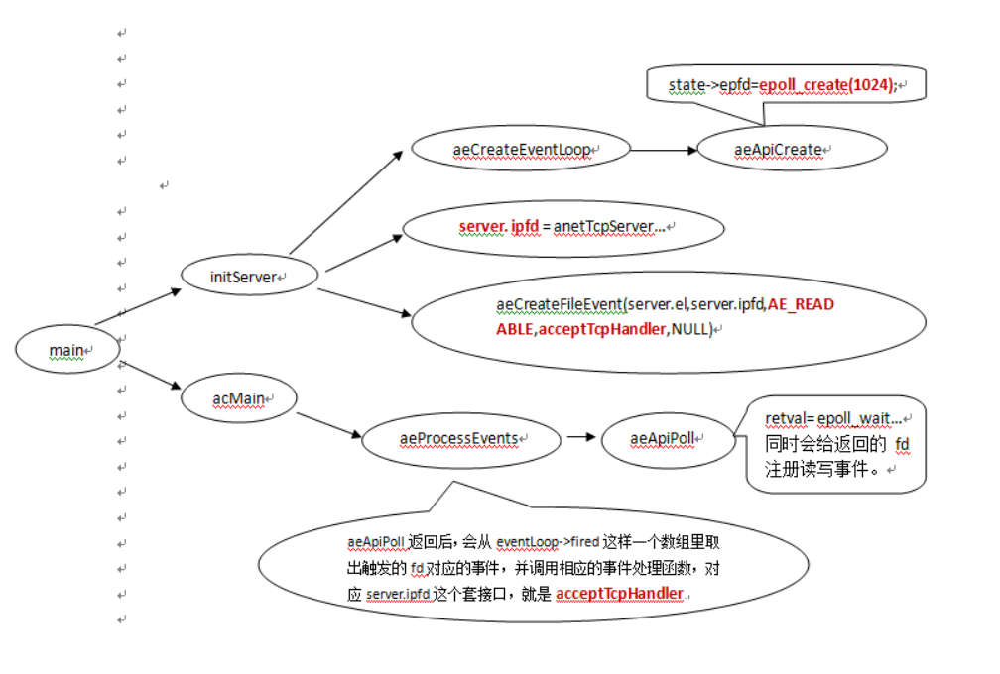

# redis
Remote dictionary Service 远程字典服务
## 集群
如何理解redis的集群？首先，单机的redis有压力和单点故障的问题。
### 主从复制
要解决压力，可以做主从架构，主写从读，于是有了主从数据库的一致性问题（MySQL也一样）。为了解决一致性:
* 全量复制。
  1. 从发送sync命令。
  2. 主收到命令后，执行bgsave，创建一个子进程，在后台生成RDB文件，并使用一个缓冲区（称为复制缓冲区）
  记录从现在开始执行的所有写命令。
  3. 从节点首先清除自己的旧数据，然后载入接收的RDB文件，将数据库状态更新至主节点执行bgsave时的数据库状态。
  4. 主节点将前述复制缓冲区中的所有写命令发送给从节点，从节点执行这些写命令，将数据库状态更新至主节点的最新状态。
  5. 如果从节点开启了AOF，则会触发bgrewriteaof的执行，从而保证AOF文件更新至主节点的最新状态。
* 增量复制

  

   master除了备份RDB文件之外还会维护者一个环形队列，以及环形队列的写索引和slave同步的全局offset，环形队列用于存储最新的操作数据，
 当slave和maste断开重连之后，会把slave维护的offset，也就是上一次同步到哪里的这个值告诉master，
 同时会告诉master上次和当前slave连接的master的runid，满足下面两个条件，Redis不会全量复制：
    * slave传递的run id和master的run id一致。
    * master在环形队列上可以找到对呀offset的值。
   
   满足上面两个条件，Redis就不会全量复制，这样的好处是大大的提高的性能，不做无效的功。
 增量复制是由psync命令实现的，slave可以通过psync命令来让Redis进行增量复制，当然最终是否能够增量复制取决于环形队列的大小和
 slave的断线时间长短和重连的这个master是否是之前的master。 
 

至此，又引入了新的问题，那就是主宕机后需要手动把一台从服务器切换为主服务器，这就需要人工干预，费事费力，
还会造成一段时间内服务不可用。于是有了哨兵模式，主宕机后，由哨兵来把从升级为主。
### 哨兵
哨兵是一个独立的进程，作为进程，它会独立运行。其原理是哨兵通过发送命令，等待Redis服务器响应，从而监控运行的多个Redis实例。
当哨兵监测到master宕机，会自动将slave切换成master，然后通过发布订阅模式通知其他的从服务器，修改配置文件，让它们切换主机。
故障切换（failover）的过程。假设主服务器宕机，哨兵1先检测到这个结果，系统并不会马上进行failover过程，
仅仅是哨兵1主观的认为主服务器不可用，这个现象成为主观下线。当后面的哨兵也检测到主服务器不可用，并且数量达到一定值时，
那么哨兵之间就会进行一次投票，投票的结果由一个哨兵发起，进行failover操作。切换成功后，就会通过发布订阅模式，
让各个哨兵把自己监控的从服务器实现切换主机，这个过程称为客观下线。这样对于客户端而言，一切都是透明的。

哨兵选举过程（基于raft算法），每个哨兵**随机等待**后都向其他哨兵发出自己想成为执行者的请求，每个哨兵对于这样的请求，
如果自己自己此前没有同意过，那么就同意次请求。详细参见：http://thesecretlivesofdata.com

slave选举，高优先级，数据完整性，runid字典序。
### 
继续增进，现在希望写的压力也分散，而且因为内存有上限，希望把一部分数据分到其他的机器上，而不是每台机器都保存完成的数据镜像。
于是有了cluster模式。
### Cluster
一组Redis Cluster是由多个Redis实例组成，官方推荐我们使用6实例，其中3个为主节点，3个为从结点。一旦有主节点发生故障的时候，
Redis Cluster可以选举出对应的从结点成为新的主节点，继续对外服务，从而保证服务的高可用性。
Redis Cluster 把所有的数据划分为16384个不同的槽位，可以根据机器的性能把不同的槽位分配给不同的Redis实例，对于Redis实例来说，
他们只会存储部分的Redis数据，当然，槽的数据是可以迁移的，不同的实例之间，可以通过一定的协议，进行数据迁移。
   * 数据获取：首先客户端需要保存一份Redis Cluster槽相关的信息，也就是路由表，然后对即将访问的key进行哈希计算，
   计算出对应的槽位，然后向对应的Redis实例发起查询请求。如果访问的Redis实例中，的确保存着对应槽的数据信息，就会进行返回，
   否则向客户端返回一个Moved指令，让客户端到正确的地址进行获取。（在客户端拥有足够多信息时，hash计算可以在客户端中完成，
   免了一次重定向的过程）
   * 数据迁移：在分布式系统中，衡量一个系统好坏的一项重要指标，系统的扩展性。什么是系统的扩展性呢？就是今天你又10万个用户，
   需要4台机器进行服务，如果明天的用户数量增加到20万了，是不是只要简单的增加4台机器就行，同时又不需要进行复杂的数据迁移。
   Redis Cluster便是如此，当你新增一些实例的时候，只需要将一部分槽位迁移到新的实例即可。在迁移的过程中，
   客户端会先去旧的实例上去查询数据，因为迁移正在发生，如果对应的数据还在本机上，那么直接返回，
   否则返回让客户端重定向到新的实例。客户端先向新的机器发起ask指令，新实例返回成功后，再一次查询最终的结果。
## 线程模型



redis整个流程和netty EventLoop是很相像的，epoll_wait要照顾定时任务，如果这一次没能把数据写到socket缓冲区里去的话（缓冲区已满），
那么就注册写事件，在下一次epoll_wait的时候去处理。，而nginx的io线程就负责accept，所以采用阻塞式调用，
而netty中采用超时select，因为要处理定时任务如心跳。
## 分布式锁
### 单实例下（一主多从）
获取锁（设置锁）
```java
SET key_name my_random_value NX PX 30000                  
// NX 表示if not exist 就设置并返回True，否则不设置并返回False   PX 表示过期时间用毫秒级， 30000 表示这些毫秒时间后此key过期
```
释放锁（删除锁） 最好使用Lua脚本删除（redis保证执行此脚本时不执行其他操作，保证操作的原子性），代码如下；逻辑是先获取key，
如果存在并且值是自己设置的就删除此key;否则就跳过；
```java
if redis.call("get",KEYS[1]) == ARGV[1] then
    return redis.call("del",KEYS[1])
else
    return 0
end
```
流程图：


### Redission 常用于单实例下
redisson很好了封装了上面这把锁，使其适用于多种复杂的情况，如可重入，过期等等。
流程：


redission的核心为：每隔一段时间若client仍持有锁为其续命、延长超时时间。
### 多实例下 RedLock
要解决的问题：主节点挂掉时，从节点会取而代之，客户端上却并没有明显感知。原先第一个客户端在主节点中申请成功了一把锁，但是这把锁
还没有来得及同步到从节点，主节点突然挂掉了。然后从节点变成了主节点，这个新的节点内部没有这个锁，所以当另一个客户端过来请求加锁时，
立即就批准了。

算法很易懂，起 5 个 master 节点，分布在不同的机房尽量保证可用性。为了获得锁，client 会进行如下操作：
1. 得到当前的时间，微秒单位
2. 尝试顺序地在 5 个实例上申请锁，当然需要使用相同的 key 和 random value，这里一个 client 需要合理设置与 master 节点沟通的 
timeout 大小，避免长时间和一个 fail 了的节点浪费时间
3. 当 client 在大于等于 3 个 master 上成功申请到锁的时候，且它会计算申请锁消耗了多少时间，这部分消耗的时间采用获得锁的当下时间
减去第一步获得的时间戳得到，如果锁的持续时长（lock validity time）比流逝的时间多的话，那么锁就真正获取到了。
4. 如果锁申请到了，那么锁真正的 lock validity time 应该是 origin（lock validity time） - 申请锁期间流逝的时间
5. 如果 client 申请锁失败了，那么它就会在少部分申请成功锁的 master 节点上执行释放锁的操作，重置状态

失败重试

如果一个 client 申请锁失败了，那么它需要稍等一会在重试避免多个 client 同时申请锁的情况，最好的情况是一个 client 需要几乎同时
向 5 个 master 发起锁申请。另外就是如果 client 申请锁失败了它需要尽快在它曾经申请到锁的 master 上执行 unlock 操作，便于其他 
client 获得这把锁，避免这些锁过期造成的时间浪费，当然如果这时候网络分区使得 client 无法联系上这些 master，那么这种浪费就是不得不
付出的代价了。
## 应用数据结构
### String
### Hash
当数量少且均为数字时，使用inset(O(log n)判断存在)，否则，当数量少的时候，使用ziplist实现(O(n)判断存在)，否则，当数量多的时候，
使用dict实现(O(1)判断存在)。
### List 可用作阻塞队列
1. lpush: 在左侧（即列表头部）插入数据。
2. rpop: 在右侧（即列表尾部）删除数据。
3. rpush: 在右侧（即列表尾部）插入数据。
4. lpop: 在左侧（即列表头部）删除数据。
### Set


支持的运算：集合的交集（共同关注模型），并集，差集运算。

当元素为整数，且元素个数不超过512时，底层使用inset来实现（判断存在O(log n)），否则使用dict（判断存在O(1)）。
### Sorted Set(zset，可将到期时间作为分数实现延时队列)

### com.github.AllenDuke.dataStructure.BitMap(其实也是String的应用，亿级用户的日活跃数统计)

### BloomFilter 
以较少的内存提供较精确的存在判断
1. bf.reserve [名称] [错误率] [初始bit数]
2. bf.add
3. bf.exists
4. bf.madd
5. bf.mexists
### Geo(其实也是zset的应用)实现附近的人
GeoHash算法


### HyperLogLog
以较小的内存提供较精确的统计，虽然统计不绝对精确，但内存相比set占用更少


pf 的内存占用为什么是 12k？
在 Redis 的 HyperLogLog实现中用到的是 16384 个桶，也就是 2^14，每个桶的 maxbits 需要 6 个 bits 来存储，最
大可以表示 maxbits=63，于是总共占用内存就是 2^14 * 6 / 8 = 12k 字节。
## 内部数据结构
### dict
Redis的一个database中所有key到value的映射，就是使用一个dict来维护的。不过，这只是它在Redis中的一个用途而已，
它在Redis中被使用的地方还有很多。比如，一个Redis hash结构，当它的field较多时，便会采用dict来存储。再比如，
Redis配合使用dict和skiplist来共同维护一个sorted set。

基于hash表，使用拉链法解决hash冲突，类似java HashMap，具有装载因子，当达到装载数量时，触发**增量式重hash**，在重哈希期间，
数据从第一个哈希表向第二个哈希表迁移。


 * 渐进式rehash，采取分而治之的方式， 将 rehash 键值对所需的计算工作均摊到对字典的每个添加、删除、查找和更新操作上，以及周期函数， 
 从而避免了集中式 rehash 而带来的庞大计算量
 * 两个哈希表（ht[2]）。只有在重哈希的过程中，ht[0]和ht[1](rehash时才分配空间)才都有效。而在平常情况下，只有ht[0]有效，
 ht[1]里面没有任何数据。上图表示的就是重哈希进行到中间某一步时的情况。
 * 当前重哈希索引（rehashidx）。如果rehashidx = -1，表示当前没有在重哈希过程中；否则，表示当前正在进行重哈希，
且它的值记录了当前重哈希进行到哪一步了
 * 在redis中每一个增删改查命令中都会判断数据库字典中的哈希表是否正在进行渐进式rehash，如果是则帮助执行一次。
 * 虽然redis实现了在读写操作时，辅助服务器进行渐进式rehash操作，但是如果服务器比较空闲，
 redis数据库将很长时间内都一直使用两个哈希表。所以在redis周期函数中，如果发现有字典正在进行渐进式rehash操作，则会花费1毫秒的时间，
 帮助一起进行渐进式rehash操作。
 * 在rehash期间，同时有两个hash表在使用，会使得redis内存使用量瞬间突增，在Redis 满容状态下由于Rehash会导致大量Key驱逐。
### robj
key是string类型，而value可以是多种数据类型。

dict的key固定用一种数据结构来表达就够了，这就是动态字符串sds。而value则比较复杂，为了在同一个dict内能够存储不同类型的value，
这就需要一个通用的数据结构，这个通用的数据结构就是robj（全名是redisObject）。
举个例子：如果value是一个list，那么它的内部存储结构是一个quicklist（quicklist的具体实现我们放在后面的文章讨论）；
如果value是一个string，那么它的内部存储结构一般情况下是一个sds。当然实际情况更复杂一点，比如一个string类型的value，
如果它的值是一个数字，那么Redis内部还会把它转成long型来存储，从而减小内存使用。
而一个robj既能表示一个sds，也能表示一个quicklist，甚至还能表示一个long型。

一个robj包含如下5个字段：
 * type: 对象的数据类型。占4个bit。可能的取值有5种：OBJ_STRING, OBJ_LIST, OBJ_SET, OBJ_ZSET, OBJ_HASH，
 分别对应Redis对外暴露的5种数据结构（即我们在第一篇文章中提到的第一个层面的5种数据结构）。
 * encoding: 对象的内部表示方式（也可以称为编码）。占4个bit。可能的取值有10种，即前面代码中的10个OBJ_ENCODING_XXX常量。
 * lru: 做LRU替换算法用，占24个bit。这个不是我们这里讨论的重点，暂时忽略。
 * refcount: 引用计数。它允许robj对象在某些情况下被共享。
 * ptr: 数据指针。指向真正的数据。比如，一个代表string的robj，它的ptr可能指向一个sds结构；一个代表list的robj，
 它的ptr可能指向一个quicklist。
### sds Simple Dynamic String 应用数据结构为string


SDS与C字符串的比较，SDS在C字符串的基础上加入了free和len字段，带来了很多好处：
1. 获取字符串长度：SDS是O(1)，C字符串是O(n)
2. 缓冲区溢出：使用C字符串的API时，如果字符串长度增加（如strcat操作）而忘记重新分配内存，很容易造成缓冲区的溢出；
而SDS由于记录了长度，相应的API在可能造成缓冲区溢出时会自动重新分配内存，杜绝了缓冲区溢出。
3. 修改字符串时内存的重分配：对于C字符串，如果要修改字符串，必须要重新分配内存（先释放再申请），因为如果没有重新分配，
字符串长度增大时会造成内存缓冲区溢出，字符串长度减小时会造成内存泄露。而对于SDS，由于可以记录len和free，
因此解除了字符串长度和空间数组长度之间的关联，可以在此基础上进行优化：空间预分配策略（即分配内存时比实际需要的多）
使得字符串长度增大时重新分配内存的概率大大减小；惰性空间释放策略使得字符串长度减小时重新分配内存的概率大大减小。
4. 存取二进制数据：SDS可以，C字符串不可以。因为C字符串以空字符作为字符串结束的标识，而对于一些二进制文件（如图片等），
内容可能包括空字符串，因此C字符串无法正确存取；而SDS以字符串长度len来作为字符串结束标识，因此没有这个问题。

此外，由于SDS中的buf仍然使用了C字符串（即以’\0’结尾），因此SDS可以使用C字符串库中的部分函数；但是需要注意的是，只有当SDS
用来存储文本数据时才可以这样使用，在存储二进制数据时则不行（’\0’不一定是结尾）。

由于sds就是一个字符数组，所以对它的某一部分进行操作似乎都比较简单。但是，string除了支持这些操作之外，当它存储的值是个数字的时候，
它还支持incr、decr等操作。那么，当string存储数字值的时候，它的内部存储不是sds了，而且，这种情况下，
setbit和getrange的实现也会有所不同。
### ziplist Hash结构的一个实现
ziplist可以用于存储字符串或整数，其中整数是按真正的二进制表示进行编码的，而不是编码成字符串序列。
它能以O(1)的时间复杂度在表的两端提供push和pop操作，但它又不是一个LinkedList，可以认为它是一个ArrayQueue。

实际上，ziplist充分体现了Redis对于存储效率的追求。一个普通的双向链表，链表中每一项都占用独立的一块内存，
各项之间用地址指针（或引用）连接起来。这种方式会带来大量的**内存碎片**，而且地址指针也会占用额外的内存。
而ziplist却是将表中每一项存放在前后连续的地址空间内，一个ziplist整体占用一大块内存。它是一个表（list），
但其实不是一个链表（linked list）。

另外，ziplist为了在细节上节省内存，对于值的存储采用了变长的编码方式，大概意思是说，对于大的整数，就多用一些字节来存储，
而对于小的整数，就少用一些字节来存储。


### quicklist 应用数据结构为list
quicklist是一个以ziplist为节点的双向链表结构，quicklist的结构为什么这样设计呢？总结起来，大概又是一个空间和时间的折中。
* 每个quicklist节点上的ziplist越短，则内存碎片越多。内存碎片多了，有可能在内存中产生很多无法被利用的小碎片，从而降低存储效率。
这种情况的极端是每个quicklist节点上的ziplist只包含一个数据项，这就蜕化成一个普通的双向链表了。
* 每个quicklist节点上的ziplist越长，则为ziplist分配大块连续内存空间的难度就越大。有可能出现内存里有很多小块的空闲空间（它们
 加起来很多），但却找不到一块足够大的空闲空间分配给ziplist的情况。这同样会降低存储效率。这种情况的极端是整个quicklist只有一个节点，
 所有的数据项都分配在这仅有的一个节点的ziplist里面。这其实蜕化成一个ziplist了。
 ```java
typedef struct quicklistNode {
    struct quicklistNode *prev;
    struct quicklistNode *next;
    unsigned char *zl; //如果当前节点的数据没有压缩，那么它指向一个ziplist结构；否则，它指向一个quicklistLZF结构。
    unsigned int sz;             /* ziplist size in bytes */
    unsigned int count : 16;     /* count of items in ziplist */
    unsigned int encoding : 2;   /* RAW==1 or LZF==2 */
    unsigned int container : 2;  /* NONE==1 or ZIPLIST==2 */
    unsigned int recompress : 1; /* was this node previous compressed? */
    unsigned int attempted_compress : 1; /* node can't compress; too small */
    unsigned int extra : 10; /* more bits to steal for future usage */
} quicklistNode;

typedef struct quicklistLZF {
    unsigned int sz; /* LZF size in bytes*/
    char compressed[];
} quicklistLZF;

typedef struct quicklist {
    quicklistNode *head;
    quicklistNode *tail;
    unsigned long count;        /* total count of all entries in all ziplists */
    unsigned int len;           /* number of quicklistNodes */
    int fill : 16;              /* fill factor for individual nodes */
    unsigned int compress : 16; /* depth of end nodes not to compress;0=off */
} quicklist;
```

### skiplist 应用数据结构为sorted set（准确地说，sorted set底层不仅仅使用了skiplist，还使用了ziplist和dict。）
skiplist本质上也是一种查找结构（但不同于平衡树和hash表），用于解决算法中的查找问题（Searching），即根据给定的key，
快速查到它所在的位置（或者对应的value）。


列表中的元素越多，能够深入的层次就越深，能进入到顶层的概率就会越大。

层数的计算：
```java
randomLevel()
    level := 1
    // random()返回一个[0...1)的随机数
    while random() < p and level < MaxLevel do
        level := level + 1
    return level

p = 1/4
MaxLevel = 32
```

我们前面提到过，Redis中的sorted set，是在skiplist, dict和ziplist基础上构建起来的:
1. 当数据较少时，sorted set是由一个ziplist来实现的(当字段个数小于hash-max-ziplist-entries（配置文件参数，默认512）
并且每个字段值长度小于hash-max-ziplist-value（配置文件参数，默认64)。
2. 当数据多的时候，sorted set是由一个叫zset的数据结构来实现的，这个zset包含一个dict + 一个skiplist。
dict用来查询数据到分数(score)的对应关系，而skiplist用来根据分数查询数据（可能是范围查找）.

使用原因：
1. 要有平衡树的查找性能，跳表在插入性能上明显优于平衡树，平衡树的插入和删除操作可能引发子树的调整，逻辑复杂，
而skiplist的插入和删除只需要修改相邻节点的指针，操作简单又快速。
2. 比平衡树占的内存小。平衡树每个节点包含2个指针（分别指向左右子树），而skiplist每个节点包含的指针数目平均为1/(1-p)，
具体取决于参数p的大小。如果像Redis里的实现一样，取p=1/4，那么平均每个节点包含1.33个指针，比平衡树更有优势。
3. 更快的范围查找。第1层链表不是一个单向链表，而是一个双向链表。而平衡树就只能中序遍历了。
4. 比平衡树更易实现和调试。
### inset 应用数据结构为（元素为整数）set
intset是一个由整数组成的有序集合，从而便于在上面进行二分查找，用于快速地判断一个元素是否属于这个集合。在内存分配上与ziplist类似，
是连续的一整块内存空间，而且对于大整数和小整数（按绝对值）采取了不同的编码，尽量对内存的使用进行了优化。
```java
typedef struct intset {
    uint32_t encoding; /* 编码方式 */
    uint32_t length; /* 集合内元素个数 *
    int8_t contents[]; /* 保存元素的数组 */
} intset;
```

intset与ziplist相比：
 * ziplist可以存储任意二进制串，而intset只能存储整数。
 * ziplist是无序的，而intset是从小到大有序的。因此，在ziplist上查找只能遍历，而在intset上可以进行二分查找，性能更高。
 * ziplist可以对每个数据项进行不同的变长编码（每个数据项前面都有数据长度字段len），而intset只能整体使用一个统一的编码（encoding）。
 
 当元素 不满足为整数 或者 元素个数不超过512 这两个条件时，set用dict实现。
 
 为了节省内存，使用升级与降级，即原来是32bit可以表示一个整数，可能会升级为64bit或者降级为16bit。

