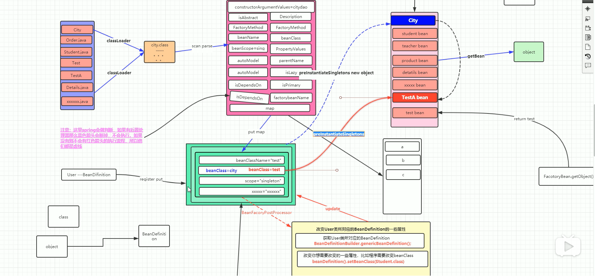
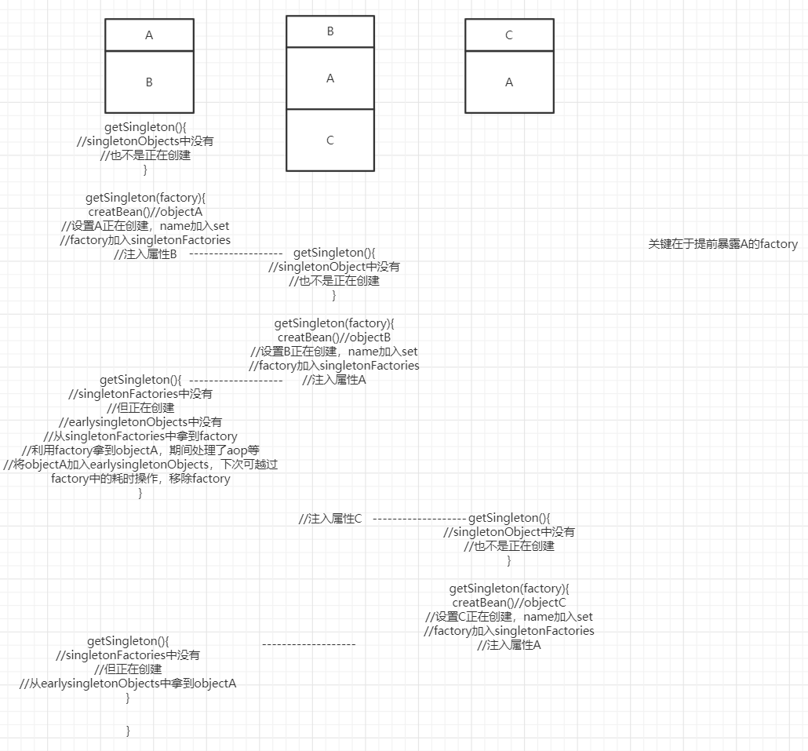
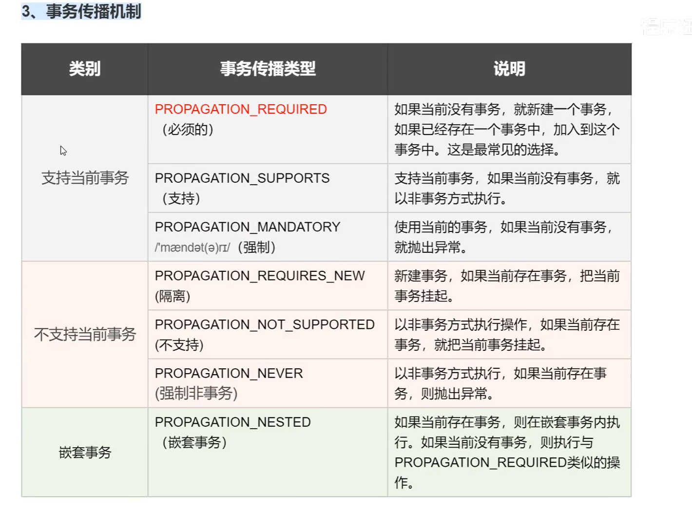

# spring
## bean实例化
单例bean在ioc启动时实例化，然后放到单例池。




总结一下：
1. 实例化一个ApplicationContext的对象；
2. 调用bean工厂后置处理器完成扫描；
3. 循环解析扫描出来的类信息；
4. 实例化一个BeanDefinition对象来存储解析出来的信息；
5. 把实例化好的beanDefinition对象put到beanDefinitionMap当中缓存起来，以便后面实例化bean；
6. 再次调用bean工厂后置处理器；
7. 当然spring还会干很多事情，比如国际化，比如注册BeanPostProcessor等等，如果我们只关心如何实例化一个bean的话那么这一步就是spring调用finishBeanFactoryInitialization
方法来实例化单例的bean，实例化之前spring要做验证，需要遍历所有扫描出来的类，依次判断这个bean是否Lazy，是否prototype，是否abstract等等；
8. 如果验证完成spring在实例化一个bean之前需要推断构造方法，因为spring实例化对象是通过构造方法反射，故而需要知道用哪个构造方法；
9. 推断完构造方法之后spring调用构造方法反射实例化一个对象；注意我这里说的是对象、对象、对象；这个时候对象已经实例化出来了，但是并不是一个完整的bean
，最简单的体现是这个时候实例化出来的对象属性是没有注入，所以不是一个完整的bean；
10. spring处理合并后的beanDefinition(合并？是spring当中非常重要的一块内容，后面的文章我会分析)；
11. 判断是否支持循环依赖，如果支持则提前把一个工厂存入singletonFactories——map（设置状态正在创建）；
12. 判断是否需要完成属性注入  
13. 如果需要完成属性注入，则开始注入属性
14. 判断bean的类型回调Aware接口
15. 调用生命周期回调方法
16. 如果需要代理则完成代理
17. put到单例池——bean完成——存在spring容器当中
## 循环依赖处理细节


要点为标记正在初始化，提前暴露一个工厂。
## aop
对接口进行aop时，使用的是jdk动态代理。

对类进行aop时，使用的是Aspectj，字节码编织技术。
### 拦截示例
```java
@Aspect
@Component
public class ErrorHandlerAspect {

    /**
     * 设置拦截点为所有的Controller
     */
    @Pointcut("execution(* com.faishze.api.fasizheapi.controller.*.*.*(..))")
    public void pointCut(){
    }


    /**
     * 对返回结果的错误进行解析，只对返回为Result的进行解析
     * 如果Result成功，就取出其中的数据，进行返回，如果不成
     * 功，封装相对应的ResponseEntity
     *
     * @param joinPoint ProceedingJoinPoint
     * @return Object
     */
    @Around(value = "pointCut()")
    public Object handler(ProceedingJoinPoint joinPoint) throws Throwable {
        Object ret = joinPoint.proceed();//调用实际方法
        if (!(ret instanceof Result)) {
            return ret;
        }

        Result result = (Result) ret;
        if (result.isSuccess()) {
            return result.getData();
        }

        ErrorCode errorCode = result.getErrorCode();
        String message = result.getMessage();
        ErrorResponse errorResponse;
        if (message == null) {
            errorResponse = new ErrorResponse(errorCode.getError(), errorCode.getMessage());
        } else {
            errorResponse = new ErrorResponse(errorCode.getError(), message);
        }
        return new ResponseEntity<>(errorResponse, errorCode.getHttpStatus());
    }
}
```
## 事务
### 隔离级别
依靠mysql支持。
### 传播机制


形象分析支持当前事务:
1. 好男人：老婆煮了饭，那么就吃，没有煮，那么就自己煮。
2. 懒男人：老婆煮了饭，那么就吃，没有煮，那么就不吃。
3. 坏男人：老婆煮了饭，那么就吃，没有煮，那么就撒野。

不支持当前事务是靠不共用Connection来实现了。

事务的底层靠AOP实现，将事务的提交、回滚切到贴有@Transactional的方法上。

spring将mysql的事务自动提交设置为false，否则将会一条语句一个事务。利用savePoint来实现事务的嵌套。
### @Transational注解
参见：https://www.ibm.com/developerworks/cn/java/j-master-spring-transactional-use/
## 常见面试题
### BeanFactory与FactoryBean
BeanFactory
定义了IOC容器的最基本形式，并提供了IOC容器应遵守的的最基本的接口，也就是Spring IOC所遵守的最底层和最基本的编程规范。
它的职责包括：实例化、定位、配置应用程序中的对象及建立这些对象间的依赖。
在Spring代码中，BeanFactory只是个接口，并不是IOC容器的具体实现，但是Spring容器给出了很多种实现，如DefaultListableBeanFactory、
XmlBeanFactory、ApplicationContext等，都是附加了某种功能的实现。
```java
package org.springframework.beans.factory;

import org.springframework.beans.BeansException;
import org.springframework.core.ResolvableType;

public interface BeanFactory {
    String FACTORY_BEAN_PREFIX = "&";

    Object getBean(String var1) throws BeansException;

    <T> T getBean(String var1, Class<T> var2) throws BeansException;

    <T> T getBean(Class<T> var1) throws BeansException;

    Object getBean(String var1, Object... var2) throws BeansException;

    <T> T getBean(Class<T> var1, Object... var2) throws BeansException;

    boolean containsBean(String var1);

    boolean isSingleton(String var1) throws NoSuchBeanDefinitionException;

    boolean isPrototype(String var1) throws NoSuchBeanDefinitionException;

    boolean isTypeMatch(String var1, ResolvableType var2) throws NoSuchBeanDefinitionException;

    boolean isTypeMatch(String var1, Class<?> var2) throws NoSuchBeanDefinitionException;

    Class<?> getType(String var1) throws NoSuchBeanDefinitionException;

    String[] getAliases(String var1);
}
```
FactoryBean
一般情况下，Spring通过反射机制利用<bean>的class属性指定实现类实例化Bean，在某些情况下，实例化Bean过程比较复杂，
如果按照传统的方式，则需要在<bean>中提供大量的配置信息。配置方式的灵活性是受限的，这时采用编码的方式可能会得到一个简单的方案。
Spring为此提供了一个org.springframework.bean.factory.FactoryBean的工厂类接口，用户可以通过实现该接口定制实例化Bean的逻辑。
FactoryBean接口对于Spring框架来说占用重要的地位，Spring自身就提供了70多个FactoryBean的实现。
```java
public interface FactoryBean<T> {

    //返回的对象实例
    T getObject() throws Exception;
    //Bean的类型
    Class<?> getObjectType();
    //true是单例，false是非单例  在Spring5.0中此方法利用了JDK1.8的新特性变成了default方法，返回true
    boolean isSingleton();
}
```
### @Autowired与@Resource
@Autowired是spring的注解，按照type来寻找，@Resource是jdk的注解，先name再type。
## 常用注解
1. @RestController
2. @Service
3. @Autowired
4. @Configuration
5. @Bean
## 常用组件